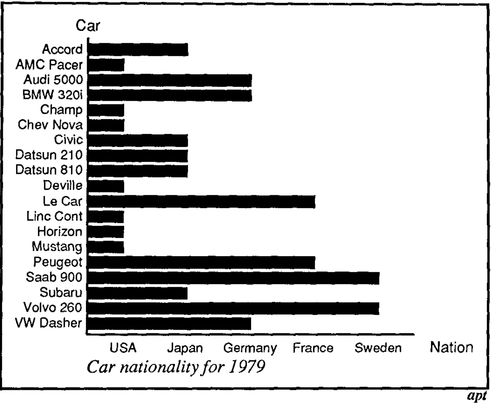

```{r}
#| label: setup
#| echo: false
library(dslabs)
library(ggrepel)
library(patchwork)
library(tidyverse)
theme_set(theme_classic() + theme(panel.border = element_rect(fill = NA, linewidth = .5)))
set.seed(2026)
```

Readings: [1](https://rafalab.dfci.harvard.edu/dsbook/ggplot2.html), [2 (Chapter 5.1 - 5.4 and 5.5.4)](https://search.library.wisc.edu/catalog/9910211448302121).

1. If you are interested in data science, you're probably already convinced that to understand something deeply it really helps to measure. All the different data that we gather, the counts of different molecules in developing tissues, the electromagnetic readouts from astronomical observatories, the likes and dislikes of a billion online videos.... these are all attempts made by people to make sense of a world that is far too complicated to grasp all at once. And if you've already stepped into this area, you've probably heard about the advanced algorithms and statistical theories that have been developed to help us navigate the recurring patterns that help us summarize and make decisions from these data.

2. A common misconception is that to use these data science methods you have to be clever. That a trained data scientist will be able to hear about a problem and data set and immediately conjure the appropriate methodology. In my experience this is not actually how things work. You don't have to be clever, you just have to look at the data. Everything that happens downstream, all the modeling and inference, can be guided by a very clear view of how the data actually look. To really know whether our assumptions are reliable or our conclusions can be trusted, the default summaries are rarely enough, and we usually have to do extra detective work.

3. The purpose of this class is to introduce you to the timeless concepts and modern methods of data visualization to help you do this detective work well. By the end you should have the intellectual foundation to make informed judgments about your visualization designs. More than conceptual knowledge, this class will give you an opportunity to practice. There are a surprising number of problem-solving techniques that apply to entire classes of problems, like methods for linking views or making maps, but it's hard to really internalize them without repetition.

### Graphical Encoding

1. Every plot is made from three parts,

    - Data: These are the raw measurements that we want to visualize.
    - Graphical Marks: These are the basic graphical elements in an image (e.g., circles, lines) that appear on the page. The appearance of the marks are determined by visual _channels_, like position, color, or shape.
    - Graphical Encoding: This is the mapping that ties the data to the graphical marks' channels.

   When we construct a data visualization, we are imprint marks on a page in the
   same way that an artist creates a work from a blank canvas. The properties of
   these marks that we can vary are called visual channels. For example,
   position and color are both channels that we can control in circle marks .
   Compared to an artist, the only difference is that we arrange the marks to
   encode meaning derived directly from precisely recorded and easily shareable
   data.

1. For example, below we will make this bar chart of country population in the
year 2000, made using the gapminder dataset. The raw data are country names
(categorical variable), their populations (numerical variable), and a country
group giving the broader geographical region (categorical variable). The visual
marks are colored rectangles. The graphical encoding is,

   - `x`-axis position $\iff$ Population size.
   - `y`-axis position $\iff$ Country name. Notice also that these have been sorted, so it also encodes country rank.
   - `color` $\iff$ Country group.

```{r}
#| fig-height: 6.7
#| fig-width: 5
#| echo: false
gapminder <- read_csv("https://uwmadison.box.com/shared/static/dyz0qohqvgake2ghm4ngupbltkzpqb7t.csv", col_types = cols(cluster = "factor"))
gap2000 <- filter(gapminder, year == 2000) # keep only year 2000
ggplot(gap2000) +
    geom_col(
        aes(pop, reorder(country, pop), fill = cluster)
    ) +
    scale_x_continuous(labels = scales::unit_format(unit = "million", scale = 1e-6), expand = c(0, 0, 0.1, 0.1)) +
    scale_fill_manual(values = c("#80BFA2", "#7EB6D9", "#3E428C", "#D98BB6", "#BF2E21", "#F23A29")) +
    labs(x = "Population", y = "Country", fill = "Country Group", color = "Country Group")
```

### Hierarchy of Encodings

1. How many times larger (in terms of area) is the circle on the right?

```{r}
#| fig-width: 6
#| fig-height: 6
#| echo: false

circles <- tibble(
    x = c(1, 3),
    y = c(1, 1),
    size = c(30, 30 * sqrt(7))
)

ggplot(circles, aes(x, y)) +
    geom_point(aes(size = size), shape = 16) +
    scale_size_identity() +
    coord_fixed(xlim = c(0, 4), ylim = c(0, 2), expand = FALSE) +
    #scale_size(range = c(6, 60), guide = FALSE) +
    theme_void()
```

Same question, but for the relative heights of these two bars?

```{r}
#| fig-width: 6
#| fig-height: 6
#| echo: false

bars <- tibble(
    x = factor(c("small", "large"), levels = c("small", "large")),
    height = c(1, 7)
)

ggplot(bars, aes(x, height)) +
    geom_col(width = 0.65, fill = "black") +
    scale_y_continuous(limits = c(0, 8), expand = c(0, 0)) +
    theme_void()
```

1. What we are seeing here is a special case of a more general phenomenon called the hierarchy of encodings. Not all differences between visual channels can be compared with the same accuracy and speed. This is a limitation of basic human perception. Moreover, for either ordered or categorical attributes, these differences are very generalizable -- it's not like some people are very accurate at perceiving areas, while other people can easily position. In both controlled lab experimental settings and large-scale crowd-sourcing experiments, the same general hierarchy tends to recur^[If you didn't make it to this lecture, the answer is that for both circles and bars the answer is seven. When we vote in class, the judgments are much more accurate for the bars than for the circles. Incidentally, when I've given this lecture to different audiences, the group that does this the best are the biologists, at one lab I went to (~ 20 people), everyone said either 7 or 8 for the bar chart.].

You should memorize the hierarchy below (at least, given a pair of channels, you should be able to say which is more effective).


1. One immediate implication of this is summarized as the Effectiveness
Principle. For any given visualization task, we should prioritize the top of the
hierarchy for the comparisons that are the most important. E.g., position and
color should be reserved for the features that are most to compare.  This means
that even for the exact same data set, depending on the question, different
approaches might be more appropriate.  An example of this is discussed in
[@mackinlay]. If we  want to compare mileage with price across all cars. It's
most appropriate to use a scatterplot, while if we want to compare individual
cars of interest, it's easier to find this information in matched bar plots.


This also gives a more formal criterion for evaluating visualizations.  For a
given task, one visualization's design is more _effective_ than another if the
associated comparisons are more easily and accurately perceived by the reader
compared to the alternatives.

1. A related principle is the expressiveness principle. An expressive
visualization is faithful to the underlying data. It shows all the relevant data
(it doesn't suppress anything meaningful) but also doesn't suggest facts that
aren't present (it doesn't mislead).  For example, the visualization below is
not expressive because it suggests cars from some countries have more or less of
some quantity.



1. Here is another exercise. How long does it take you to find the circle?

```{r}
#| label: popout
#| echo: false

make_shapes <- function(n, color, shape, range = c(0.05, 0.95)) {
    if (n <= 0) {
        return(NULL)
    }
    data.frame(
        x = runif(n, range[1], range[2]),
        y = runif(n, range[1], range[2]),
        color = color, shape = shape
    )
}


popout_plot <- function(n_blue_circles, n_red_squares) {
    target <- make_shapes(1, "Red", "Circle", range = c(0.1, 0.9))
    blue_circles <- make_shapes(n_blue_circles, "Blue", "Circle")
    red_squares <- make_shapes(n_red_squares, "Red", "Square")

    # Build ggplot object
    bind_rows(target, blue_circles, red_squares) |>
        ggplot(aes(x = x, y = y, color = color, shape = shape)) +
        geom_point(size = 3.2) +
        scale_color_manual(values = c("#1f78b4", "#b2182b")) +
        scale_shape_manual(values = c("Circle" = 16, "Square" = 15)) +
        coord_fixed(xlim = c(0, 1), ylim = c(0, 1), expand = FALSE) +
        theme_void() +
        theme(legend.position = "none")
}

popout_plot(n_blue_circles = 0, n_red_squares = 50)
```

Okay, now compare with this.

```{r}
popout_plot(n_blue_circles = 50, n_red_squares = 0)
```

Now, can you find the red circle?

```{r}
popout_plot(n_blue_circles = 25, n_red_squares = 25)
```

1. What we have seen is the phenomenon called "visual popout" or, more formally, preattentive processing. Some properties in visual channels can be perceived immediately without any cognitive effort. Others (like shape in the example above) require us to deliberately scan over the visualization.  Unfortunately, it's not so straightforward to combine popout across channels. Once we have both red squares and circles, it's no longer easy to find the red circle.

### Grammar of Graphics

1. The _Grammar of Graphics_ is the idea that we can compose rich visualizations
by recombining a few basic building blocks. This is in contrast to systems with
prespecified chart types, where the user is forced to pick from a limited
dropdown menu of plots. The hope is to make visualization design feel more like
ordinary language (hence _grammar_), even though each sentence is just a
combination of words, we're able to express a vast array of meanings. `

1. We will use two software packages that implement a version of the grammar of
graphics. The `ggplot2` package is based in R and is well suited to creating
rich, static visualizations.  The package has been around for nearly 20 years
and is extremely widely used in practice.  Mosaic vegaplot is a relative
newcomer, but it is well suited to interactive visualization design. We'll see
how both handle data, marks, and encodings.

**`ggplot2`**

1. Let's use the grammar of graphics to construct this plot.

```{r}
#| echo: false
r <- murders |>
    summarize(rate = sum(total) / sum(population)) |>
    pull(rate)

ggplot(murders, aes(x = population, y = total)) +
    geom_abline(intercept = log10(r), linewidth = 0.4, col = "#b3b3b3") +
    geom_text_repel(aes(label = abb), segment.size = 0.2) +
    geom_point(aes(col = region)) +
    scale_x_log10(labels = scales::unit_format(unit = "million", scale = 1e-6)) +
    scale_y_log10() +
    scale_color_brewer(palette = "Set2") +
    labs(
        x = "Population (log scale)",
        y = "Total number of murders (log scale)",
        color = "Region",
        title = "US Gun Murders in 2010"
    ) +
    theme_bw() +
    theme(
        legend.position = "top",
        panel.grid.minor = element_blank()
    )
```

1. Data: The first argument to `ggplot()` must be a data.frame where each row is an observation and each column is an attribute describing the observation. This is important because each mark that you see on a ggplot figure – a line, a point, a rectanlge, ... – had to start out as a row within an R data.frame. The visual properties of the mark (e.g., color) are determined by the values along columns.

```{r}
data(murders)
head(murders)
```

1. Marks: The words in the grammar of graphics are the geometry layers, called "geoms." We can associate each row of a data frame with points, lines, rectangles, etc., by referring to the appropriate geom. A typical plot will compose a chain of layers on top of a dataset,

> ggplot(data) + [layer 1] + [layer 2] + …

For example, by deconstructing the plot above, we would expect to have point and text layers. For now, let’s just tell the plot to put all the marks at the origin.

```{r}
ggplot(murders) +
    geom_point(x = 0, y = 0) +
    geom_text(x = 0, y = 0, label = "test")
```

You can see all the types of geoms in the [cheat sheet](https://github.com/rstudio/cheatsheets/blob/master/data-visualization-2.1.pdf). We will go over this more detail below.

1. Encodings: In ggplot2, we use `aes()` to implement the graphical encoding.
`aes()` stands for aesthetic mapping, which is a synonym for graphical encoding.
Analyzing the original graph, we recognize these specific encoding,

   - State Population → x-axis coordinate
   - Number of murders → y-axis coordinate
   - Geographical region → color

  And this is formalized through the code.

```{r}
ggplot(murders) +
    geom_point(aes(x = population, y = total, col = region))
```

1.  The specific mapping from data values to physical mark properties are
implemented through scales. These are also basic "words" in the ggplot2 grammar.
For example, the original plot used log scales for population and total, it also
used a custom color scale, and this was achieved by simply adding new scale layers.

```{r}
ggplot(murders) +
    geom_point(aes(x = population, y = total, col = region)) +
    scale_color_brewer(palette = "Set2") +
    scale_x_log10() +
    scale_y_log10()
```

1. Notice that the original visualization also had text labeling all the states
and a reference line giving the nationwide murder rate (so we could see whether
a state was above or below the national rate given its population size).  These
can again be implemented simply by adding more layers. For the text labels, we
can use `geom_text_repel` from the `ggrepel` package,

```{r}
ggplot(murders) +
    geom_text_repel(aes(x = population, y = total, label = abb), segment.size = 0.2) +
    geom_point(aes(x = population, y = total, col = region)) +
    scale_x_log10() +
    scale_y_log10() +
    scale_color_brewer(palette = "Set2")
```

 This code is actually unnecessarily verbose. It copies x- and y-encoding for
 both the text and the point layers.  A clearer approach is to set these
 encodings into a global aesthetic encoding. This can be set using the second
 argument to ggplot.

```{r}
ggplot(murders, aes(x = population, y = total)) +
    geom_text_repel(aes(label = abb), segment.size = 0.2) +
    geom_point(aes(col = region)) +
    scale_x_log10() +
    scale_y_log10() +
    scale_color_brewer(palette = "Set2")
```

1. The overlay line giving the national rate is actually a bit subtle to
construct. Unlike all the other marks on this plot, it isn't defined by any row
in the murders data frame. It turns out that you can also overlay marks by
setting their properties directly. These kinds of layers no longer have `aes()`
in them.

```{r}
r <- murders |>
    summarize(rate = sum(total) / sum(population)) |>
    pull(rate)

ggplot(murders, aes(x = population, y = total)) +
    geom_abline(intercept = log10(r), slope = 1, col = "#b3b3b3") +
    geom_text_repel(aes(label = abb), segment.size = 0.2) +
    geom_point(aes(col = region)) +
    scale_x_log10() +
    scale_y_log10() +
    scale_color_brewer(palette = "Set2")
```

1. Finally, we can add layers that customize the plot appearance and improve the
annotation. `theme()` can be used to fine tune plot properties, like whether to
include a background grid or the position of the legend. `labs()` can be used to
come up with new legend or axis titles.

```{r}
ggplot(murders, aes(x = population, y = total)) +
    geom_abline(intercept = log10(r), slope = 1, col = "#b3b3b3") +
    geom_text_repel(aes(label = abb), segment.size = 0.2) +
    geom_point(aes(col = region)) +
    scale_x_log10() +
    scale_y_log10() +
    scale_color_brewer(palette = "Set2") +
    labs(
        x = "Population (log scale)",
        y = "Total number of murders (log scale)",
        color = "region",
        title = "US Gun Murders in 2010"
    ) +
    theme(legend.position = "top")
```

1. With agentic coding, it is not so necessary to write each of these layers by
hand, but you should be very careful in specifying your encodings and the types
of layers you want. We just saw that even for this simple plot, there are so
many subtle choices that can improve it. Even if you get lucky and the plot
looks reasonable starting from a vague prompt, in order to sharpen the quality
of your thinking, I encourage you to iterate on the design, building it up over
several stages and being precise in your specification.  

Here's an example that built up the visualization above from a few prompts. You
can read the prompts and the intermediate outputs [here](lhttps://drive.google.com/drive/folders/1DROl3TK9XpsPWdD3FMczOZbenLZQc4NE?usp=drive_link). One point of
caution is that this is a very common dataset, and you can see, even from the
reasoning traces, that it referred to the book from which the notes are drawn.
And even at the very end, I decided to change the appearance of the rate line so
that it lay below the points (the layers are added in the order they appear in
the code) and was a little bit lighter (instesad of "gray50" I set it to
"#d4d4d4").

```{r}
#| echo: false
national_rate <- murders |>
    summarize(rate = sum(total) / sum(population) * 1e5) |>
    pull(rate)

murders |>
    ggplot(aes(x = population / 1e6, y = total, color = region)) +
    geom_abline(
        slope = 1, intercept = log10(national_rate) + 1,
        color = "#d4d4d4"
    ) +
    geom_point(size = 2.5) +
    geom_text_repel(aes(label = abb), size = 3.5, show.legend = FALSE) +
    scale_x_log10(labels = scales::label_number(suffix = "M")) +
    scale_y_log10() +
    scale_color_brewer(palette = "Dark2") +
    labs(
        x = "Population (log scale)",
        y = "Number of Murders (log scale)",
        color = "Region"
    ) +
    theme_classic() +
    theme(
        axis.title = element_text(size = 15),
        axis.text = element_text(size = 12),
        legend.title = element_text(size = 13),
        legend.text = element_text(size = 12)
    )
```

**Mosaic vgplot**

1. A similar grammar of graphics is implemented by Mosaic vgplot. One nuance is
that this is done in JavaScript, rather than R, and requires a different data
loading procedure. We have hidden the code below, and we'll go over that step in
detail in our "Data Management" lecture (though if you're curious, you can look
at the source code for these notes linked at the very top).

```{r}
write_csv(murders, "data/murders.csv")
write_csv(gap2000, "data/gap2000.csv")
write_csv(gapminder, "data/gapminder.csv")
ojs_define(national_rate = national_rate)
```

```{ojs}
//| echo: false
path = (p) => new URL(`data/${p}`, document.baseURI).href

vg = {
  const vg = await import("https://cdn.jsdelivr.net/npm/@uwdata/vgplot@0.19.0/+esm");
  const wasm = await vg.wasmConnector();
  vg.coordinator().databaseConnector(wasm);
  await vg.coordinator().exec([
    vg.loadCSV("murders", path("murders.csv")),
    vg.loadCSV("gap2000", path("gap2000.csv")),
    vg.loadCSV("gapminder", path("gapminder.csv"))
  ]);
  return vg;
}
```

1. We can read the analogy to ggplot2 even from a minimal scatter plot example.

    - `vg.from` specifies which dataset to use. I've hidden the code, but `murders` is a database that's accessible to all javascript cells in this notebook.
    - `vg.dot` is analogous to `geom_point` and specifies the visual mark to use.
    - The dictionary in the second argument to `vg.from` describes the graphical encoding.

The `r` argument is not part of the encoding and simply fixes the size of all the points to 5 pixels across. It is analogous to how in a ggplot layer you can specify properties without referring to the original data. For example, `geom_point(aes(x = population, y = total), size = 5)`. The width and height parameters just rescale the overall canvas size to be 650 pixels across and 400 pixels tall.

```{ojs}
vg.plot(
  vg.dot(vg.from("murders"), {x: "population", y: "total", fill: "region", r: 5}),
  vg.width(650),
  vg.height(450)
)
```

1. As before, we can customize the scales. Here, `xScale` and `yScale` allow us to use a log scale while the color scheme allows us to switch to a colorbrewer palette.

```{ojs}
vg.plot(
  vg.dot(vg.from("murders"), {x: "population", y: "total", fill: "region", r: 5}),
  vg.xScale("log"),
  vg.yScale("log"),
  vg.colorScheme("set2"),
  vg.width(650),
  vg.height(450)
)
```

In the spirit of the grammar of graphics, we can also compose multiple layers.
Here we've added a `vg.text` layer to add state labels. To avoid repeating the
`x` and `y` specification, we defined a new object `xy`. The `...` notation
means we "unpack" the entries so it can be merged with the parent object.

```{ojs}
xy = ({x: "population", y: "total"})

vg.plot(
  vg.dot(vg.from("murders"), {...xy, fill: "region", r: 5}),
  vg.text(vg.from("murders"), {...xy, text: "abb", dy: -12, fill: "#888", fontSize: 12}),
  vg.xScale("log"),
  vg.yScale("log"),
  vg.colorScheme("set2"),
  vg.width(650),
  vg.height(450)
)
```

1. Finally, we overlay a line giving the national rate. The syntax here differs
slightly from ggplot. Instead of specifying the intercept and slope, we specify
the end points of the line in length two array. We've also added some annotation
using `xLabel` and `yLabel` and a legend with `vg.colorLegend()`.

Finally, you might be wondering why we're going through this entire exercise of
repeating a plot that we already made in ggplot. To motivate learning Mosaic,
I've added hovering functionality, which only displays the text of the state
that's closest to wherever the mouse is. Even though ggplot2 arguably leads to a
much more beautiful and easier-to-customize figure, it would be very difficult
to implement this kind of interactivity. Don't worry about the syntax for now.
This is something that we'll cover in-depth in the interaction lectures.

```{ojs}
rate = national_rate / 1e5
rate_line = [
  {population: 1e5, total: rate * 1e5},
  {population: 4e7, total: rate * 4e7}
]

$hovered = vg.Selection.single({empty: true})

vg.plot(
  vg.line(rate_line, {x: "population", y: "total", stroke: "#d4d4d4"}),
  vg.dot(vg.from("murders"), {...xy, fill: "region", r: 5}),
  vg.nearest({as: $hovered}),
  vg.text(vg.from("murders", {filterBy: $hovered}), {...xy, text: "abb", dy: -12, fill: "#888", fontSize: 12}),
  vg.xScale("log"),
  vg.yScale("log"),
  vg.colorScheme("Set2"),
  vg.xLabel("Population (log scale)"),
  vg.yLabel("Number of Murders (log scale)"),
  vg.colorLegend({columns: 1}),
  vg.width(650),
  vg.height(450)
)
```

### Graphical Marks

1. Depending on the data and problem at hand, it helps to have a wide vocabulary of potential graphical marks to apply. We've already seen *point* and **text marks**, though we've only used them to encode continuous $x, y$ position (and for the text, the associated label). They actually support encoding for even more visual channels -- alpha, color, size, and shape (for points) --, as documented in the ggplot2 [cheat sheet](https://rstudio.github.io/cheatsheets/data-visualization.pdf)^[You're responsible for knowing the encodings for the marks we discuss in this note, but not everything in this cheat sheet.].

Let's review a few of the other common marks, potential pitfalls, and how you can avoid them.

3. We'll illustrate marks with the gapminder dataset, which describes the
changes in standard of living around the world over the last few decades.

```{r}
gapminder <- read_csv("https://uwmadison.box.com/shared/static/dyz0qohqvgake2ghm4ngupbltkzpqb7t.csv", col_types = cols(cluster = "factor"))
gap2000 <- filter(gapminder, year == 2000) # keep only year 2000
```

1. **Bar Marks** associate a continuous field with a categorical one. They also support alpha, color (border of the bar), fill (inside of the bar), and linetype (e.g., solid vs dashed borders) visual channels.

```{r}
#| fig-height: 4.5
#| fig-width: 7
ggplot(gap2000) +
    geom_col(aes(country, pop))
```

The plot above is messy --  the country names are overlapping one another. One
way of dealing with this is to turn the plot on its side.

```{r}
#| fig-height: 6.7
#| fig-width: 5
ggplot(gap2000) +
    geom_col(aes(pop, country))
```

Though you could have also simply rotated the labels,

```{r}
#| fig-height: 4.5
#| fig-width: 7
ggplot(gap2000) +
    geom_col(aes(country, pop)) +
    theme(axis.text.x = element_text(angle = 90))
```

Another issue is that, by default, the countries are ordered alphabetically. In
some cases, this may be justified. If we really don't know what kinds of
comparisons will be the most interesting, it makes sense to support an
alphabetical lookup. But if you can encode extra information in these
categorical variables, that is always useful. For example, we can sort by
country population.

```{r}
#| fig-height: 6.7
#| fig-width: 5
ggplot(gap2000) +
    geom_col(aes(pop, reorder(country, pop), fill = cluster))
```

1. A few other points that I think are worth improving

    * The axis titles are not meaningful.
    * There is a strange gap between the left hand edge of the plot and the start of the bars.
    * The scientific notation for population size is unusual.
    * The color scheme is a bit boring.

   I've gone ahead and made these changes, putting comments next to which piece
   of code makes which modifications.

```{r}
#| fig-height: 6.7
#| fig-width: 5
ggplot(gap2000) +
    geom_col(
        aes(pop, reorder(country, pop), fill = cluster)
    ) +
    scale_x_continuous(labels = scales::unit_format(unit = "million", scale = 1e-6), expand = c(0, 0, 0.1, 0.1)) + # labels in millions, removes gap
    scale_fill_manual(values = c("#80BFA2", "#7EB6D9", "#3E428C", "#D98BB6", "#BF2E21", "#F23A29")) + # changes colors
    labs(x = "Population", y = "Country", fill = "Country Group", color = "Country Group") # adds labels
```

9. This seems like a lot of work for just a lowly bar plot! But I think it's
amazing customizable the figure is -- we can give it our own sense of style.
With practice, these sorts of modifications will become second nature.
And
really, even though we spent some time on this plot, there are still many things
that could be interesting to experiment with, like font styles, background
appearance, maybe even splitting the countries into two panels.

10. In the plot above, each bar is anchored at 0. Instead, we could have each
bar encode *two* continuous attributes, a left and right, along with a
categorical attribute as in bar plots. This is called a
**segment** mark. To illustrate, let's compare the minimum and maximimum life
expectancies within each country cluster.  We'll need to create a new
`data.frame` with just the summary information. For this, we `group_by` each
cluster, so that a `summarise` call finds the minimum and maximum life
expectancies restricted to each cluster. We'll discuss the `group_by` +
`summarise` pattern in detail next week.

```{r}
#| fig-height: 4.5
# find summary statistics
life_ranges <- gap2000 |>
    group_by(cluster) |>
    summarise(
        min_life = min(life_expect),
        max_life = max(life_expect)
    )

# look at a few rows
head(life_ranges)
ggplot(life_ranges) +
    geom_segment(
        aes(min_life, reorder(cluster, max_life), xend = max_life, yend = cluster, col = cluster),
        size = 5,
    ) +
    scale_color_manual(values = c("#80BFA2", "#7EB6D9", "#3E428C", "#D98BB6", "#BF2E21", "#F23A29")) +
    labs(x = "Minimum and Maximum Expected Span", col = "Country Group", y = "Country Group") +
    xlim(0, 85) # otherwise would only range from 42 to 82
```

1. **Line marks** are useful for comparing changes. Our eyes naturally focus on
rates of change when we see lines. They support continuous x and y channels, as
well as linetype and linewidth. Below, we'll plot the fertility over time, colored
in by country cluster.

```{r}
ggplot(gapminder) +
    geom_line(
        aes(year, fertility, col = cluster, group = country),
        alpha = 0.7, size = 0.9
    ) +
    scale_x_continuous(expand = c(0, 0)) + # same trick of removing gap
    scale_color_manual(values = c("#80BFA2", "#7EB6D9", "#3E428C", "#D98BB6", "#BF2E21", "#F23A29"))
```

The `group` argument is necessary for ensuring each
country gets its own line; if we removed it, `ggplot2` would become confused by
the fact that the same `x` (year) values are associated with multiple `y`'s
(fertility rates). Please do not submit plots like this...

```{r}
ggplot(gapminder) +
    geom_line(
        aes(year, fertility, col = cluster),
        alpha = 0.7, size = 0.9
    ) +
    scale_x_continuous(expand = c(0, 0)) +
    scale_color_manual(values = c("#80BFA2", "#7EB6D9", "#3E428C", "#D98BB6", "#BF2E21", "#F23A29"))
```

12. **Area marks** have a flavor of both bar and line marks. The encodings are
the same as for lines. The filled area supports absolute comparisons, while the
changes in shape suggest derivatives.

```{r}
population_sums <- gapminder |>
    group_by(year, cluster) |>
    summarise(total_pop = sum(pop))
head(population_sums)

ggplot(population_sums) +
    geom_area(aes(year, total_pop, fill = cluster)) +
    scale_y_continuous(labels = scales::unit_format(unit = "million", scale = 1e-6)) +
    scale_x_continuous(expand = c(0, 0)) +
    scale_fill_manual(values = c("#80BFA2", "#7EB6D9", "#3E428C", "#D98BB6", "#BF2E21", "#F23A29"))
```

Just like in bar marks, we don't necessarily need to anchor the $y$-axis at 0.
For example, here the bottom and top of each area mark is given by the 30% and
70% quantiles of population within each country cluster. This kind of mark is
called a **ribbon mark**. It requires three continuous attributes.

```{r}
population_ranges <- gapminder |>
    group_by(year, cluster) |>
    summarise(min_pop = quantile(pop, 0.3), max_pop = quantile(pop, 0.7))
head(population_ranges)

ggplot(population_ranges) +
    geom_ribbon(
        aes(x = year, ymin = min_pop, ymax = max_pop, fill = cluster),
        alpha = 0.8
    ) +
    scale_y_continuous(labels = scales::unit_format(unit = "million", scale = 1e-6)) +
    scale_x_continuous(expand = c(0, 0)) +
    scale_fill_manual(values = c("#80BFA2", "#7EB6D9", "#3E428C", "#D98BB6", "#BF2E21", "#F23A29"))
```

1. All those examples were made with ggplot2. Mosaic doesn't support segment or
ribbon marks. But we can easily generate the analogous bar and line plots. Here
is the analogous bar plot. `barX` defines a bar mark, the `sort` option orders
countries, and the remaining layers customize the annotation and scales.

```{ojs}
vg.plot(
  vg.barX(
    vg.from("gap2000"),
    {
      x: "pop",
      y: "country",
      fill: "cluster",
      sort: {y: "-x"}
    }
  ),
  vg.xLabel("Population"),
  vg.yLabel("Country"),
  vg.xTickFormat(d => `${d / 1e6} million`),
  vg.colorRange(["#80BFA2", "#7EB6D9", "#3E428C", "#D98BB6", "#BF2E21", "#F23A29"]),
  vg.colorLegend({label: "Country Group", columns: 1}),
  vg.marginLeft(120), // keep labels visible
  vg.width(400),
  vg.height(575)
)
```

1.$^{\ast}$ A minor point on how to read the syntax for the argument in
`xTickFormat`. In javascript, you can define an "anonymous" (unnamed) function
using `x => what to do with x`. This is exactly like R's `\(x) { what to do with
x}`. The `${d / 1e6} million` substitutes the result of `d / 1e6` into the
string "{result} million", just like R's `glue({result}, million)`.

1. Here is the analogous lineplot. The `z` encoding groups each country's
observations, and `stroke` is the mosaic equivalent of ggplot2's `color`.

```{ojs}
vg.plot(
  vg.lineY(
    vg.from("gapminder"),
    {
      x: "year",
      y: "fertility",
      z: "country",
      stroke: "cluster",
      strokeOpacity: 0.7,
      strokeWidth: 2
    }
  ),
  vg.xTickFormat("d"), // makes sure years are formatted correctly
  vg.xLabel("Year"),
  vg.yLabel("Fertility"),
  vg.colorRange(["#80BFA2", "#7EB6D9", "#3E428C", "#D98BB6", "#BF2E21", "#F23A29"]),
  vg.colorLegend({label: "Country Group", columns: 1}),
  vg.width(500),
  vg.height(350)
)
```

## Objectives

By the end of this week, you should be able to,

- Define the hierarchy of encodings, rank visual channels according to their perceptual efficiency, and use these concepts to evaluate visualiations (on their own, and in comparison with one another).
- Define graphical marks, visual encodings, and the grammar of graphics and discuss these concepts in the context of ggplot2 and mosaic vgplot code.
- Given a practical visualization goal, describe the graphical marks, graphical encodings, and scales that could be used to achieve them and justify your choices in terms of concepts like the hierarchy of encodings, popout, the expressiveness principle, and the effectiveness principle.
- Recognize when an input data set or visualiation task is/isn't appropriate for a particular graphical mark, like point, line, bar, segment, text, or ribbon marks .
- Suggest improvements for a specific plot, justify the design choices, and outline the implementation in ggplot2 and mosaic.