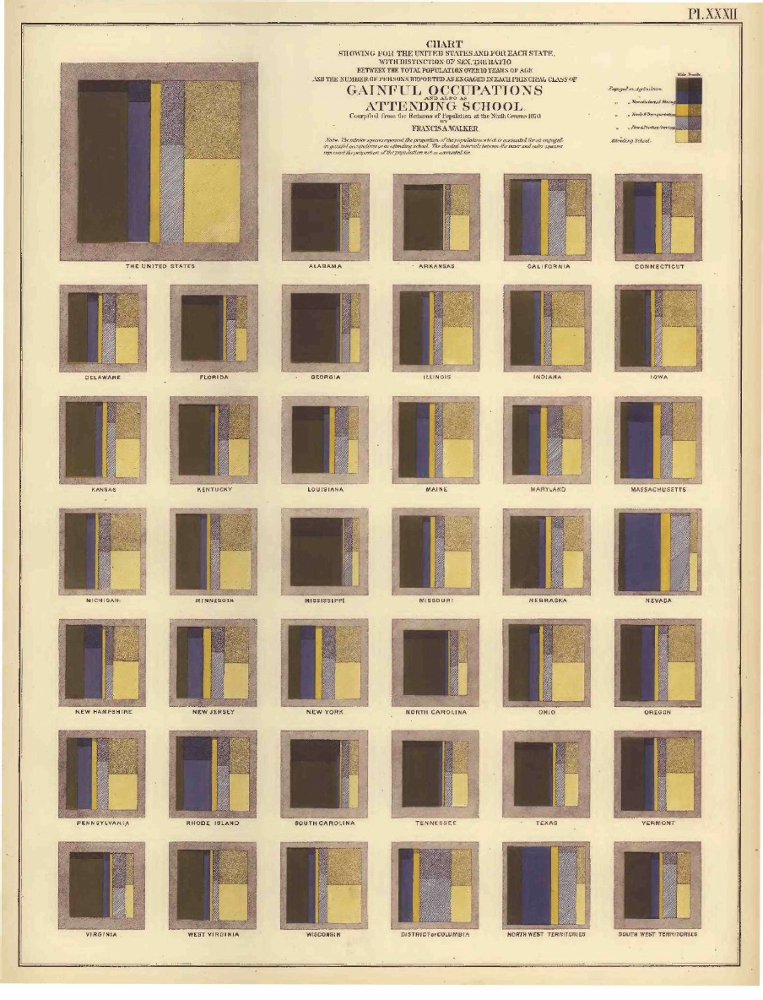
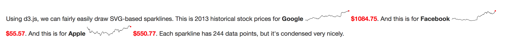
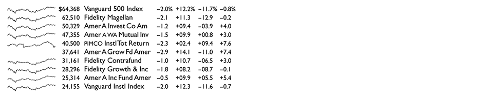
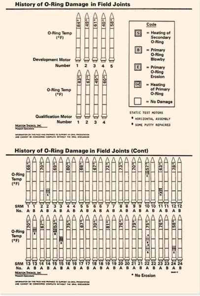
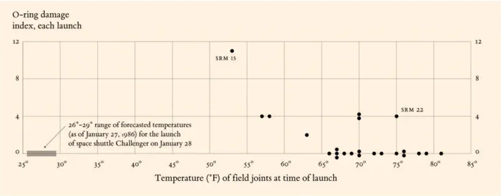
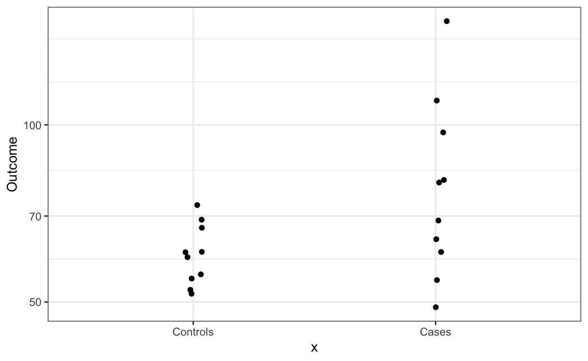

```{r}
#| label: setup
#| echo: FALSE
library(knitr)
library(tidyverse)
library(dslabs)
library(ggridges)
library(palmerpenguins)
library(patchwork)

penguins <- penguins |>
    filter(!is.na(sex))

theme_set(theme_classic() + theme(panel.border= element_rect(fill = NA, linewidth = .5)))
set.seed(2026)
```

References

- https://observablehq.com/plot/features/facets
- https://www.edwardtufte.com/notebook/sparkline-theory-and-practice-edward-tufte/
- vconcat, hconcat https://idl.uw.edu/mosaic/examples/weather.html
- https://observablehq.com/@didoesdigital/about-sparklines
- https://observablehq.com/@kgryte/stdlib-unicode-sparkline-column-chart
- https://medium.com/@hint_fm/design-and-redesign-4ab77206cf9
- https://simplystatistics.org/posts/2019-02-21-dynamite-plots-must-die/

## Concepts

1. It might seem like we’re limited with the total number of variables we can
display at a time. While there are many types of encodings we could in theory
use, only a few them are very effective, and they can interfere with one
another.

1. There are several ways around this, though. One of the most effective is to
combine multiple views, either in parallel (small multiples) or which complement
one another (multiform views). We'll study why this works and the design
considerations that make the results more readable.

### Small Multiples

1. Our eyes are good at making sense of many small plots, as long as there is
shared structure across the plots. We can quickly scan the collection and spot
meaningful relationships. Formally, a small multiples plot first partitions the
data into disjoint subsets and then applies the same encoding to each of the
subsets. Each subset is associated with a small panel within the larger plot.

1. Some important considerations are,

   - Should the views share the same axes? Sharing makes panels directly
   comparable, but if the data ranges are very different, it might be difficult
   to read differences within some of the panels.
   - How should the panels be arranged? If the subsets are determined by a
   categorical variable, we could always use sort alphabetically to help with
   direct lookups. Alternatively, we could sort by some property of the data
   within each panel (e.g., average $y$-axis value).

   The basic downside of this approach is that it takes up a lot of space, since we are repeating an base visualization many times. When there are many subsets, we either have to shrink the individual panels (which can become illegible) or make the visualization very large (which we may not want to do if it's not the most important message to communicate).

1. Here's a historical example, by Francis Walker for the 1870 US Census.  Note
the simplicity of each component, which keeps the overall display readable.

   

1. Keep these kinds of plots in mind as a potential alternative to
interactivity. When we cover interactive visualization, we will show how to use
user-controlled inputs to filter down to different subsets and update the visual
display accordingly. This serves a similar purpose as small multiples, and
doesn't have the problem of taking up so much space as small multiple plots.
However, interactivity has the downside of creating a large memory burden (the
same problem applies to animation). We have remember what the previous subset
looked like, while with small multiples we can make the comparison directly.
Here's a famous historical example to highlight the benefit of small multiples
in reducing memory burden, from Muybridge.

   

1. Ridge plots are a special case of small multiples that are particularly
suited to displaying multiple parallel time series or densities.  An example
ridge plot for the gapminder dataset is shown below. The effectiveness of this
plot comes from the fact that multiple densities can be displayed in close
proximity to one another, making it possible to facet across many variables in a
space-efficient way.

    ```{r}
#| echo: FALSE
data(gapminder)
gapminder <- gapminder |>
  mutate(
    dollars_per_day = (gdp / population) / 365,
    group = case_when(
      region %in% c("Western Europe", "Northern Europe","Southern Europe",  "Northern America",  "Australia and New Zealand") ~ "West",
      region %in% c("Eastern Asia", "South-Eastern Asia") ~ "East Asia",
      region %in% c("Caribbean", "Central America",  "South America") ~ "Latin America",
      continent == "Africa" &  region != "Northern Africa" ~ "Sub-Saharan",
      TRUE ~ "Others"
    ),
    group = factor(group, levels = c("Others", "Latin America",  "East Asia", "Sub-Saharan", "West")),
    west = ifelse(group == "West", "West", "Developing")
  )
    ```


    ```{r}
#| echo: FALSE
past_year <- 1970
gapminder_subset <- gapminder %>%
  filter(year == past_year, !is.na(dollars_per_day))

ggplot(gapminder_subset, aes(dollars_per_day, group)) +
  geom_density_ridges() +
  scale_x_log10()
    ```

1. Why not plot the raw data? We do this using a `geom_point` below. The result
isn’t as satisfying, because, while the shape of the ridges popped out
immediately in the original plot, we have to invest a bit more effort to
understand the regions of higher density in the raw data plot. Also, when there
are many samples, the entire range might appeared covered in marks when in fact
there are some intervals with higher density than others.

    ```{r}
#| echo: FALSE
ggplot(gapminder_subset, aes(dollars_per_day, group)) +
  geom_point(shape = "|", size = 5) +
  scale_x_log10()
    ```

    A nice compromise is to include both the raw positions and the smoothed
densities.

    ```{r}
#| echo: FALSE
ggplot(gapminder_subset, aes(dollars_per_day, group)) +
  geom_density_ridges(
    jittered_points = TRUE,
    position = position_points_jitter(height = 0),
    point_shape = '|', point_size = 3
  ) +
  scale_x_log10()
    ```

1. Another special case are sparklines. These are small, simplified line plots
that are integrated directly into text.

   

   They show trends without any axes or labels, which keeps them from feeling
   too cluttered. At most, selective annotation can be used highlight a few
   points of interest.

1. Besides direct integration into text, it's common to see sparklines in merged
into standalone figures. Even though there are many plots, the fact that they
all share the same encoding means our eyes quickly recognize groupings and
exceptions.

   

### Multiform Plots

1. Small multiples are useful whenever we want different rows of the data to
appear in different panels. What if we want to compare different columns, or
work with several datasets? An alternative is to use multiform plots.  The idea
is to construct plots separately and then combine them only at the very end.
This can be understood as the opposite of small multiples: Instead of applying
the same encoding to different data subsets, we show different encodings of the
same data.

1. The main advantage of multiform plots is that individual panels can be
tailored to specific visual comparisons, but relationships across panels can
also be studied. For example, the plot below shows change in the total number
and composition of undergraduate majors over the last few decades. In principle,
the same information could be communicated using a stacked area plot. However,
comparing the percentages for 1970 and 2015 is much more straightforward using a
line plot, and we can still see changes in the overall number of degrees using
the area plot.

    ```{r}
#| echo: FALSE
#| fig-width: 10
#| fig-height: 3.5
    # trends in bachelor's degrees plot
    library(tidyverse)
    library(scales)
    library(patchwork)

    degrees <- read_csv("https://raw.githubusercontent.com/krisrs1128/stat436_s23/main/data/degrees.csv") %>%
        filter(field %in% c("Business", "Health professions and related programs", "Social sciences and history", "Psychology", "Education"))

    p <- list()
    p[["trend"]] <- degrees %>%
      group_by(year) %>%
      summarise(total = sum(count)) %>%
      ggplot() +
        geom_area(aes(year, total)) +
        scale_x_continuous(expand = c(0, 0)) +
        scale_y_continuous(expand = c(0, 0, 0.1, 0), labels = label_number(scale_cut = cut_short_scale())) +
        labs(x = NULL, y = "degrees awarded")

    delta_data <- degrees %>%
      filter(year %in% c(1971, 2015))

    p[["delta"]] <- ggplot(delta_data, aes(year_str, perc)) +
      scale_x_discrete(expand = c(0.05, 0.01, 0, 0.9)) +
      scale_y_continuous(labels = label_percent()) +
      geom_point() +
      geom_text(
        data = delta_data %>% filter(year == 2015),
        aes(label = str_wrap(field, 20)),
        size = 3.5, nudge_x = 0.04, hjust = 0
      ) +
      geom_line(aes(group = field)) +
      labs(x = NULL, y = "proportion of degrees")

    p[["trend"]] + p[["delta"]] +
      plot_layout(widths = c(0.65, 0.35))
    ```

    For reference, here is a non-multiform display of the same information.

    ```{r}
#| echo: FALSE
    ggplot(degrees) +
      geom_area(aes(year, count, fill = field)) +
        scale_x_continuous(expand = c(0, 0)) +
        scale_y_continuous(expand = c(0, 0, 0.1, 0), labels = label_number(scale_cut = cut_short_scale())) +
        scale_fill_brewer(palette = "Set2")
    ```

1. There are a few considerations that can substantially improve the quality of
a multiform plot,

    * Consistent visual encodings for shared variables
    * Clear, but unobtrusive annotation
    * Proper alignment in figure baselines

    We will discuss each point separately.

1. The figures below are multiform plots of a dataset of athlete physiology. They
are very similar, but the second is better because it enforces a more strict
consistency in encodings across panels. Specifically, the male / female variable
is (1) encoded using the same color scheme across all panels and (2) ordered so
that female repeatedly appears on the right of male.

    ```{r}
#| echo: FALSE
    athletes <- read_csv("https://raw.githubusercontent.com/krisrs1128/stat436_s23/main/data/athletes.csv") %>%
      filter(sport %in% c("basketball", "field", "rowing", "swimming", "tennis", "track (400m)"))
    p <- list()

    p[["bar"]] <- athletes %>%
      count(sex) %>%
      mutate(sex = factor(sex, levels = c("m", "f"))) %>%
      ggplot() +
      geom_bar(aes(sex, n), stat = "identity") +
      scale_y_continuous(expand = c(0, 0))
    p[["scatter"]] <- ggplot(athletes) +
      geom_point(aes(rcc, wcc, col = sex)) +
      scale_color_brewer(palette = "Set1")
    p[["box"]] <- ggplot(athletes) +
      geom_boxplot(aes(sport, pcBfat, fill = sex))

    (p[["bar"]] + p[["scatter"]]) / p[["box"]]
    ```

    The improved, visually consistent approach is given below.

    ```{r}
#| echo: FALSE
    athletes <- athletes %>%
      mutate(sex = recode(sex, "m" = "male", "f" = "female"))

    p[["bar"]] <- athletes %>%
      count(sex) %>%
      ggplot() +
      geom_bar(aes(sex, n, fill = sex), stat = "identity") +
      scale_y_continuous(expand = c(0, 0)) +
      scale_fill_brewer(palette = "Set1") +
      labs(y = "number")
    p[["scatter"]] <- ggplot(athletes) +
      geom_point(aes(rcc, wcc, col = sex)) +
      scale_color_brewer(palette = "Set1") +
      theme(legend.position = "none") +
      labs(x = "RBC count", y = "WBC Count")
    p[["box"]] <- ggplot(athletes) +
      geom_boxplot(aes(sport, pcBfat, col = sex, fill = sex), alpha = 0.5) +
      scale_color_brewer(palette = "Set1") +
      scale_fill_brewer(palette = "Set1") +
      theme(legend.position = "none") +
      labs(y = "% body fat", x = NULL)

    (p[["bar"]] + p[["scatter"]]) / p[["box"]] +
      plot_layout(guides = "collect") &
      plot_annotation(theme = theme(legend.position = "bottom"))
    ```

1. Effective annotation can be used to refer to different subpanels of the data
without drawing too much attention to itself. Labels should be visible but
subtle -- not too large, similar fonts as the figures, and logically ordered
((a) on top left). A nice heuristic is to think of these annotations like page
numbers. They are useful for making references, but aren't something that is
actively read.

    ```{r}
#| echo: FALSE
    p[["bar"]] <- p[["bar"]] + ggtitle("a")
    p[["scatter"]] <- p[["scatter"]] + ggtitle("b")
    p[["box"]] <- p[["box"]] + ggtitle("c")

    (p[["bar"]] + p[["scatter"]]) / p[["box"]] +
      plot_layout(guides = "collect") &
      plot_annotation(theme = theme(legend.position = "bottom"))
    ```

  1. For alignment, we will want figure baselines / borders to be consistent.
  Misalignment can be distracting. This is primarily a problem when multiform plots
  are made from manually. If we follow the programmatic approaches discussed in
  the next lecture, we won't have this issue.


### Information Density

1. Small multiples (and especially sparklines) are most legible when they trim
away extraneous marks, allowing us to focus on the data itself. This principle
applies to other figures and has been called _information density_ or the
_data-to-ink ratio_. We can increase information density by trimming away grid
lines, reducing the number of digits in axes labels, removing borders from
legends, etc.

1. A startling example is this redesign of a visualization related to the Space
Shuttle Challenger disaster, which was caused by damage to the shuttle's O-rings
due to unusually cold weather. Here is a version from the official investigation
into the disaster.

   

   Edward Tufte redesigned the figure to increase the data-to-ink ratio,

   

   which makes the relationship between temperature and O-ring damage much
   clearer. Tufte argues that had these clearer visualization designs been part
   of standard practice at NASA, then the disaster might have been prevented. We
   should take this with a grain of salt, though.  [viegaswattenberg] point out
   that the safety of the launch could be affected by many components of the
   shuttle, each of which could be damaged by environmental or engineering
   factors. We only know to plot temperature against O-ring damage after the
   disaster already happened.

1. Nonetheless, increasing information density (and removing irrelevant marks)
is something always worth considering. One corrolary is that we should avoid
"premature summarization." By reducing data to aggregate statistics, we reduce
the amount of information available to the viewer. For example, instead of showing "dynamite plot",

   it is more informative to show the points,

   

   If summaries are essential for making comparisons, then we could
   alternatively superimpose them over the raw data [irizzary] using a boxplot
   or ridgeplot.

   

## Implementation

### `ggplot2`

1. There are two ggplot2 layers for making small multiples, which the package
calls "facets". The first, `facet_grid` uses formula syntax to split the data
into subsets, each of which is associated with a panel. For example, `~ island` splits the three islands into columns.

```{r}
#| echo: true
#| fig-height: 2.5
ggplot(penguins, aes(bill_length_mm, bill_depth_mm, color = species)) +
    geom_point() +
    facet_grid(~ island)
```

   Placing the variable before the `~` splits across rows.

   ```{r}
#| echo: true
#| fig-height: 3.5
ggplot(penguins, aes(bill_length_mm, bill_depth_mm, color = species)) +
    geom_point() +
    facet_grid(island ~ .)
   ```


   We can facet across multiple variables. Variables before `~` are split across
   rows, those afterwards are split across columns.

   ```{r}
#| echo: true
#| fig-height: 3.5
ggplot(penguins, aes(bill_length_mm, bill_depth_mm, color = species)) +
    geom_point() +
    facet_grid(sex ~ island)
   ```

   Exercise: How might we facet with a continuous variable? Hint: Consider
   `cut()`.

   Exercise: What about more complicated formulas? Try `sex + island ~ year`

1. If we have many very many panels and don't want them all in one row, we can
use `facet_wrap`. It enforces a maximum number of panels per row and wraps extra
panels onto new rows.

   ```{r}
#| echo: true
#| fig-height: 2.5
ggplot(penguins, aes(bill_length_mm, bill_depth_mm, color = species)) +
  geom_point() +
  facet_wrap(~island)
   ```

1. By default, the panels are sorted alphabetically. But to increase information
density, it helps to instead sort by a property of the data. We can use
`reorder` within our formula to sort the categories by a variable of interest.

```{r}
#| echo: true
#| fig-height: 2.5
ggplot(penguins, aes(bill_length_mm, bill_depth_mm, color = species)) +
  geom_point() +
  facet_wrap(~reorder(island, bill_length_mm))
```

   Exercise: By default `reorder` sorts using the mean of the second argument within each group of the first. It's possible to sort by other properties, like median or variance. How is this done?

### `ggridges`

1. The ggridges package can be used to create ridge plots. If we want to
organize many densities according to a ridge plot, we can use
`geom_density_ridges`.

```{r}
#| echo: true
#| fig-height: 2.5
ggplot(penguins, aes(body_mass_g, species, fill = species)) +
  geom_density_ridges()
```

1. Sometimes we want a ridge plot and already have the height values for the
ridges computed in advance. In this case, we can use `geom_ridgeline` with a
height encoding.

```{r}
#| fig-height: 2.5
#| echo: true
tibble(x = seq(0, 1, length.out = 10)) |>
    mutate(
       `y = x` = x,
       `y = x^2` = x^2
    ) |>
    pivot_longer(-x, names_to = "f", values_to = "y") |>
    ggplot(aes(x, f, height = y)) +
    geom_ridgeline()
```

### `patchwork`

1. `patchwork` can be used to merge ggplot2 components into multiform plots. It
uses `a + b` to places ggplot objects `a` and `b` side-by-side and `/` to place
them vertically. The `plot_layout` command can be used to customize the theme of
the overall plot, for example, setting `guides = "collect"` ensures all legends
are taken out of the component plots and gathered in a single place. We can also
use the `widths` and `heights` argument of this function to control the relative
size of the components.

```{r}
#| echo: true
#| fig-height: 2.5
p1 <- ggplot(penguins, aes(bill_length_mm, bill_depth_mm, color = species)) +
  geom_point()

p2 <- ggplot(penguins, aes(body_mass_g, fill = species)) +
  geom_histogram(bins = 30) +
  scale_fill_discrete(guide = "none")

p1 + p2 +
  plot_layout(guides = "collect")
```

_Exercise: We removed the color legend for the histogram `p2` using `guide = "none"` in the `scale_fill_discrete` layer. Why? What would have happened to the plot if we removed this layer?_

1. We can use `+` and `/` like algebraic symbols to compose more complex
layouts. For example, below we place two plots side-by-side and both of those on
top of a third.

```{r}
p3 <- ggplot(penguins, aes(flipper_length_mm, body_mass_g, color = species)) +
  geom_point()

(p1 + p2) / p3 +
  plot_layout(guides = "collect")
```

### vgplot concat

1. Let's first read in the penguins dataset. The code is a bit tedious because
the original data have `NA` values, which causes the any variable with missing
values to be read as a string, even when it should be treated as a numerical
variable.

```{ojs}
vg = {
  const mod = await import("https://cdn.jsdelivr.net/npm/@uwdata/vgplot@0.4.0/+esm");
  const wasm = await mod.wasmConnector();
  mod.coordinator().databaseConnector(wasm);
  return mod;
}

// load the penguins data
penguins_db = {
  await vg.coordinator().exec(`
    CREATE TABLE IF NOT EXISTS penguins AS
    SELECT
      species,
      island,
      bill_length_mm::DOUBLE AS bill_length_mm,
      bill_depth_mm::DOUBLE AS bill_depth_mm,
      flipper_length_mm::DOUBLE AS flipper_length_mm,
      body_mass_g::DOUBLE AS body_mass_g,
      sex
    FROM read_csv_auto(
      'https://raw.githubusercontent.com/allisonhorst/palmerpenguins/main/inst/extdata/penguins.csv'
    )
    WHERE species IS NOT NULL
      AND bill_length_mm != 'NA'
  `);
  return true;
}
```

1. `vgplot` doesn't support faceting directly, but you can compose component
plots using `hconcat` and `vconcat`, analogous to patchwork's `+` and `/`. This
can be used to manually create faceted plots, but the subsets and component
plots have to be created manualy.

```{ojs}
{
  await penguins_db;

    // define two component plots
    const scatterPlot = vg.plot(
        vg.dot(
            vg.from("penguins"),
            {x: "bill_length_mm", y: "bill_depth_mm", fill: "species"}
        ),
        vg.width(300),
        vg.height(250)
    );

    const barChart = vg.plot(
        vg.rectY(
            vg.from("penguins"),
            {x: vg.bin("body_mass_g"), y: vg.count(), fill: "species"}
        ),
        vg.width(300),
        vg.height(250)
    );

    // combine with hconcat
    return vg.hconcat(scatterPlot, barChart);
}
```
