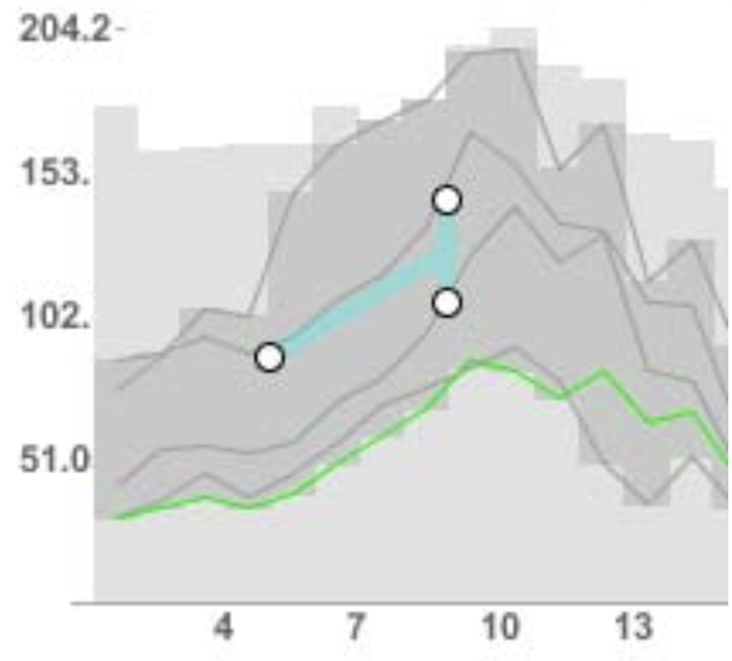
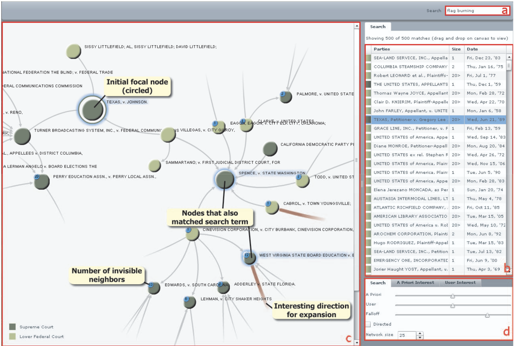

```{r}
#| label: setup
#| echo: false
library(tidyverse)
theme_set(theme_classic() + theme(panel.border= element_rect(fill = NA, linewidth = .5)))
set.seed(2026)
```

reading:
- https://mastering-shiny.org/basic-reactivity.html
- https://homes.cs.washington.edu/~jheer/files/idfva-draft.pdf

## Taxonomy: View Manipulation

1. Besides data and view specification, interactivity can support view
manipulation. Important actions associated with view specification are,

   - **Select** items to focus or operate on.
   - **Navigate** the view to an region of interest.
   - **Coordinate** interactions across related panels.
   - **Organize** views into an easier to understand layout.

1. **Selection** operations are used to direct our attention to subsets of
particular interest. While we could use a search bar or dropdown widget for this
purpose, these require a priori knowledge of groups of interest. To highlight
items based on plot itself, we can instead use click or hover events. These
types of inputs (based on the plot rather than external widgets) are called
graphical queries.



Hover and click are useful for individual samples. For groups, we can instead
use brushes (interactive rectangular selections).  This examples uses brushes on
a parallel coordinates and shows that low weight cars transitioned to having
lower MPG in the late 1970s.



Instead of brushes, for some data it makes more sense to define lassos
(arbitrarily shaped selections).



1. Rather than querying the samples directly, we can query properties of the
samples. For example, this version of
[TimeSearcher](https://www.youtube.com/watch?v=VWx1TMcrb74) lets us we can
search for all lines with slopes within a certain range.

   

1. In complex data, we often **navigate** to a particular view of interest. Some
visualizations act like small viewports into a larger display, in which case
navigation might mean panning and zooming the viewport to the region of
interest.

   

1. Beyond literal navigation across visualization space, it is often helpful to
navigate across resolutions.  Focus-plus-context visualizations include a
graphical overview that, when queried, reveals extra details (the focus) without
losing the context. Some examples,

    - To navigate a very large tree, we would start most of the subtrees collapsed into intermediate notes, and when those nodes are clicked, the associated subtrees can be expanded. The graphical query is clicking on or near a node.
    - To navigate a very detailed map, we can show an overview of the main landmarks. By brushing on this overview map, we update another panel giving all the details within that brushed region. The graphical query is brushing on the overview map.

   This principle is summarized by Shneiderman's Mantra: Overview first, zoom
   and filter, then details-on-demand.

1. Focus-plus-context only makes sense when an overview is useful. A laywer
interested in a particular case doesn't need an overview of all cases ever
litigated, instead they need to navigate to cases similar to the one they are
working on. In this case, an alternative to Shneiderman's mantra is "Search,
Show Context, Expand on Demand"

   

1. Interactivity can also be used to **coordinate** views. This is especially
helpful when working with small multiples and multipanel layouts. Dynamic
linking is a visualization technique where interacting with one view updates
others. For example, selecting a sample (or group of samples) in one view
highlights or filters the corresponding samples in the other views.

   Here is an example where each panel has the same visual encoding. By brushing
   the delays histogram, we can see that the most delayed flights often depart
   later in the day.

   

   Here is a multipanel example. We can see which departure/dropoff combinations
   are most common and they change over the course of the day.

   

1. Finally, interactivity can be used to **organize** displays. We're so used to
working with multiple windows open at a time that it's easy to forget that this
is indeed a form of interactivity. We have to deliberately tell our
visualization to adjust $x$ and $y$ axis scales so that when the window is
resized, the plot remains visible.

1. Altogether this taxonomy shows that interactivity entails many design choices
into visualization, more than we already had with deciding on graphical
encodings in static visualizations. Which features or samples should be
queryable, and how (widget vs. graphical, click vs. brush, ...)?  Earlier we saw
that the hierarchy of encodings means the choice of design will prioritize
certain comparisons over others. Similarly, choices of interactivity will
prioritize some queries over others. As designers, it's our responsibility to
know which queries our users will be most likely to care about and create
visualizations that help them resolve them accurately and easily.

1. How should we search across the (vast) space of possible visualization
designs? From a review of design studies, Tamara Munzner recommends ....

## Implementation Patterns

1. Mosaic can also be used for view manipulation through
[interactors](https://idl.uw.edu/mosaic/api/vgplot/interactors.html). These take
`Selection` objects whose values will be modified through the plot interactions.
These interactors are usually paired with `vg.highlight`, so that once the
`Selection` changes, the view updates to reflect that.

For example, the `vg.interval*` family of interactors define different types of
brushes. The code below will update the `range` reactive value every time the
brush is changed, and any point that falls out of the interval will have its
color change to grey (`fill: "#ccc"`) and be made semitransparent (`fillOpacity:
0.2`).

```js
const $range = vg.Selection.intersect();

vg.plot(...
      vg.intervalX({as: $range, brush: {fill: "none"}}),
      vg.highlight({by: $range, fill: "#ccc", fillOpacity: 0.2}),
      ...
)
```

1. A similar options works for hover events. In the sketch below, we update the
`$curr` selection based on the $x$-value of the user's mouse position. The
`vg.highlight` element then monitors changes in the selection and makes all
points outside the selection more transparent.

```js
const $curr = vg.Selection.intersect();

vg.plot(...
  vg.nearestX({as: $curr}),
  vg.highlight({by: $curr}),
  ...
)
```

1. For view coordination, we can use a selection to filter the data shown in
panels besides the one that's being interacted with. This is done by modifying
the input data argument, using a `vg.from` call. For example, for a brush
defined in the first panel to change the data that appears in panel 2, we can
use a pattern like the one below.

```js
const $range = vg.Selection.intersect();

vg.plot(...
    // define range on first panel
    vg.plot_panel1(
        vg.intervalX({as: $range})
    )

    // update the data in the second
    vg.plot_panel2(
        vg.from("database_name", {filterBy: $range}),
    )
)

```

## Implementation Example

1. Let's use these patterns to build a richer example, one step at a time. Our
target is the [Seattle weather
interactive](https://idl.uw.edu/mosaic/examples/weather.html) from the Mosaic
gallery, shown below. It implements several types of view manipulation,

   - Brush the scatterplot of maximum temperature. This changes the heights of bars on the bottom panel, restricting counts to the selected date range.
   - Click on bars in the bottom panel. This filters the points that appear in the main panel and greys out unselected legend items. Clicking again reselects all weather categories.
   - Click on the legend. This changes both the scatterplot and barplot, just like clicking the bars.

```{ojs}
//| echo: false
$click = vg.Selection.single()
$range = vg.Selection.intersect()

vg.vconcat(
  vg.hconcat(
    vg.plot(
      vg.dot(
        vg.from("weather", {filterBy: $click}),
        {
          x: vg.dateMonthDay("date"),
          y: "temp_max",
          fill: "weather",
          r: "precipitation",
          fillOpacity: 0.7
        }
      ),
      vg.intervalX({as: $range, brush: {fill: "none", stroke: "#888"}}),
      vg.highlight({by: $range, fill: "#ccc", fillOpacity: 0.2}),
      vg.colorLegend({as: $click, columns: 1}),
      vg.xyDomain(vg.Fixed),
      vg.xTickFormat("%b"),
      vg.colorDomain($domain),
      vg.colorRange($colors),
      vg.rDomain(vg.Fixed),
      vg.rRange([2, 10]),
      vg.width(680),
      vg.height(300)
    )
  ),
  vg.plot(
    vg.barX(
      vg.from("weather"),
      {x: vg.count(), y: "weather", fill: "#ccc", fillOpacity: 0.2}
    ),
    vg.barX(
      vg.from("weather", {filterBy: $range}),
      {x: vg.count(), y: "weather", fill: "weather"}
    ),
    vg.toggleY({as: $click}),
    vg.highlight({by: $click}),
    vg.xDomain(vg.Fixed),
    vg.yDomain($domain),
    vg.yLabel(null),
    vg.colorDomain($domain),
    vg.colorRange($colors),
    vg.width(680)
  )
);
```

1. Before we construct this plot, let's create the coordinator. We refer to a
version of the dataset saved in the `parquet` file linked below (you can also
browse it
[here](https://raw.githubusercontent.com/uwdata/mosaic/main/data/seattle-weather.parquet)).

```{ojs}
vg = {
  const vg = await import("https://cdn.jsdelivr.net/npm/@uwdata/vgplot@0.19.0/+esm");
  const wasm = await vg.wasmConnector();
  vg.coordinator().databaseConnector(wasm);
  await vg.coordinator().exec([
    vg.loadParquet("weather", "https://raw.githubusercontent.com/uwdata/mosaic/main/data/seattle-weather.parquet")
  ]);
  return vg;
}
```

We define the color schemes as a `Param` object so that if we ever change the
palette, all the plots will automatically rerender.

```{ojs}
$domain = vg.Param.array(["sun", "fog", "drizzle", "rain", "snow"])
$colors = vg.Param.array(["#e7ba52", "#a7a7a7", "#aec7e8", "#1f77b4", "#9467bd"])
```

1. Before adding interactivity, let's create a static version. This forces us to
define the basic graphical marks (like dots) and the associated encodings (e.g.,
date $\to$ $x$ position, temperature $\to$ $y$ position). We combine the panels
into a stacked layout using `vconcat`.

```{ojs}
vg.vconcat(
  vg.plot(
    vg.dot(
      vg.from("weather"),
      {
        x: vg.dateMonthDay("date"),
        y: "temp_max",
        fill: "weather",
        r: "precipitation"
      }
    ),
    vg.colorLegend(),
    vg.colorDomain($domain),
    vg.colorRange($colors)
  ),
  vg.plot(
    vg.barX(
      vg.from("weather"),
      {x: vg.count(), y: "weather", fill: "weather"}
    ),
    vg.yDomain($domain),
    vg.colorDomain($domain),
    vg.colorRange($colors)
  )
);
```

1. We now add a brushing **selection** to the scatterplot, without attempting to
coordinate the views. This is the `intervalX` brushing approach described above.
Whenever the brush is moved, it triggers a change to `vg.highlight`, which greys
out all the points that don't fall into the `range_v1`
selection^[We're using the suffices `_v1`, `_v2`, ... to distinguish between
selections across our implementation versions.]

```js
const $range_v1 = vg.Selection.intersect();

vg.plot(
  ...
  vg.intervalX({as: $range_v1, brush: {fill: "none"}}),
  vg.highlight({by: $range_v1, fill: "#ccc", fillOpacity: 0.2}),
  ...
)
```

We also set `vg.xyDomain(vg.Fixed)` so that the axes are fixed throughout all
our interactions. If we removed this, the axes limits would change with each
interaction, which makes comparisons more difficult.

```{ojs}
$range_v1 = vg.Selection.intersect()

vg.vconcat(
  vg.plot(
    vg.dot(
      vg.from("weather"),
      {
        x: vg.dateMonthDay("date"),
        y: "temp_max",
        fill: "weather",
        r: "precipitation"
      }
    ),
    vg.intervalX({as: $range_v1, brush: {fill: "none"}}),
    vg.highlight({by: $range_v1, fill: "#ccc", fillOpacity: 0.2}),
    vg.colorLegend(),
    vg.xyDomain(vg.Fixed),
    vg.colorDomain($domain),
    vg.colorRange($colors)
  ),
  vg.plot(
    vg.barX(
      vg.from("weather"),
      {x: vg.count(), y: "weather", fill: "weather"}
    ),
    vg.yDomain($domain),
    vg.colorDomain($domain),
    vg.colorRange($colors)
  )
);
```

1. Next let's **coordinate** the two plots, so that the barplot reflects the
brushed date range. We can think of this like the conditional distribution of
weather types given the selected date range. We use the same `vg.from()` pattern
from the previous section, where we set `filterBy` to the range `Selection`
object (which changes each time we brush).

```js
vg.plot(
  vg.barX(
    vg.from("weather", {filterBy: $range_v2}),
    {x: vg.count(), y: "weather", fill: "weather"}
  ),
  ...
)
```

This adjusts the height of the bars, but loses context about the original
distribution over weather types. To keep that context, we can keep an unfiltered
version of the barplot as the background in grey (hex code `#ccc`). This is a
basic form of the focus-plus-context principle.

```js
vg.plot(
  // unfiltered background distribution over the full dataset
  vg.barX(
    vg.from("weather"),
    {x: vg.count(), y: "weather", fill: "#ccc", fillOpacity: 0.2}
  ),
  // filtered counts restricted to the brushed range
  vg.barX(
    vg.from("weather", {filterBy: $range_v2}),
    {x: vg.count(), y: "weather", fill: "weather"}
  ),
  ...
)
```

This is the updated plot.

```{ojs}
$range_v2 = vg.Selection.intersect()

vg.vconcat(
  vg.plot(
    vg.dot(
      vg.from("weather"),
      {
        x: vg.dateMonthDay("date"),
        y: "temp_max",
        fill: "weather",
        r: "precipitation"
      }
    ),
    vg.intervalX({as: $range_v2, brush: {fill: "none"}}),
    vg.highlight({by: $range_v2, fill: "#ccc", fillOpacity: 0.2}),
    vg.colorLegend(),
    vg.xyDomain(vg.Fixed),
    vg.colorDomain($domain),
    vg.colorRange($colors)
  ),
  vg.plot(
    vg.barX(
      vg.from("weather"),
      {x: vg.count(), y: "weather", fill: "#ccc", fillOpacity: 0.2}
    ),
    vg.barX(
      vg.from("weather", {filterBy: $range_v2}),
      {x: vg.count(), y: "weather", fill: "weather"}
    ),
    vg.xDomain(vg.Fixed),
    vg.yDomain($domain),
    vg.colorDomain($domain),
    vg.colorRange($colors)
  )
);
```

1. Finally, let's support **selection** through clicks on the barplot and the
legend. We define a new `click_v3` selection object. Notice here we're using
`vg.Selection.single()` rather than `vg.selection.intersect()`, because we only
want to filter by one bar at a time (the new bar replaces the previous bar's
filtering statement rather than being merged with it -- try swapping `single`
with `intersect` or `union` and see how the interaction changes).

`click_v3` appears in four places, twice to monitor for user inputs and twice to
update the in response.

   - Tracking: `vg.toggleY({as: $click_v3})` in the barplot tracks which weather type is clicked, and `vg.colorLegend({as: $click_v3})` does the same for the color legend.
    - Responding: `vg.from("weather", {filterBy: $click_v3})` filters data in the scatterplot to reflect the clicked wehather type (it is the first argument in the dotplot, which defines the data to display), and `vg.highlight({by: $click_v3})` greys out the unclicked bars in the barplot.

   At this point our implementation matches the version at the top, except for
   relatively small customizations on the theme, like the color of our brush or
   formatting the tick marks.  You can review the source code to see the full
   code for our original version.

```{ojs}
$click_v3 = vg.Selection.single()
$range_v3 = vg.Selection.intersect()

vg.vconcat(
  vg.plot(
    vg.dot(
      vg.from("weather", {filterBy: $click_v3}),
      {
        x: vg.dateMonthDay("date"),
        y: "temp_max",
        fill: "weather",
        r: "precipitation"
      }
    ),
    vg.intervalX({as: $range_v3, brush: {fill: "none"}}),
    vg.highlight({by: $range_v3, fill: "#ccc", fillOpacity: 0.2}),
    vg.colorLegend({as: $click_v3}),
    vg.xyDomain(vg.Fixed),
    vg.colorDomain($domain),
    vg.colorRange($colors),
    vg.rDomain(vg.Fixed)
  ),
  vg.plot(
    vg.barX(
      vg.from("weather"),
      {x: vg.count(), y: "weather", fill: "#ccc", fillOpacity: 0.2}
    ),
    vg.barX(
      vg.from("weather", {filterBy: $range_v3}),
      {x: vg.count(), y: "weather", fill: "weather"}
    ),
    vg.toggleY({as: $click_v3}),
    vg.highlight({by: $click_v3}),
    vg.xDomain(vg.Fixed),
    vg.yDomain($domain),
    vg.colorDomain($domain),
    vg.colorRange($colors)
  )
);
```

Note the asymmetry in how the two selections are used: the brush *highlights*
in its own panel and *filters* the other panel, while the click *filters* the
scatterplot and *highlights* the barplot. One input can drive many
coordinated responses at once. Since filtering by weather type removes
categories with small dot sizes, we also fix the radius scale with
`vg.rDomain(vg.Fixed)`.

1. This matches the interactive figure at the top of the section — the only
remaining differences in the published gallery version are cosmetic
(`fillOpacity`, month tick formatting, dot size ranges, and figure dimensions).
Stepping back, the finished example is a small web of dependencies: two
reactive selections, five plot components that read from them, and a database
behind everything. The next section introduces a way of drawing this structure
— the reactive graph — that makes designs like this easier to reason about.

## Reactivity

1. The example above looked simple when we only looked at the plot, but the
actual implementation is quite complex. There are two reactive inputs and five
parts of the plot read from them. To organize our thinking about the
dependencies between plot components, it helps to draw a reactive graph.

1. Before giving a more abstract definition, let's see how it works in our
example above.

1. This view immediately suggests some alternatives,

   - Instead of filtering the scatterplot, we could have highlighted points in
   or out of the bars.
   - Instead of selecting one bar at a time, we could have selected multiple at once.

1. More abstractly, a reactive graph summarizes how user inputs propagate
through the visualization. Nodes mean {} and edges are drawn between two nodes
whenever {}.

1. Here's toy example that illustrates why thinking of the reactive graph is
helpful. Consider the app below, which simulates two gaussians and reports a
$t$-statistic for the difference in means. Suppose we begin with this implementation,

(prepare mosaic analog for this.)

```{r}
llibrary(shiny)
library(tidyverse)

ui <- fluidPage(
  titlePanel("Random Normals"),
  numericInput("mean", "Enter the mean", 0),
  sliderInput("n", "Enter the number of samples", 500, min=1, max=2000),
  sliderInput("sigma", "Enter the standard deviation", 1, min=.1, max=5),
  plotOutput("histogram"),
  dataTableOutput("dt")
)

server <- function(input, output) {
  output$histogram <- renderPlot({
    data.frame(values = rnorm(input$n, input$mean, input$sigma)) %>%
      ggplot() +
        geom_histogram(aes(values), bins = 100) +
        xlim(-10, 10)
  })

  output$dt <- renderDataTable({
    data.frame(values = rnorm(input$n, input$mean, input$sigma))
  })
}

app <- shinyApp(ui, server)
```

1. When we draw the reactive graph for this visualization, we can see a problem:
the code reruns `rnorm` for each output. So, even though the interfaces suggests
that the printed samples are the same as the ones in the histogram, they are
actually different. To resolve this, we need a way of storing an intermediate
computation which (1) depends on the inputs but (2) feeds into several outputs.

1. Therefore, we update the graph to trim away the redundant edges.

(prepare the mosaic analog of this)

```{r}
library(shiny)
library(tidyverse)

ui <- fluidPage(
  titlePanel("Random Normals"),
  numericInput("mean", "Enter the mean", 0),
  sliderInput("n", "Enter the number of samples", 500, min=1, max=2000),
  sliderInput("sigma", "Enter the standard deviation", 1, min=.1, max=5),
  plotOutput("histogram"),
  dataTableOutput("dt")
)

server <- function(input, output) {
  samples <- reactive({
    data.frame(values = rnorm(input$n, input$mean, input$sigma))
  })

  output$histogram <- renderPlot({
      ggplot(samples()) +
        geom_histogram(aes(values), bins = 100) +
        xlim(-10, 10)
  })

  output$dt <- renderDataTable(samples())
}

app <- shinyApp(ui, server)}
```

1. Whenever building an interactive visualization, I find it helpful to work
through these steps,

   - Implement a static version of the plot.
   - Decide on candidate reactive graph structures. What are the user inputs, data queries, and visual encoding responses?
   - Implement interactivity one part of the graph at a time.