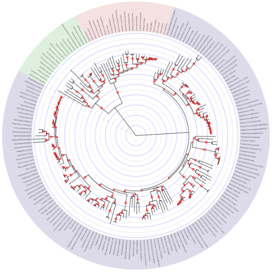
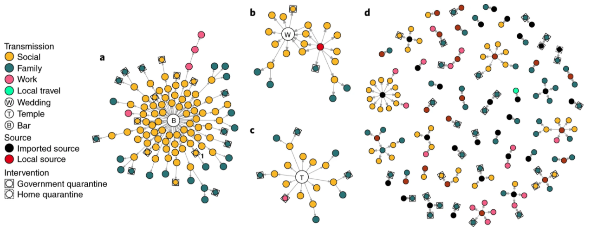
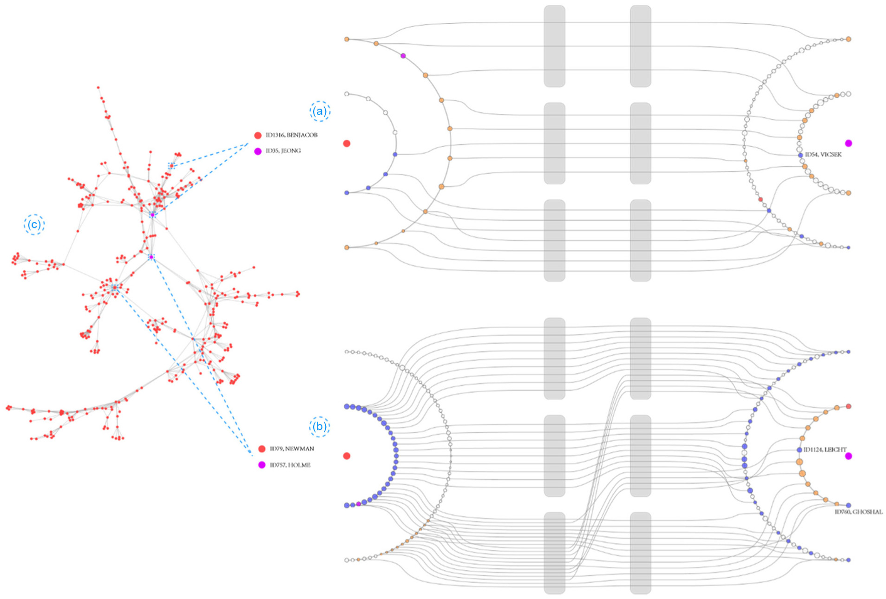
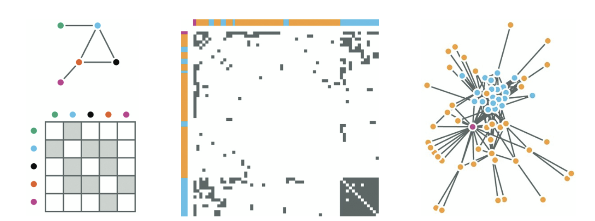
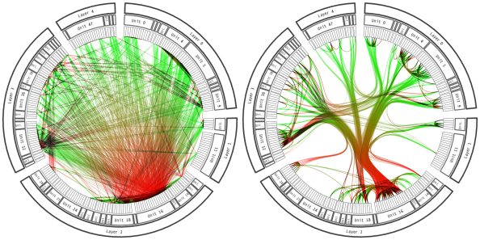

```{r}
#| label: setup
#| echo: false
library(knitr)
library(tidyverse)
library(gridExtra)
library(patchwork)
library(networkD3)
library(igraph)
library(tidygraph)
library(ggraph)
set.seed(2026)
```

## Graph Visualization Tasks

_What are typical queries for graph data?_

1. Graphs are common across a wide range of fields — for example, biochemistry
(metabolic networks), sociology (friendship networks), digital humanities
(letter-writing networks), evolution (phylogenetic trees), transportation
(logistical routing), gastronomy (recipe networks) and cybersecurity
(inter-computer communication). In each of these fields, it's common to
visualize the network. How can network visualization be useful across so many
areas? We'll develop task abstractions that helps us recognize commonalities
across network analysis.  We'll also develop criteria that can be used to
evaluate the quality of the resulting visualizations.

1.  Networks and trees are types of *graphs*, which are defined by (a) a set $V$
of vertices and (b) a set $E$ of edges between pairs of vertices. Some examples
to keep in mind,

    * The Internet: $V = \{\text{All Webpages}\}, \left(v, v^{\prime}\right) \in E$
    if there is a hyperlink between pages $v$ and $v^{\prime}$.
    * Evolutionary Tree: $V = \{\text{All past and present species}\}, \left(v,
    v^{\prime}\right) \in E$ if one of the species $v$ or $v^{\prime}$ is a
    descendant of the other.
    * Disease Transmission: $V = \{\text{Community Members}\}, \left(v,
    v^{\prime}\right) \in E$ if the two community members have come in close
    contact.
    * Directory Tree: $V = \{\text{All directories in a computer}\}, \left(v,
    v^{\prime}\right) \in E$ if one directory is contained in the other.

```{r}
#| label: fig-internet
#| fig-cap: "A visualization of the internet from the [Opte Project](https://opte.org)."
#| echo: false
include_graphics("https://uwmadison.box.com/shared/static/cjk3i7mephlyguka9y5h1d40uy9rhdk2.png")
```

```{r}
#| label: fig-tree-of-life
#| fig-cap: "An evolutionary tree from the [Interactive Tree of Life](https://itol.embl.de/)."
#| echo: false

```

```{r}
#| label: fig-covid
#| fig-cap: "A COVID-19 transmission network, from *Clustering and superspreading potential of SARS-CoV-2 infections in Hong Kong*."
#| echo: false

```

```{r}
#| label: fig-directories
#| fig-cap: "Directories in a file system can be organized into a tree, with parent and child directories."
#| echo: false
include_graphics("https://uwmadison.box.com/shared/static/erbi39htkgzndhxh8yhvcoq3imfkxdca.png")
```

1. Either vertices or edges might have attributes. For example, in the directory
tree, we might know the sizes of the files (vertex attribute), and in the
disease transmission network we might know the duration of contact between
individuals (edge attribute).

1. An edge may be either undirected or directed. In a directed edge, one vertex
leads to the other, while in an undirected edge, there is no sense of ordering.

### Tasks

1. What visual comparisons do networks and trees facilitate? Viewed narrowly,
there are two basic types of queries for graph data. *Topological* queries ask
how nodes are linked with one another — for example, is node A within three
steps of node B? *Attributional* queries instead concern the attributes
associated with nodes and edges — for example, which nodes (or edges) have an
attribute value above X?

1. More broadly, we often visualize graphs with the goal of developing a more
global view beyond isolated nodes. Our initial examples suggest that trees and
networks can represent either physical interactions or conceptual relationships,
and across both, three tasks recur,

    * Searching for groupings
    * Following paths
    * Isolating key nodes

1. By "searching for groupings," we mean finding *clusters* of nodes that are
highly interconnected, but which have few links outside the cluster. This kind
of modular structure might lend itself to deeper investigation within each of
the clusters.

    * Clusters in a network of political blogs might suggest an echo chamber effect.
    * Gene clusters in a differential expression study might suggest pathways
    needed for the production of an important protein.
    * Clusters in a recipe network could be used identify different culinary
    techniques or cuisines.

1. By "following paths," we mean tracing the paths out from a particular node,
to see which other nodes it is close to. This is where *connections* between
nodes or clusters of interest become visible.

    * Following paths in a citation network might reveal the chain of publications
    that led to an important discovery.
    * Following paths in a recommendation network might suggest other users who
    might be interested in watching a certain movie.

```{r}
#| label: fig-recommendation
#| fig-cap: "A recommendation network linking individuals and the movies that they viewed."
#| echo: false
include_graphics("https://psl.linqs.org/assets/images/hyper/fig3.png")
```

1. "Isolating key nodes" is a more fuzzy concept, usually referring to the task
of finding nodes that are exceptional in some way. Two recurring notions of
"exceptional" are *hubs*, which have many more neighbors than other nodes, and
*central* nodes, which lie on the shortest paths between many pairs of nodes.

    * A node with many edges in a disease transmission network is a superspreader.
    * A node that links two clusters in a citation network might be especially
    interdisciplinary.
    * A node with large size in a directory tree might be a good target for
    reducing disk usage.

```{r}
#| label: fig-betweenness
#| fig-cap: "The scientific journal *Social Networks* links several publication communities, as found by *Betweenness Centrality as an Indicator of the Interdisciplinarity of Scientific Journals*."
#| echo: false
include_graphics("https://www.leydesdorff.net/betweenness/index_files/image008.jpg")
```

### What Makes a Good Graph Visualization

1. What distinguishes a good from a bad graph visualization? As in all data
visualization, effectiveness is closely tied to function. The representation and
interaction should make sure information needed to support the intended task is
easily accessible, and that superfluous information does not occupy too much of
the reader's attention.

1. For example, if a visualization has too many edge crossings, then we will
have trouble answering any topological queries — crossings can make it
impossible to follow edges. The remainder of these notes works through the main
alternatives -- node-link diagrams and the layout algorithms that make them
legible, adjacency matrices, enclosure, and edge bundling. Each one makes a
different subset of the tasks above easy, and none of them is best for all
three.

1. In interactive graphs, we should aim to minimize the amount of change in the
positions of the nodes and edges given any user input -- too much movement
creates confusion. The same lesson applies to dynamic graphs. It is hard to make
sense of an evolving graph if the same nodes and edges are unnecessarily jumping
around.

## Representing Graphs in R

1. One of the best R packages for graph manipulation is called `tidygraph`. The
goal of this package is to extend the semantics of the tidyverse to
graph-structured data. We can't simply use the standard `dplyr` functions
because graphs cannot be stored in a single data.frame -- any graph must be
represented by a *pair* of data.frames, one for the nodes and one for the edges,
and the `tidygraph` structure represents graphs in exactly this way.

1. For example, `G` below shows the friendship connections between 70 students
in a high school over two years, derived from a survey conducted in 1957 and
1958. The `Node Data` component gives features for each student (in this case,
just the name), while `Edge Data` represents friendship links between students.

```{r}
G <- as_tbl_graph(highschool)
G
```

1. The beauty of this data structure is that we can define the analogs of the
usual tidyverse verbs for it. For example, we can derive a new node attribute
using `mutate`.

```{r}
G |>
    mutate(favorite_color = sample(c("red", "blue"), n(), replace = TRUE))
```

1. What if we want to mutate the edges instead? We have to tell tidygraph to
"activate" the edge set,

```{r}
G |>
    activate(edges) |>
    mutate(weight = runif(n()))
```

    To avoid these activate calls, a convenient shorthand is calling mutate with
    `%N>%` and `%E>%` for modifying node and edge data, respectively,

```{r}
G %E>%
    mutate(weight = runif(n()))
```

1. There are many other verbs that have been defined for tidygraph objects. For
example, we can join two graphs together.

```{r}
## initialize two simple graphs
G1 <- create_ring(10) %N>%
    mutate(id = LETTERS[1:n()])
G2 <- create_bipartite(4, 2) |>
    mutate(id = LETTERS[1:n()])

## join them together
G1 |>
    graph_join(G2)
```

```{r}
#| label: fig-graph-join
#| echo: false
#| fig-width: 12
#| fig-cap: "A ring graph, a bipartite graph, and the result of joining them."
p_ring <- ggraph(G1) +
    geom_edge_link() +
    geom_node_label(aes(label = id))

p_bipartite <- ggraph(G2) +
    geom_edge_link() +
    geom_node_label(aes(label = id))

p_joined <- ggraph(G1 |> graph_join(G2)) +
    geom_edge_link() +
    geom_node_label(aes(label = id))

p_ring | p_bipartite | p_joined
```

1. Similarly, we can filter nodes or edges based on their attributes.

```{r}
G %E>%
    mutate(weight = runif(n())) |>
    filter(weight < 0.2) |>
    arrange(-weight)
```

1. It's possible to perform simple graph algorithms using these verbs. For
example, we can cluster nodes based on their connection structure. This is our
first "searching for groupings" task, solved computationally rather than
visually.

```{r}
G |>
    to_undirected() |>
    mutate(cluster = group_louvain())
```

```{r}
#| label: fig-louvain
#| echo: false
#| fig-cap: "Louvain clusters in the high school friendship network."
G |>
    to_undirected() |>
    mutate(cluster = group_louvain()) |>
    ggraph() +
    geom_edge_link(width = 0.2) +
    geom_node_point(aes(col = as.factor(cluster)), size = 3) +
    scale_color_brewer(palette = "Set2")
```

1. We can even map over nodes to compute topological queries. For example, the
block below computes the number of neighbors within two steps of each node,
using the [`local_size`
function](https://tidygraph.data-imaginist.com/reference/local_graph.html). More
general operations can be computed using map operations, like
[`map_local`](https://tidygraph.data-imaginist.com/reference/map_local.html) or
[`map_bfs`](https://tidygraph.data-imaginist.com/reference/map_bfs.html).

```{r}
G |>
    mutate(two_steps = local_size(order = 2))
```

## Visual Representations

### Node-Link Diagrams

1. A node-link diagram is a visual encoding strategy for network data, where
nodes are drawn as points and links between nodes are drawn as lines between
them. The `ggraph` package gives a ggplot2-like design interface for
graph-structured (rather than tabular) data. Like ggplot2, visualizations are
built by composing layers for separate visual marks, and scale and labeling
functions are available to customize the appearance of those marks. Note that
`ggraph` expects a `tbl_graph` as input, not simply a `data.frame`.

```{r}
#| label: fig-nodelink-basic
#| fig-cap: "A node-link diagram of the high school friendship network."
G_school <- G %E>%
    mutate(year = factor(year))

ggraph(G_school) +
    geom_edge_link(aes(col = year), width = 0.1) +
    geom_node_point()
```

1. Attributes of nodes and edges can be encoded using size (node radius or edge
width) or color, exactly as in ggplot2. Above, edge color encoded the survey
year, while below both node size and node color encode degree.

```{r}
#| label: fig-nodelink-degree
#| fig-cap: "Encoding node degree using both size and color."
G_school %N>%
    mutate(log_degree = log(local_size(), 10)) |>
    ggraph() +
    geom_edge_link(width = 0.2) +
    geom_node_point(aes(col = log_degree, size = log_degree))
```

1. The node-link representation is especially effective for the task of
following paths. It's an intuitive visualization for examining the local
neighborhood of one node or describing the shortest path between two nodes.

**Layout algorithms**

1. In node-link diagrams, spatial position is a design choice. It does not
directly encode any attribute in the dataset, but layout algorithms (i.e.,
algorithms that try to determine the spatial positions of nodes in a node-link
diagram) try to ensure that nodes that are close to one another in the
shortest-path-sense also appear close to one another on the page.

```{r}
#| label: fig-layouts
#| fig-cap: "A comparison of two layout algorithms for the same network."
#| fig-width: 10
p_kk <- ggraph(G_school, layout = "kk") +
    geom_edge_link(aes(col = year), width = 0.1) +
    geom_node_point()

p_fr <- ggraph(G_school, layout = "fr") +
    geom_edge_link(aes(col = year), width = 0.1) +
    geom_node_point()

grid.arrange(p_kk, p_fr, ncol = 2)
```

1. One common layout algorithm uses force-directed placement. The edges here are
interpreted as physical springs, and the node positions are iteratively updated
according to the forces induced by the springs. Here is an interactive
force-directed layout of the same network, generated using the `networkD3`
package.

```{r}
school_edges <- G_school |>
    activate(edges) |>
    as.data.frame()
simpleNetwork(school_edges)
```

**Trees**

1. Formally, trees are a special type of graph which have no cycles (paths
starting at one node that can return without retracing any steps). Informally,
they can be thought of as hierarchies descending from a "root" node. That extra
structure means the layout does not have to be discovered by an iterative
algorithm — we can simply encode each node's depth in the tree using vertical or
radial position.

1. To illustrate, we'll work with the following dataset, which shows the
directory structure of an open source software package called `flare`.

```{r}
G_flare <- tbl_graph(flare$vertices, flare$edges)
G_flare
```

1. In ggraph, this kind of visualization is constructed using the same node-link
geoms as above. We organize nodes by depth (distance from the root) by
specifying that the layout be `tree`. Setting `circular = TRUE` wraps that same
layout around a circle, which uses space more efficiently for deep trees.

```{r}
#| label: fig-tree-layouts
#| fig-width: 12
#| fig-cap: "The flare directory structure, drawn with a linear and a circular tree layout."
p_tree <- ggraph(G_flare, "tree") +
    geom_edge_link() +
    geom_node_label(aes(label = shortName), size = 3)

p_circular <- ggraph(G_flare, "tree", circular = TRUE) +
    geom_edge_link() +
    geom_node_label(aes(label = shortName), size = 3)

p_tree | p_circular
```

**Scaling**

1. The key drawback of node-link diagrams is that they do not scale well to
networks with a large number of nodes or with a large number of edges per node.
The nodes and edges begin to overlap too much, and the result looks like a
["hairball."](https://www.visual-computing.org/2016/04/18/untangling-networks/)

```{r}
#| label: fig-hairball
#| fig-cap: "A node-link diagram that has stopped being informative."
#| echo: false
include_graphics("https://www.visual-computing.org/wp-content/uploads/Rice31-hairball2.png")
```

1. In this situation, it is possible to use additional structure in the data to
salvage the node-link display. For example, in a large tree, a rectangular or
BubbleTree layout can be used.

```{r}
#| label: fig-bubbletree
#| fig-cap: "Example rectangular and BubbleTree layouts for very large trees, as shown in Visualization Analysis and Design."
#| echo: false
include_graphics("https://uwmadison.box.com/shared/static/r9boadgujdkp0xy3hk23n6j2ri13yh6h.png")
```

1. If a large network has a modular structure, then it is possible to first lay
out the separate clusters far apart from one another, before running force
directed placement.

```{r}
#| label: fig-hierarchical-fdp
#| fig-cap: "A hierarchical force directed layout algorithm, as shown in Visualization Analysis and Design."
#| echo: false
include_graphics("https://uwmadison.box.com/shared/static/0zihaty78j8ytmdjwlqetbxpjzbrz8k6.png")
```

1. When no such structure is available, it's often useful to try filtering or
aggregating nodes instead. Aggregation works by replacing the original nodes
with metanodes representing entire clusters; filtering restricts attention to
one node's neighborhood, as in the ego networks below, where an overview is
paired with detail views for a few selected nodes. This is especially powerful
if the degree of filtering or aggregation can be adjusted interactively.

```{r}
#| label: fig-ego
#| fig-cap: "An overview node-link diagram (left) paired with ego network detail views for selected nodes (right)."
#| echo: false

```

1. To summarize, node-link diagrams are very good for characterizing local
structure, but struggle with large networks.

### Adjacency Matrices

1. The adjacency matrix of an undirected graph is the matrix with a 1 in entry
$ij$ if nodes $i$ and $j$ are linked by an edge and 0 otherwise. It has one row
and one column for every node in the graph. Visually, these 1's and 0's can be
encoded as black and white squares.

1. The example below shows the node-link and adjacency matrix plots associated
with a small toy graph.

```{r}
#| label: fig-toy-matrix
#| fig-cap: "A six node graph, drawn as a node-link diagram and as an adjacency matrix."
E <- matrix(c(1, 3, 2, 3, 3, 4, 4, 5, 5, 6),
    byrow = TRUE, ncol = 2
) |>
    as_tbl_graph() |>
    mutate(
        id = row_number(),
        group = id < 4
    )

p_toy_link <- ggraph(E, layout = "kk") +
    geom_edge_fan() +
    geom_node_label(aes(label = id))

p_toy_matrix <- ggraph(E, "matrix") +
    geom_edge_tile(mirror = TRUE, show.legend = TRUE) +
    geom_node_text(aes(label = id), x = -.5, nudge_y = 0.5) +
    geom_node_text(aes(label = id), y = 0.5, nudge_x = -0.5) +
    scale_y_reverse(expand = c(0, 0, 0, 1.5)) + # make sure the labels aren't hidden
    scale_x_discrete(expand = c(0, 1.5, 0, 0)) +
    coord_fixed() # make sure squares, not rectangles

grid.arrange(p_toy_link, p_toy_matrix, ncol = 2)
```

1. In a directed graph, the $ij^{th}$ entry is set to 1 if node $i$ leads
directly to node $j$. Unlike the undirected graph, it is not necessarily
symmetric. The high school friendship network is a directed graph, because the
students were surveyed about their closest friends, and this was not always
symmetric.

```{r}
#| label: fig-school-matrix
#| fig-cap: "Adjacency matrices for the two years of the friendship survey."
ggraph(G_school, "matrix") +
    geom_edge_tile() +
    coord_fixed() +
    facet_wrap(~year)
```

1. Node properties can be encoded along the rows and columns of the matrix. Edge
properties can be encoded by the color or opacity of cells in the matrix. The
example below simulates clustered data and draws the cluster label for each node
along rows and columns.

```{r}
#| label: fig-islands
#| fig-width: 6
#| fig-height: 4
#| fig-cap: "A simulated network with four communities."
G_islands <- sample_islands(4, 40, 0.4, 15) |>
    as_tbl_graph() |>
    mutate(
        group = rep(seq_len(4), each = 40),
        group = as.factor(group)
    )

ggraph(G_islands, "matrix") +
    geom_node_point(aes(col = group), x = -1) +
    geom_node_point(aes(col = group), y = 1) +
    geom_edge_tile(mirror = TRUE) +
    scale_y_reverse() +
    scale_color_brewer(palette = "Set2") +
    coord_fixed()
```

1. The example below takes a protein network and colors each edge according to
the weight of experimental evidence behind that interaction.

```{r}
#| label: fig-proteins
#| fig-height: 6
#| fig-width: 12
#| fig-cap: "A protein interaction network, with edges shaded by the confidence of the interaction."
proteins <- read_tsv("https://uwmadison.box.com/shared/static/t97v5315isog0wr3idwf5z067h4j9o7m.tsv") |>
    as_tbl_graph(from = node1, to = node2)

ggraph(proteins, "matrix") +
    geom_edge_tile(aes(fill = combined_score), mirror = TRUE) +
    coord_fixed() +
    geom_node_text(aes(label = name), size = 3, x = -2.5, nudge_y = 0.5, hjust = 0) +
    geom_node_text(aes(label = name), size = 3, angle = 90, y = 0.5, nudge_x = -0.5, hjust = 0) +
    scale_y_reverse(expand = c(0, 0, 0, 2.7)) + # make sure the labels aren't hidden
    scale_x_discrete(expand = c(0, 3, 0, 0)) +
    scale_edge_fill_distiller() +
    labs(edge_fill = "Edge Confidence")
```

1. The key advantage of visualization using adjacency matrices is that they can
scale to large and dense networks. It's possible to perceive structure even when
the squares are quite small, and there is no risk of edges overlapping with one
another.

1. Adjacency matrices can be as useful as node-link diagrams for the task of
finding group structure. The example below shows how cliques (fully connected
subsets), bicliques (sets of nodes that are fully connected between one
another), and clusters (densely, but not completely, connected subsets) are
clearly visible in both node-link and adjacency matrix visualizations.

```{r}
#| label: fig-cliques
#| fig-cap: "Cliques, bicliques, and clusters are visually salient using either node-link or adjacency matrix representations of a matrix."
#| echo: false
include_graphics("https://uwmadison.box.com/shared/static/s3hhjcn5nap0gsgaykfv6gbhleqpclnv.png")
```

1. The key disadvantage of adjacency matrix visualization is that it's
challenging to make sense of the local topology around a node. Finding the
"friends of friends" of a node requires effort. For this reason, a number of
hybrid methods which blend node-link and adjacency matrix representations have
been proposed. [Some
approaches](https://www.microsoft.com/en-us/research/publication/matrixexplorer-dual-representation-system-explore-social-networks/)
use the adjacency matrix to give a global view of a network, with dynamic
queries on the matrix revealing the associated, local node-link diagrams.

```{r}
#| label: fig-nodelink-matrix
#| fig-cap: "Node-link and adjacency matrix views of the same network, from Munzner's Visualization Analysis and Design."
#| echo: false

```

1. These visualizations also tend to be less intuitive for audiences that
haven't viewed them before.

**Ordering**

1. Unlike a node-link diagram, an adjacency matrix requires us to associate each
node with a row and a column, so the visualization depends on the choice of
ordering. Different orderings of rows and columns can have a dramatic effect on
the structure that's visible^[Though this additional degree of freedom can also
allow richer comparisons.]. For example, here is the same clustered network as
above, but with a random reordering of rows and columns — the block structure
has completely disappeared.

```{r}
#| label: fig-random-order
#| fig-width: 6
#| fig-height: 4
#| fig-cap: "The same simulated network, with rows and columns in random order."
ggraph(G_islands, "matrix", sort.by = sample(vcount(G_islands))) +
    geom_node_point(aes(col = group), x = -1) +
    geom_node_point(aes(col = group), y = 1) +
    geom_edge_tile(mirror = TRUE) +
    scale_y_reverse() +
    scale_color_brewer(palette = "Set2") +
    coord_fixed()
```

1. Since ordering matters this much, it is worth choosing it deliberately rather
than accepting whatever order the data happened to arrive in. This is also
beautifully illustrated at this [page](https://bost.ocks.org/mike/miserables/)
(change the "order" dropdown menu), and in the screen recording below.



### Enclosure

1. If nodes can be conceptually organized into a hierarchy, then it's possible
to use enclosure (i.e., the containment of some visual marks within others) to
encode those relationships. Rather than drawing an edge from parent to child, we
draw the child *inside* the parent.

```{r}
#| label: fig-circlepack
#| fig-width: 12
#| fig-cap: "A tree and the equivalent representation using containment. The outer circle corresponds to the root node in the tree, and paths down the tree are associated with sequences of nested circles."
p_nodelink <- ggraph(G_flare, "tree") +
    geom_edge_link() +
    geom_node_point(aes(size = size)) +
    scale_size(range = c(0.1, 5))

p_circlepack <- ggraph(G_flare, "circlepack", weight = size) +
    geom_node_circle(aes(fill = depth)) +
    scale_fill_distiller(direction = 1) +
    coord_fixed()

grid.arrange(p_nodelink, p_circlepack, ncol = 2)
```

1. The most important representation of this kind is the treemap. In the
visualization below, each node is allocated an area, and all its children are
drawn within that area (and so on, recursively, down to the leaves). The first
two lines of code are the most important. The first says that we want to use a
`treemap` layout, and that the size of each node should reflect the `size`
column in the nodes component of `G_flare`. The second line specifies visual
encodings to add to each treemap tile (color will reflect how deep we are into
the tree).

```{r}
#| label: fig-treemap
#| fig-cap: "A treemap representation of the flare directory structure."
ggraph(G_flare, "treemap", weight = size) +
    geom_node_tile(aes(fill = depth)) +
    scale_fill_distiller(direction = 1) +
    coord_fixed()
```

1. This is a particularly useful visualization when it's important to visualize
a continuous attribute associated with each node. In the example above, the size
of each tile was determined by the `size` variable. A large node might
correspond to a large part of a budget or a large directory in a filesystem —
here is an example
[visualization](https://archive.nytimes.com/www.nytimes.com/interactive/2012/02/13/us/politics/2013-budget-proposal-graphic.html)
of Obama's 2013 budget proposal.

1. The main difficulty with using enclosure is that it becomes more difficult to
trace the parent-child structure of the tree, and treemaps are not useful at all
for topological comparisons, like the distance between two nodes. Connections
between nodes immediately stand out in the node-link diagram, but they require
deliberate inspection when using treemaps.

1. Hierarchy most obviously occurs in trees, but it can also be present in
networks with clustering structure at several levels. In these situations,
containment marks can directly represent those relationships. For example, in
the network below, the red and yellow clusters are contained in a green
supercluster. The combination of node-link diagram and containment sets makes
this structure clear.

```{r}
#| label: fig-containment-sets
#| fig-cap: "An example of how hierarchy across groups of nodes can be encoded within a network."
#| echo: false
include_graphics("https://uwmadison.box.com/shared/static/wy5pw79og5at35rncgn4ep2uuzawoduc.png")
```

1. An intermediate between the node-link and the treemap approach is to use an
icicle plot. In this approach, the distance from the root is still encoded using
position, like in a node-link diagram. A continuous value can be associated with
each descendant node and encoded using the length of the associated rectangle.
In ggraph, we can create this by specifying a `partition` layout.

```{r}
#| label: fig-icicle
#| fig-cap: "An icicle plot of the flare directory structure."
ggraph(G_flare, "partition", weight = size) +
    geom_node_tile(aes(y = -y, fill = depth)) +
    scale_fill_distiller(direction = 1)
```

### Edge Bundling

1. Return to the problem of edge crossings. When many edges travel through a few
shared paths, it may be worthwhile to bundle them together, in the same way that
cables running along the same route in a server rack are tied together. This
preserves the key connectivity structure while minimizing the overlap that comes
with more naive visualizations.

```{r}
#| label: fig-bundle-compare
#| fig-cap: "In edge bundling, similar paths are placed close to one another. An edge bundled view of a network is much easier to read."
#| echo: false

```

1. Bundled connections can be visualized using the `geom_conn_bundle` geometry
in ggraph. Before using this layout, it is necessary to have a hierarchy over
all the nodes, since shared ancestry among connected nodes is how the proximity
of paths is determined. This is why edge bundling comes last in these notes — it
needs both the node-link machinery and the hierarchies from the previous
section. Here, the tree is the flare directory structure, and the bundled edges
are the `import` statements between source files.

```{r}
#| label: fig-bundling
#| fig-width: 9
#| fig-height: 9
#| fig-cap: "An example of hierarchical edge bundling in R."
from <- match(flare$imports$from, flare$vertices$name)
to <- match(flare$imports$to, flare$vertices$name)
ggraph(G_flare, layout = "dendrogram", circular = TRUE) +
    geom_conn_bundle(data = get_con(from = from, to = to), alpha = 0.1) +
    geom_node_label(aes(label = shortName), size = 2) +
    coord_fixed()
```
