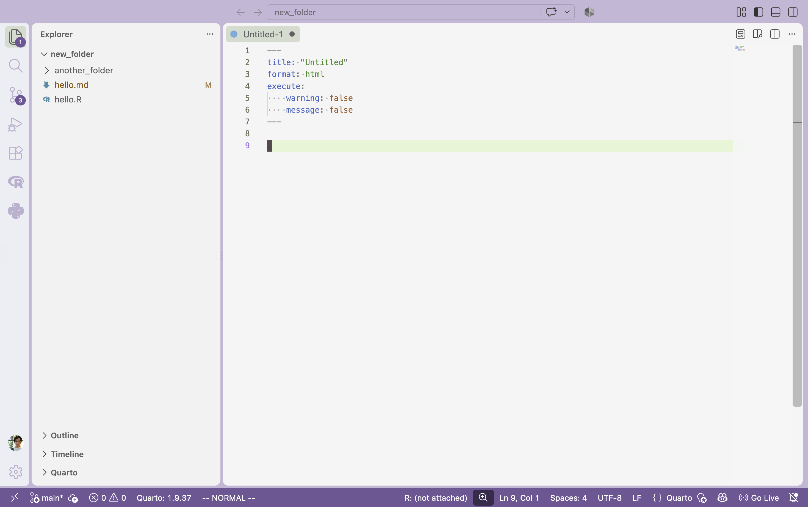

_This note won't be tested in the exam but helps set you up for running in class exercises and solving homework programs._

1. This note describes the development environment we'll use throughout the
class.  By the end, you should be able to

    - Navigate a modern code editor.
    - Use quarto notebooks to combine code, visualizations, and commentary.
    - Run the pi coding agent to create a ggplot2 visualization
    - Check that your code notebooks are formatted properly for submission.

Before we get started, please make sure to the install quarto and pi. The
instructions below describe how to do this for different types of operating
system.

## Code Editors

1. We will be making visualizations directly within programming languages. This
is different from creating visualizations in software like Excel, Power BI, or
Tableau, because our visualizations will be defined by writing out code in text
files rather than interacting with a GUI (clicking on buttons, selecting from
dropdown menus, etc.).

Contrast the excel approach,



With a version written in code,



1. Since programming is all done by editing text files, it helps to have
efficient ways of navigating across, typing in, and monitoring changes to text
files. This is what modern code editors support. This note describes vscode, but
Rstudio and positron are similar (and I'm happy to go over that one-on-one).

1. To open an existing directory, go to "File > Open Folder." This will make the
editor aware of all the files in that folder.



You can navigate all the files in a project using the stack of paper icon at
the top left of the editor. If you have directories, clicking on them will open
all the files within. You can also create new files and directories by right
clicking in this space.

1. We'll mainly be working with quarto files (described in detail below).  These
files have a bit of boilerplate text that always has to be present, and it's
annoying to copy that in manually each time. Instead, you can can type `Cntl +
Shift + p` (windows) or `Cmd + Shift + p` (mac) to bring up the "Command
Palette," where you can request a quarto file with the basic text already included^[This works for other types of files too, like python notebooks.]



1. Modern code editors have built-in support for `git`, a program for
checkpointing progress in your code projects. It's essentially "track changes"
for code. The program is helpful because,

    - It makes sure you don't accidentally lose all your work.
    - When using AI agents, it makes it easier to highlight the changes they make.

Describing everything git can do is beyond the scope of this course (and I
believe it is taught in the introductory R courses). But for our purposes, it's
enough to know that you can initialize a repository inside a folder.



Commit a change, which acts like a checkpoint for your later review.



And track any changes made since the last commit.



1. It's not as important, but you know that you can customize your code editor.
You can change the layout of the different panels, the color
themes^[The examples below are mostly from the Chalice extension.], even the
fonts. There are also extensions (blocks icon on the left) that other people
have written that give even more options.



## Quarto Notebooks

1. Literate programming is the idea that code from a programming language code
can be embedded within a documentation language. This places the emphasis back
on why we are writing the code, what exactly we're supposed to learn
from/accomplish with it.

> The main idea is to treat a program as a piece of literature, addressed to human beings rather than to a computer.
>
> -- Donald Knuth, in _Literate Programming_

1. Quarto is an implementation of literate programming that's well suited to
data visualization. It supports R, python, and javascript programming languages,
and those code blocks are embedded within the markdown documentation language.
Python is helpful for the machine learning-related visualization topics at the
end of the course, and javascript will help us make interactive plots, but for
this course we only assume prior experience with R.

1. If you are using vscode, make sure to install the Quarto extension. This will
make it easier to run code without leaving the editor. If you use Rstudio,
quarto is supported by default.



1. You can create a code block using three backticks and the name of the
language. For example, this is what an R code block looks like.

```{r}
#| echo: fenced
x <- c(1, 2, 3)
```

These are the equivalents in python and javascript.

```{python}
#| echo: fenced
x = [1, 2, 3]
```

```{ojs}
//| echo: fenced
x = [1, 2, 3] // js arrays are written the same was as python
```

1. You can modify options within each block. These won't appear in the rendered
document but control the appearance of the output. For example, you can name
your chunks, which is useful for debugging.

```{r}
#| label: my-label
#| echo: fenced
x <- c(1, 2, 3)
```

One trick that's very useful for our course -- you can resize figures and write
captions this way.

```{r}
#| fig-width: 6
#| fig-height: 3.5
#| echo: fenced
plot(1:3)
```

Contrast that with,

```{r}
#| fig-width: 3
#| fig-height: 8
#| echo: fenced
plot(1:3)
```

7. Sometimes code prints lots of messages that can clutter the document.

```{r}
#| echo: fenced
library(tidyverse)
```

To keep things clean, I often set the messages and warnings code chunk options to false.

```{r}
#| message: false
#| warnings: false
#| echo: fenced
library(tidyverse)
```

1. It can be annoying to copy these options to every single chunk. Instead, you
can modify the metadata at the top of the document so that the option will apply
to every single chunk below.



1. To render a document, you can go to the command palette and enter `Quarto Preview` to pull up that option. You can also render from the command line with the terminal command `quarto preview your-document.qmd`.



1. A common pitfall when using quarto is that if you take the rendered HTML
document outside of its original directory, the figures won't render properly.
For example, if we take the previous document and move it to a new folder, we'll
see this.



1. To solve this, add the option `self-contained: true` to the file header. This
will make sure that all images and file styling will be carried along with the
HTML directly.

## Agentic Coding

1. Coding agents are programs that you can call from your command line that are
able to edit and run computer programs. Unlike simply typing prompts into a web
interface, they can have much more context and run preliminary checks locally on
your machine.

1. These tools can be helpful in visualization, especially if you think very
carefully through what you are trying to accomplish, have built up an effective
vocabulary for communicating technical concepts, and can review the intermediate
outputs critically.

1. In this class, I'll be asking you to be using the Pi agent for all the work
you submit. This is so that everyone has the access to the same models, which
keeps things fair. It's also because the software is open source and compatible
with many different underlying models. It's likely that the best models will
continue to change over time, and having a single platform that interfaces with
all of them will make sure that your skills remain relevant despite these
changes in model.

1. You can use pi from the terminal. In the recording below, I've used a free
model to add a new histogram of random numbers. Notice how I used the `@` symbol
to refer to a file. This guided the model towards the context that it needed for
the task. While here the `@` symbol specifies the file we want to edit, it can
also be used to refer to any information that helps solve the task, like related
files or documentation. Also, a minor point -- at the start, I rearranged my
terminal window so that it appears on the right. This is not really needed, I
just did that so we can see more of the output.



1. At the very end of that recording, I use the `/export` command to save the
session. The result is a plain HTML file that I could share with anyone who was
interested in the prompts or intermediate outputs.



1. If you are done with a task and want to move on to another problem, you can
use the `/clear` command to clear all the context from the interactions so far.
This can keep the previous interactions from inadvertently influencing with the
next set of edits.

1. Another important Pi command is `/model`. This lets you switch between
different models. The example in the video above is simple and could be done
successfully with a free model. For slightly more complex tasks, even a very
cheap model will often be preferable For slightly more complex tasks, even a
very cheap model will often be preferable.

1. I will give you an openrouter API key that gives you access to a a few
openrouter models. Please use this for the assignments in the class. Once you
have the API key, you can add it to Pi using the steps in the video below.

