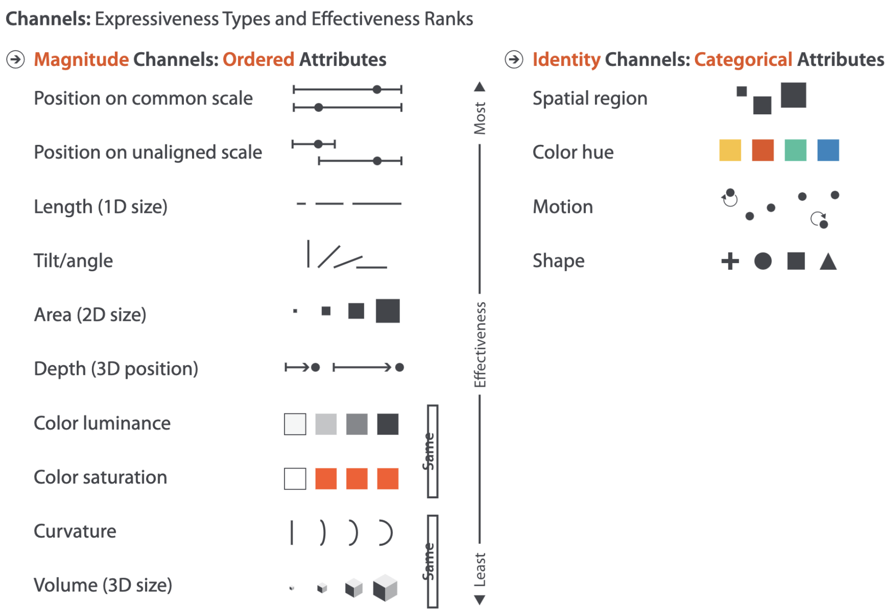
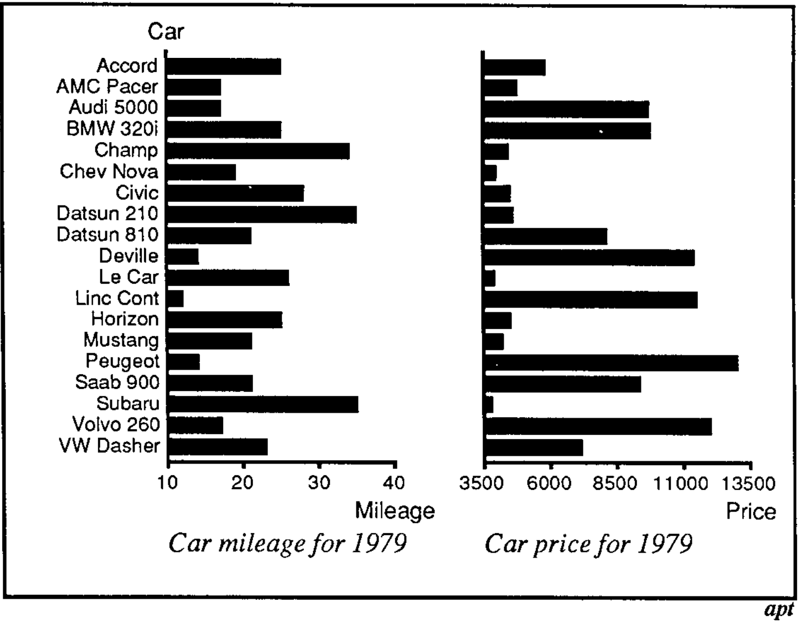
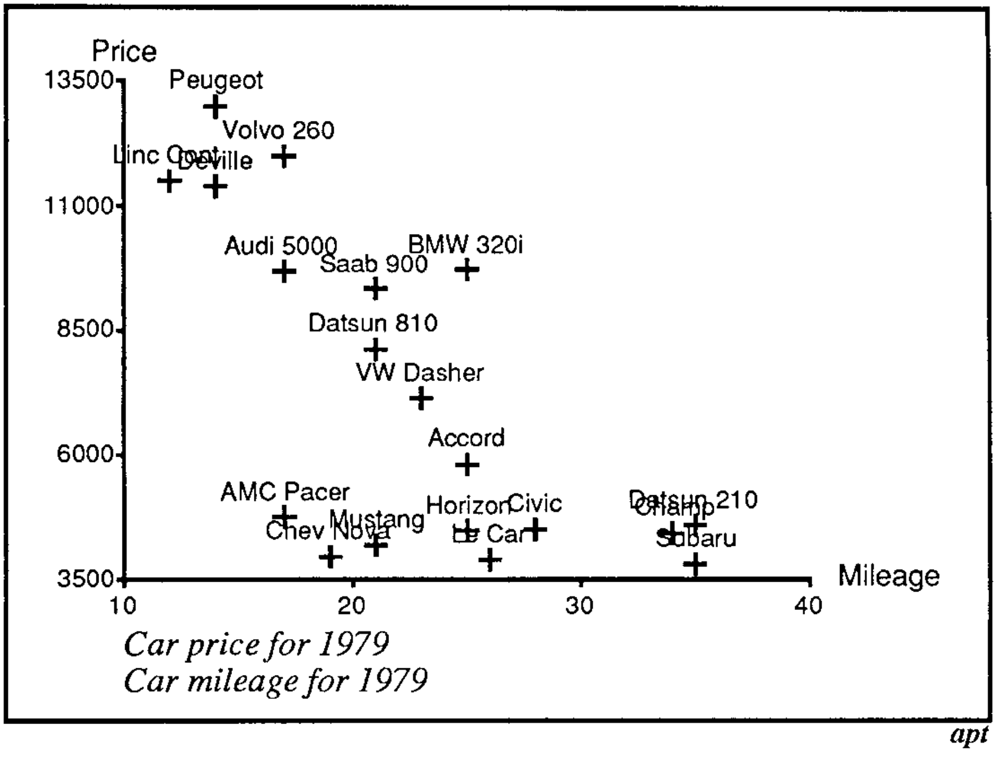

```{r}
#| label: setup
#| echo: false
library(dslabs)
library(ggrepel)
library(patchwork)
library(tidyverse)
theme_set(theme_classic() + theme(panel.border = element_rect(fill = NA, linewidth = .5)))
set.seed(2026)
```

Readings: [1 (Chapter 5.1 - 5.4 and
5.5.4)](https://search.library.wisc.edu/catalog/9910211448302121), [2
(optional)](https://rafalab.dfci.harvard.edu/dsbook/ggplot2.html).

[Code](https://github.com/krisrs1128/data_visualization_notes/blob/main/notes/01-graphical_encoding.qmd)

Items marked with $^\dagger$ will not be tested on exams.

1.  If you are interested in data science, you're probably already
    convinced that to understand something deeply it helps to measure.
    All the different data that we gather, the counts of different
    molecules in developing tissues, the spectral readouts from
    astronomical observatories, the likes and dislikes on a billions
    online videos.... these are attempts to make sense of a world that
    is too complicated to grasp all at once. All our advanced algorithms
    and statistical theories are forms of data compression, but designed
    for humans, not computers.

2.  A common misconception is that to use data science methods you must
    be clever. That a trained data scientist can hear about a problem
    and data set and immediately conjure the appropriate methodology. In
    my experience this is not how things work. You don't have to be
    clever, you only have to look at the data. A clear data of how the
    data look guides everything that happens later, all the modeling and
    inference. To know whether assumptions are reliable or conclusions
    can be trusted, we have to do some patient detective work. This
    class introduces you to the timeless concepts and modern methods of
    data visualization to help you do this detective work well.

### Graphical Encoding

3.  Every plot has three parts. The first two are,

    - **Data**: The measurements that we want to visualize.
    - **Graphical marks**: The basic graphical elements in an image
      (e.g., circles, lines) that appear on the page.

    When we construct a data visualization, we are imprinting marks on a
    page. The properties of these marks that we can vary are called
    *visual channels*. For example, position and color are both channels
    that we can control in circle marks. This gives the third part,

    - **Graphical encoding**: The mapping from the data to the graphical
      marks' visual channels

4.  For example, the bar chart below shows country populations in 2000,
    from the gapminder dataset. The raw data are country names
    (categorical variable), their populations (numerical variable), and
    a country group giving the broader geographical region (categorical
    variable). The visual marks are colored rectangles. The graphical
    encoding is,

    - Bar length $\iff$ Population size.
    - `y`-axis position $\iff$ Country name. These have been sorted, so
      $y$-axisx position also encodes country rank.
    - `color` $\iff$ Country group.

```{r}
#| fig-height: 6.7
#| fig-width: 5
#| echo: false
gapminder <- read_csv("https://uwmadison.box.com/shared/static/dyz0qohqvgake2ghm4ngupbltkzpqb7t.csv", col_types = cols(cluster = "factor"))
gap2000 <- filter(gapminder, year == 2000) # keep only year 2000
ggplot(gap2000) +
    geom_col(
        aes(pop, reorder(country, pop), fill = cluster)
    ) +
    scale_x_continuous(labels = scales::unit_format(unit = "million", scale = 1e-6), expand = c(0, 0, 0.1, 0.1)) +
    scale_fill_manual(values = c("#80BFA2", "#7EB6D9", "#3E428C", "#D98BB6", "#BF2E21", "#F23A29")) +
    labs(x = "Population", y = "Country", fill = "Country Group", color = "Country Group")
```

### Hierarchy of Encodings

5.  How many times larger (in terms of area) is the circle on the right?

```{r}
#| fig-width: 6
#| fig-height: 6
#| echo: false

circles <- tibble(
    x = c(1, 3),
    y = c(1, 1),
    size = c(30, 30 * sqrt(7))
)

ggplot(circles, aes(x, y)) +
    geom_point(aes(size = size), shape = 16) +
    scale_size_identity() +
    coord_fixed(xlim = c(0, 4), ylim = c(0, 2), expand = FALSE) +
    #scale_size(range = c(6, 60), guide = FALSE) +
    theme_void()
```

Same question, but for the relative heights of these two bars?

```{r}
#| fig-width: 6
#| fig-height: 6
#| echo: false

bars <- tibble(
    x = factor(c("small", "large"), levels = c("small", "large")),
    height = c(1, 7)
)

ggplot(bars, aes(x, height)) +
    geom_col(width = 0.65, fill = "black") +
    scale_y_continuous(limits = c(0, 8), expand = c(0, 0)) +
    theme_void()
```

6.  This is a special case of the hierarchy of encodings. Not all
    differences between visual channels can be compared with the same
    accuracy and speed. This is a limitation of human perception. In
    both laboratory and crowdsourcing experiments, the same orderings
    recur[^1].

[^1]: If you didn't make it to this lecture, the answer is that for both
    circles and bars the answer is seven. When we vote in class, the
    judgments are much more accurate for the bars than for the circles.
    Incidentally, when I've given this lecture to different audiences,
    the group that does this the best are the biologists, at one lab I
    went to (\~ 20 people), everyone said either 7 or 8 for the bar
    chart.

You should remember the hierarchy below (at least, given a pair of
channels, you should know which is more effective).



7.  An implication of the hierarchy is the **Effectiveness Principle**.
    For any visualization task, we should use the top of the hierarchy
    for the most important comparisons. The best design always depends
    on the question. For example, to compare mileage with price across
    cars, use a scatterplot, but to analyze specific cars, use bar plots
    sorted by name, because we can then use position to look up car
    name.





This gives a formal evaluation method. For a given task, one design is
more *effective* than another if it lets the reader make the task's
comparisons more accurately.

8.  Here is another exercise. How long does it take you to find the
    circle?

```{r}
#| label: popout
#| echo: false

make_shapes <- function(n, color, shape, range = c(0.05, 0.95)) {
    if (n <= 0) {
        return(NULL)
    }
    data.frame(
        x = runif(n, range[1], range[2]),
        y = runif(n, range[1], range[2]),
        color = color, shape = shape
    )
}


popout_plot <- function(n_blue_circles, n_red_squares) {
    target <- make_shapes(1, "Red", "Circle", range = c(0.1, 0.9))
    blue_circles <- make_shapes(n_blue_circles, "Blue", "Circle")
    red_squares <- make_shapes(n_red_squares, "Red", "Square")

    # Build ggplot object
    bind_rows(target, blue_circles, red_squares) |>
        ggplot(aes(x = x, y = y, color = color, shape = shape)) +
        geom_point(size = 3.2) +
        scale_color_manual(values = c("#1f78b4", "#b2182b")) +
        scale_shape_manual(values = c("Circle" = 16, "Square" = 15)) +
        coord_fixed(xlim = c(0, 1), ylim = c(0, 1), expand = FALSE) +
        theme_void() +
        theme(legend.position = "none")
}

popout_plot(n_blue_circles = 0, n_red_squares = 50)
```

Okay, now compare with this.

```{r}
popout_plot(n_blue_circles = 50, n_red_squares = 0)
```

Now, can you find the red circle?

```{r}
popout_plot(n_blue_circles = 25, n_red_squares = 25)
```

9.  What we have seen is the phenomenon called "visual popout" or, more
    formally, preattentive processing. Some properties in visual
    channels can be perceived immediately without any cognitive effort.
    Others (like shape in the example above) require us to deliberately
    scan over the visualization.  Unfortunately, it's not so
    straightforward to combine popout across channels. Once we have both
    red squares and circles, it's no longer easy to find the red circle.

### Grammar of Graphics

10. The *Grammar of Graphics* is the idea that we can compose rich
    visualizations by combining a few basic building blocks. This is in
    contrast to systems with prespecified chart types, where the user is
    forced to pick from a limited dropdown menu of plots. The hope is to
    make visualization design feel more like ordinary language (hence
    *grammar*), even though each sentence is just a combination of
    words, we're able to express infinite meanings.

11. We will use two implementations of the grammar of graphics.
    `ggplot2` is a twenty year old R package that is very widely used
    for static plots.  `mosaic vgplot` is newer and built for
    interactivity. We'll see how both handle data, marks, and encodings.

**`ggplot2`**

12. Let's use the grammar of graphics to construct this plot.

```{r}
#| echo: false
r <- murders |>
    summarize(rate = sum(total) / sum(population)) |>
    pull(rate)

ggplot(murders, aes(x = population, y = total)) +
    geom_abline(intercept = log10(r), linewidth = 0.4, col = "#b3b3b3") +
    geom_text_repel(aes(label = abb), segment.size = 0.2) +
    geom_point(aes(col = region)) +
    scale_x_log10(labels = scales::unit_format(unit = "million", scale = 1e-6)) +
    scale_y_log10() +
    scale_color_brewer(palette = "Set2") +
    labs(
        x = "Population (log scale)",
        y = "Total number of murders (log scale)",
        color = "Region",
        title = "US Gun Murders in 2010"
    ) +
    theme_bw() +
    theme(
        legend.position = "top",
        panel.grid.minor = element_blank()
    )
```

13. Data: The first argument to `ggplot()` must be a data.frame where
    each row is an observation and each column is an attribute
    describing the observation. Each mark that you see on a ggplot
    figure – a line, a point, a rectangle, ... – started as a row within
    an R `data.frame`. The visual channels of the mark are determined by
    the column values.

```{r}
data(murders)
head(murders)
```

14. Marks: The words in the grammar of graphics are the geometry layers,
    called "geoms." We can associate each row of a data frame with
    points, lines, rectangles, etc., by referring to the appropriate
    geom. A typical plot will compose a chain of layers on top of a
    dataset,

> ggplot(data) + \[layer 1\] + \[layer 2\] + …

For example, by deconstructing the plot above, we would expect to have
point and text layers. For now, let’s just tell the plot to put all the
marks at the origin.

```{r}
ggplot(murders) +
    geom_point(x = 0, y = 0) +
    geom_text(x = 0, y = 0, label = "test")
```

You can see all the types of geoms in the [cheat
sheet](https://github.com/rstudio/cheatsheets/blob/master/data-visualization-2.1.pdf).
We will go over this more detail below.

15. Encodings: In ggplot2, we use `aes()` to implement the graphical
    encoding. `aes()` stands for aesthetic mapping, which is a synonym
    for graphical encoding. Analyzing the original graph, we recognize
    these specific encodings,

- State Population → x-axis coordinate
- Number of murders → y-axis coordinate
- Geographical region → color

  Formalizing this with code,

```{r}
ggplot(murders) +
    geom_point(aes(x = population, y = total, col = region))
```

16.  The exact mappings from data values to visual channels are
    implemented through scales. For example, the original plot used log
    scales for population and total, it also used a custom color scale,
    set with `scale_color_brewer`.

```{r}
ggplot(murders) +
    geom_point(aes(x = population, y = total, col = region)) +
    scale_color_brewer(palette = "Set2") +
    scale_x_log10() +
    scale_y_log10()
```

17. Notice that the original visualization also had text labeling all
the states and a reference line giving the nationwide murder rate (so we
could see whether a state was above or below the national rate given its
population size).  These are implemented simply by adding more layers.
For the text labels, we used `geom_text_repel` from the `ggrepel`
package,

```{r}
ggplot(murders) +
    geom_text_repel(aes(x = population, y = total, label = abb), segment.size = 0.2) +
    geom_point(aes(x = population, y = total, col = region)) +
    scale_x_log10() +
    scale_y_log10() +
    scale_color_brewer(palette = "Set2")
```

 This code is actually unnecessarily verbose. It copies x- and
y-encoding for both the text and the point layers.  A clearer approach
is to set these encodings into a global aesthetic encoding, the second
argument on the first line.

```{r}
ggplot(murders, aes(x = population, y = total)) +
    geom_text_repel(aes(label = abb), segment.size = 0.2) +
    geom_point(aes(col = region)) +
    scale_x_log10() +
    scale_y_log10() +
    scale_color_brewer(palette = "Set2")
```

18. The overlay line giving the national rate is actually a bit subtle
to construct. Unlike all the other marks on this plot, it isn't defined
by any row in the murders data frame. It turns out that you can overlay
marks by setting their properties directly. These layers no longer have
`aes()`.

```{r}
r <- murders |>
    summarize(rate = sum(total) / sum(population)) |>
    pull(rate)

ggplot(murders, aes(x = population, y = total)) +
    geom_abline(intercept = log10(r), slope = 1, col = "#b3b3b3") +
    geom_text_repel(aes(label = abb), segment.size = 0.2) +
    geom_point(aes(col = region)) +
    scale_x_log10() +
    scale_y_log10() +
    scale_color_brewer(palette = "Set2")
```

19. Finally, we can customize the plot appearance and annotation.
`theme()` fine tunes plot properties, like where to place the legend.
`labs()` can be used to add better labels.

```{r}
ggplot(murders, aes(x = population, y = total)) +
    geom_abline(intercept = log10(r), slope = 1, col = "#b3b3b3") +
    geom_text_repel(aes(label = abb), segment.size = 0.2) +
    geom_point(aes(col = region)) +
    scale_x_log10() +
    scale_y_log10() +
    scale_color_brewer(palette = "Set2") +
    labs(
        x = "Population (log scale)",
        y = "Total number of murders (log scale)",
        color = "region",
        title = "US Gun Murders in 2010"
    ) +
    theme(legend.position = "top")
```

20. With agentic coding, you don't need to manually write the layers.
    But you must still think carefully about your encodings. Even our
    simple plot above involved many subtle judgments. You might get
    lucky with a vague prompt, but to sharpen the quality of your
    thinking, you should iterate on the design and experiment with
    alternative specifications.

Here's an example that built up the visualization above across several
steps
([link](https://drive.google.com/drive/folders/1DROl3TK9XpsPWdD3FMczOZbenLZQc4NE?usp=drive_link)).
One caution is that this is a common dataset, and the reasoning traces
show that it referred to the book used in these notes. Even then, I made
two manual changes. The rate line was drawn over the points, so I
switched the layer order. I then lightened it "#d4d4d4" from "gray50".

```{r}
#| echo: false
national_rate <- murders |>
    summarize(rate = sum(total) / sum(population) * 1e5) |>
    pull(rate)

murders |>
    ggplot(aes(x = population / 1e6, y = total, color = region)) +
    geom_abline(
        slope = 1, intercept = log10(national_rate) + 1,
        color = "#d4d4d4"
    ) +
    geom_point(size = 2.5) +
    geom_text_repel(aes(label = abb), size = 3.5, show.legend = FALSE) +
    scale_x_log10(labels = scales::label_number(suffix = "M")) +
    scale_y_log10() +
    scale_color_brewer(palette = "Dark2") +
    labs(
        x = "Population (log scale)",
        y = "Number of Murders (log scale)",
        color = "Region"
    ) +
    theme_classic() +
    theme(
        axis.title = element_text(size = 15),
        axis.text = element_text(size = 12),
        legend.title = element_text(size = 13),
        legend.text = element_text(size = 12)
    )
```

**Mosaic vgplot**

21. A similar grammar of graphics is implemented by Mosaic vgplot. One
    nuance is that this is done in javascript, rather than R, and
    requires a different data loading procedure. I've included the code
    below, but we won't go over it. For now you can just copy and paste
    it for any visualization you want to make, and we'll go over it in
    detail in our "Data Management" notes.

```{r}
# save R data frames to CSV
write_csv(murders, "data/murders.csv")
write_csv(gap2000, "data/gap2000.csv")
write_csv(gapminder, "data/gapminder.csv")
ojs_define(national_rate = national_rate)
```

```{ojs}
//| echo: true
path = (p) => new URL(`data/${p}`, document.baseURI).href

// load CSVs to javascript
vg = {
  const vg = await import("https://cdn.jsdelivr.net/npm/@uwdata/vgplot@0.19.0/+esm");
  const wasm = await vg.wasmConnector();
  vg.coordinator().databaseConnector(wasm);
  await vg.coordinator().exec([
    vg.loadCSV("murders", path("murders.csv")),
    vg.loadCSV("gap2000", path("gap2000.csv")),
    vg.loadCSV("gapminder", path("gapminder.csv"))
  ]);
  return vg;
}
```

22. We can read the analogy to ggplot2 even from a minimal scatter plot
    example.

    - `vg.from` specifies which dataset to use.
    - `vg.dot` is analogous to `geom_point` and specifies the graphical
      mark to use.
    - The dictionary in the second argument to `vg.from` describes the
      graphical encoding.

The `r` argument is not part of the encoding and simply fixes the point
radius to 5 pixels. The width and height parameters rescale the canvas
size to 650 pixels across and 400 pixels tall.

```{ojs}
vg.plot(
  vg.dot(vg.from("murders"), {x: "population", y: "total", fill: "region", r: 5}),
  vg.width(650),
  vg.height(450)
)
```

23. As before, we can customize the scales. Here, `xScale` and `yScale`
    allow us to use a log scale while the color scheme allows us to
    switch to the [Set 2 colorbrewer
    palette](https://emilhvitfeldt.github.io/r-color-palettes/discrete/RColorBrewer/Set2/).

```{ojs}
vg.plot(
  vg.dot(vg.from("murders"), {x: "population", y: "total", fill: "region", r: 5}),
  vg.xScale("log"),
  vg.yScale("log"),
  vg.colorScheme("set2"),
  vg.width(650),
  vg.height(450)
)
```

In the spirit of the grammar of graphics, we can also compose layers.
Here we've added state labels with `vg.text`. To avoid repeating the `x`
and `y` specification, we defined a new object `xy`. The `...` notation
means we "unpack" the entries so it can be merged with the parent
object.

```{ojs}
xy = ({x: "population", y: "total"})

vg.plot(
  vg.dot(vg.from("murders"), {...xy, fill: "region", r: 5}),
  vg.text(vg.from("murders"), {...xy, text: "abb", dy: -12, fill: "#888", fontSize: 12}),
  vg.xScale("log"),
  vg.yScale("log"),
  vg.colorScheme("set2"),
  vg.width(650),
  vg.height(450)
)
```

24. Finally, we overlay a line giving the national rate. The syntax here
    differs slightly from ggplot. Instead of specifying the intercept
    and slope, we specify the end points of the line in length two
    array. We've also added some annotation using `xLabel` and `yLabel`
    and a legend with `vg.colorLegend()`.

The reason why we're using Mosaic to recreate a plot that we already is
because it natively supports interactivity. The example below allows you
to see state labels with a hover interaction. ggplot2 can create more
beautiful figures and is easier to customize, but it renders static
image files. We'll go over the syntax during the interaction lectures.

```{ojs}
rate = national_rate / 1e5
rate_line = [
  {population: 1e5, total: rate * 1e5},
  {population: 4e7, total: rate * 4e7}
]

$hovered = vg.Selection.single({empty: true})

vg.plot(
  vg.line(rate_line, {x: "population", y: "total", stroke: "#d4d4d4"}),
  vg.dot(vg.from("murders"), {...xy, fill: "region", r: 5}),
  vg.nearest({as: $hovered}),
  vg.text(vg.from("murders", {filterBy: $hovered}), {...xy, text: "abb", dy: -12, fill: "#888", fontSize: 12}),
  vg.xScale("log"),
  vg.yScale("log"),
  vg.colorScheme("Set2"),
  vg.xLabel("Population (log scale)"),
  vg.yLabel("Number of Murders (log scale)"),
  vg.colorLegend({columns: 1}),
  vg.width(650),
  vg.height(450)
)
```

### Graphical Marks

25. Depending on the data and problem at hand, it helps to have a wide
    vocabulary of potential graphical marks to apply. We've already seen
    *point* and **text marks**, though we've only used them to encode
    continuous $x, y$ position (and for the text, the associated label).
    They actually support encoding for even more visual channels --
    alpha, color, size, and shape (for points) -- as documented in the
    ggplot2 [cheat
    sheet](https://rstudio.github.io/cheatsheets/data-visualization.pdf)[^2].
    Let's review a few of the other common marks and how to avoid
    potential pitfalls.

26. We'll illustrate marks with the gapminder dataset, which describes
    the changes in standard of living around the world over the last few
    decades.

[^2]: You're responsible for knowing the encodings for the marks we
    discuss in this note, but not everything in the cheat sheet.

```{r}
gapminder <- read_csv("https://uwmadison.box.com/shared/static/dyz0qohqvgake2ghm4ngupbltkzpqb7t.csv", col_types = cols(cluster = "factor"))
gap2000 <- filter(gapminder, year == 2000) # keep only year 2000
```

27. **Bar Marks** associate a continuous field with a categorical one.
    They also support alpha, color (border of the bar), fill (inside of
    the bar), and linetype (e.g., solid vs dashed borders) visual
    channels.

```{r}
#| fig-height: 4.5
#| fig-width: 7
ggplot(gap2000) +
    geom_col(aes(country, pop))
```

The plot above is messy -- the country names are overlapping one
another. One way to deal with this is to reverse the encodings.

```{r}
#| fig-height: 6.7
#| fig-width: 5
ggplot(gap2000) +
    geom_col(aes(pop, country))
```

You could have instead rotated the labels,

```{r}
#| fig-height: 4.5
#| fig-width: 7
ggplot(gap2000) +
    geom_col(aes(country, pop)) +
    theme(axis.text.x = element_text(angle = 90))
```

By default, the countries are ordered alphabetically. In some cases,
this is justified. If we really don't know what kinds of comparisons
will be the most interesting, we should support alphabetical lookup. But
for some tasks it helps to encode information in the variable order. For
example, we can sort by country population.

```{r}
#| fig-height: 6.7
#| fig-width: 5
ggplot(gap2000) +
    geom_col(aes(pop, reorder(country, pop), fill = cluster))
```

28. A few other points that I think are worth improving

    - The axis titles are not meaningful.
    - There is a strange gap between the left hand edge of the plot and
      the start of the bars.
    - The scientific notation for population size is unusual.
    - The color scheme is boring.

I've gone ahead and made these changes, putting comments next to which
piece of code makes which modifications.

```{r}
#| fig-height: 6.7
#| fig-width: 5
ggplot(gap2000) +
    geom_col(
        aes(pop, reorder(country, pop), fill = cluster)
    ) +
    scale_x_continuous(labels = scales::unit_format(unit = "million", scale = 1e-6), expand = c(0, 0, 0.1, 0.1)) + # labels in millions, removes gap
    scale_fill_manual(values = c("#80BFA2", "#7EB6D9", "#3E428C", "#D98BB6", "#BF2E21", "#F23A29")) + # changes colors
    labs(x = "Population", y = "Country", fill = "Country Group", color = "Country Group") # adds labels
```

29. This seems like a lot of work for just a bar plot. But I think it's
    amazing how customizable the figure is -- we can give it our own
    sense of style. Ther eare still many things that could be
    interesting to experiment with, like font styles, background
    appearance, maybe splitting the countries into two panels.

30. In the plot above, each bar is anchored at 0. Instead, we could have
    each bar encode *two* continuous attributes, a left and right, along
    with a categorical attribute as in bar plots. This is called a
    **segment** mark. Let's compare the minimum and maximum life
    expectancies within each country cluster. We'll need to create a new
    `data.frame` with just the summary information. For this, we
    `group_by` each cluster, so that a `summarise` call finds the
    minimum and maximum life expectancies restricted to each cluster.
    We'll discuss the `group_by` + `summarise` pattern next week.

```{r}
#| fig-height: 4.5
# find summary statistics
life_ranges <- gap2000 |>
    group_by(cluster) |>
    summarise(
        min_life = min(life_expect),
        max_life = max(life_expect)
    )

# look at a few rows
head(life_ranges)
ggplot(life_ranges) +
    geom_segment(
        aes(min_life, reorder(cluster, max_life), xend = max_life, yend = cluster, col = cluster),
        size = 5,
    ) +
    scale_color_manual(values = c("#80BFA2", "#7EB6D9", "#3E428C", "#D98BB6", "#BF2E21", "#F23A29")) +
    labs(x = "Minimum and Maximum Expected Span", col = "Country Group", y = "Country Group") +
    xlim(0, 85) # otherwise would only range from 42 to 82
```

31. **Line marks** are useful for comparing changes. Our eyes naturally
    focus on rates of change when we see lines. They support continuous
    `x` and `y` channels, as well as linetype and linewidth. Below,
    we'll plot the fertility over time, colored in by country cluster.

```{r}
ggplot(gapminder) +
    geom_line(
        aes(year, fertility, col = cluster, group = country),
        alpha = 0.7, size = 0.9
    ) +
    scale_x_continuous(expand = c(0, 0)) + # same trick of removing gap
    scale_color_manual(values = c("#80BFA2", "#7EB6D9", "#3E428C", "#D98BB6", "#BF2E21", "#F23A29"))
```

The `group` argument is necessary for ensuring each country gets its own
line; if we removed it, `ggplot2` becomes confused by the fact that the
same `x` (year) values are associated with multiple `y`'s (fertility
rates). Please do not submit plots like this...

```{r}
ggplot(gapminder) +
    geom_line(
        aes(year, fertility, col = cluster),
        alpha = 0.7, size = 0.9
    ) +
    scale_x_continuous(expand = c(0, 0)) +
    labs(title = "BAD") +
    scale_color_manual(values = c("#80BFA2", "#7EB6D9", "#3E428C", "#D98BB6", "#BF2E21", "#F23A29"))
```

32. **Area marks** blend bar and line marks. The filled area supports
    absolute comparisons, while the changes in shape suggest
    derivatives.

```{r}
population_sums <- gapminder |>
    group_by(year, cluster) |>
    summarise(total_pop = sum(pop))
head(population_sums)

ggplot(population_sums) +
    geom_area(aes(year, total_pop, fill = cluster)) +
    scale_y_continuous(labels = scales::unit_format(unit = "million", scale = 1e-6)) +
    scale_x_continuous(expand = c(0, 0)) +
    scale_fill_manual(values = c("#80BFA2", "#7EB6D9", "#3E428C", "#D98BB6", "#BF2E21", "#F23A29"))
```

Just like in bar marks, we don't necessarily need to anchor the $y$-axis
at 0. For example, here the bottom and top of each area mark is given by
the 30% and 70% quantiles of population within each country cluster.
This kind of mark is called a **ribbon mark**. It requires three
continuous attributes.

```{r}
population_ranges <- gapminder |>
    group_by(year, cluster) |>
    summarise(min_pop = quantile(pop, 0.3), max_pop = quantile(pop, 0.7))
head(population_ranges)

ggplot(population_ranges) +
    geom_ribbon(
        aes(x = year, ymin = min_pop, ymax = max_pop, fill = cluster),
        alpha = 0.8
    ) +
    scale_y_continuous(labels = scales::unit_format(unit = "million", scale = 1e-6)) +
    scale_x_continuous(expand = c(0, 0)) +
    scale_fill_manual(values = c("#80BFA2", "#7EB6D9", "#3E428C", "#D98BB6", "#BF2E21", "#F23A29"))
```

33. All those examples were made with ggplot2. Mosaic doesn't support
    segment or ribbon marks. But we can generate the analogous bar and
    line plots. FOr example, `barX` defines a bar mark, the `sort`
    option orders countries, and the remaining layers customize the
    annotation and scales.

```{ojs}
vg.plot(
  vg.barX(
    vg.from("gap2000"),
    {
      x: "pop",
      y: "country",
      fill: "cluster",
      sort: {y: "-x"}
    }
  ),
  vg.xLabel("Population"),
  vg.yLabel("Country"),
  vg.xTickFormat(d => `${d / 1e6} million`),
  vg.colorRange(["#80BFA2", "#7EB6D9", "#3E428C", "#D98BB6", "#BF2E21", "#F23A29"]),
  vg.colorLegend({label: "Country Group", columns: 1}),
  vg.marginLeft(120), // keep labels visible
  vg.width(400),
  vg.height(575)
)
```

1.$^{\ast}$ A minor point on how to read the syntax for the argument in
`xTickFormat`. In javascript, you can define an "anonymous" (unnamed)
function using `x => what to do with x`. This is exactly like R's
`\(x) { what to do with x}`. The `${d / 1e6} million` substitutes the
result of `d / 1e6` into the string "{result} million", just like R's
`glue({result}, million)`.

34. Here is the analogous lineplot. The `z` encoding groups each
    country's observations, and `stroke` is the mosaic equivalent of
    ggplot2's `color`.

```{ojs}
vg.plot(
  vg.lineY(
    vg.from("gapminder"),
    {
      x: "year",
      y: "fertility",
      z: "country",
      stroke: "cluster",
      strokeOpacity: 0.7,
      strokeWidth: 2
    }
  ),
  vg.xTickFormat("d"), // makes sure years are formatted correctly
  vg.xLabel("Year"),
  vg.yLabel("Fertility"),
  vg.colorRange(["#80BFA2", "#7EB6D9", "#3E428C", "#D98BB6", "#BF2E21", "#F23A29"]),
  vg.colorLegend({label: "Country Group", columns: 1}),
  vg.width(500),
  vg.height(350)
)
```

## Objectives

By the end of this week, you should be able to,

- Define the hierarchy of encodings, rank visual channels according to
  their perceptual efficiency, and use these concepts to evaluate
  visualizations (on their own, and in comparison with one another).
- Define graphical marks, visual encodings, and the grammar of graphics
  and discuss these concepts in the context of ggplot2 and mosaic vgplot
  code.
- Given a practical visualization goal, describe the graphical marks,
  graphical encodings, and scales that could be used to achieve them and
  justify your choices in terms of concepts like the hierarchy of
  encodings, popout, and the effectiveness principle.
- Recognize when an input data set or visualization task is/isn't
  appropriate for a particular graphical mark, like point, line, bar,
  segment, text, or ribbon marks .
- Suggest improvements for a specific plot, justify the design choices,
  and outline the implementation in ggplot2 and mosaic.
