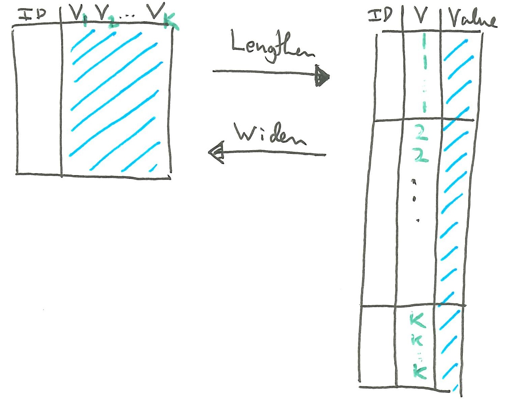
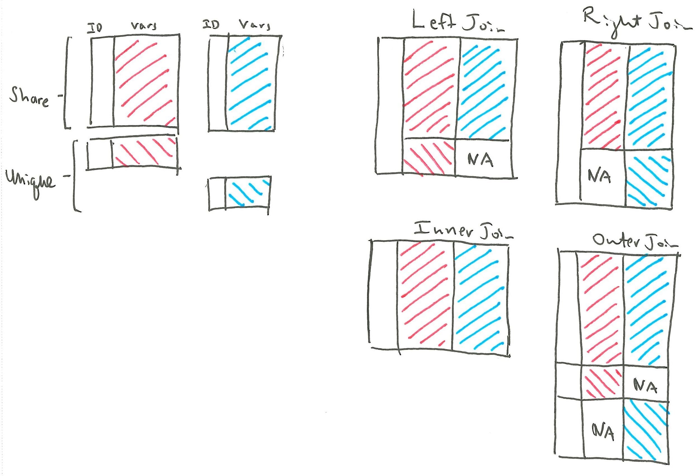
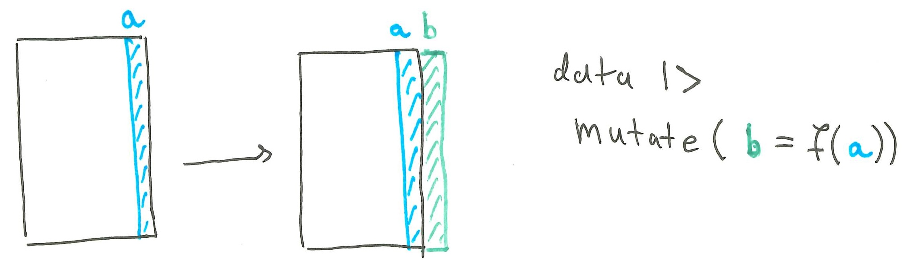
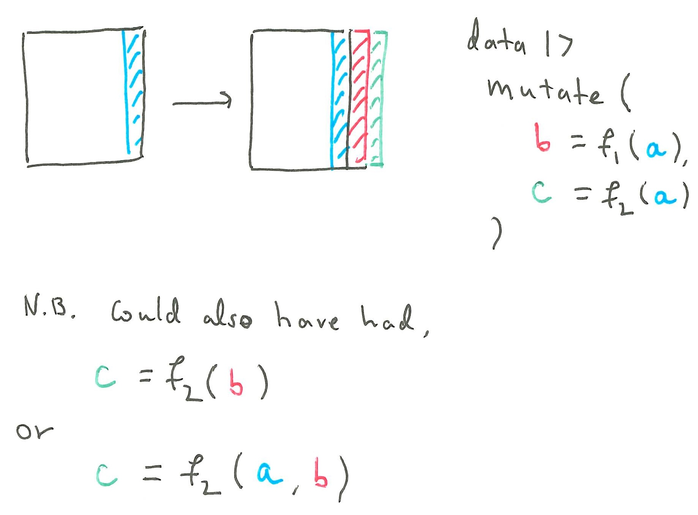
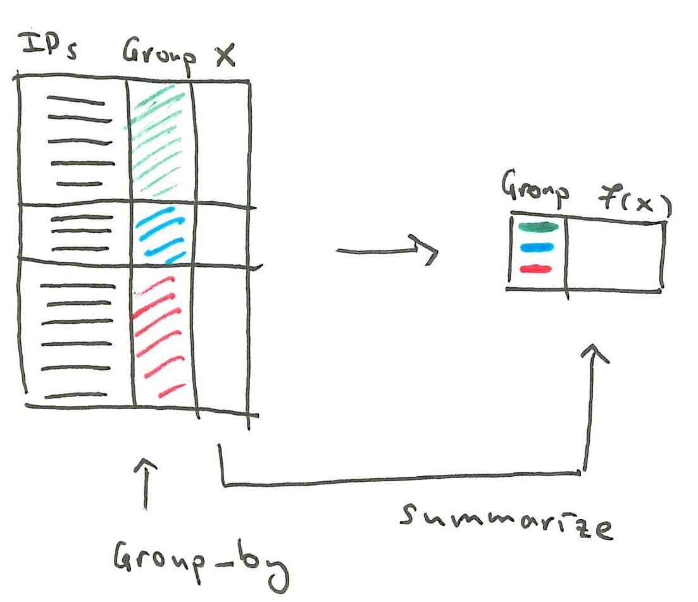
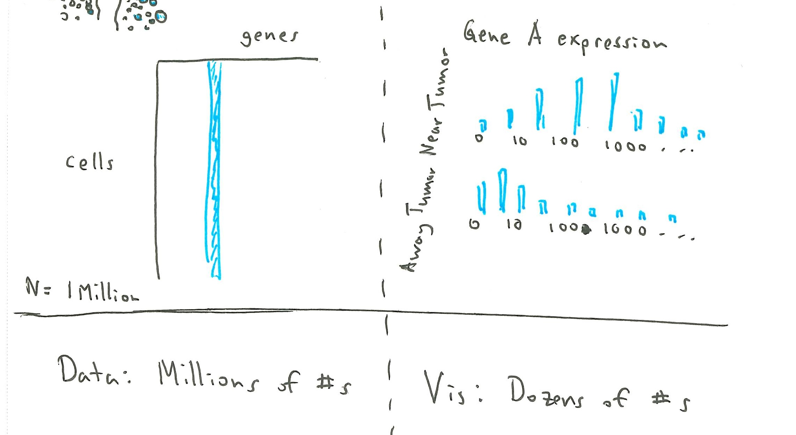

Readings: [1](https://r4ds.had.co.nz/tidy-data.html)

Items marked with $^\dagger$ will not be tested on exams.

```{r}
#| label: setup
#| echo: true
library(tidyverse)
theme_set(theme_classic(base_size=14) + theme(panel.border= element_rect(fill = NA, linewidth = .5)))
set.seed(2026)
```

## Concepts

### Tidy Data

1. A dataset is called tidy if rows correspond to distinct observations and
columns correspond to distinct variables.


2. This structure is helpful because for many questions we only need to refer
to particular subsets of rows ("filtering") or columns ("selecting").

3. For visualization, it is important that data be in tidy format. This is
because (a) each visual mark will be associated with a row of the dataset and (b) properties of the visual marks will determined by values within the columns.
A plot that is easy to create when the data are in tidy format might be very
hard to create otherwise.

4. The tidy data might seem like an idea so natural that it’s not worth teaching
(let alone formalizing). However, exceptions are encountered frequently, and
it’s important that you be able to spot them. We'll start the notes by
explaining the core data tidying concepts, then we'll see how they can be
implemented in code.

5. Here is an example of a tidy dataset.

```{r}
#| echo: true
table1
```

6. Below are three non-tidy versions of the same dataset. They are
representative of more general classes of problems that may arise,

   a. A variable might be implicitly stored within column names, rather than
explicitly stored in its own column. Here, the years are stored as column
names. The first table gives the number of TB cases, and the second table gives
the overall population. It's not really possible to create the plot above using
the data in this format.

```{r}
#| echo: true
table4a # cases
table4b # population
```

   b. The same observation may appear in multiple rows, where each instance of the
row is associated with a different variable. Here, the observations are the
country by year combinations.

```{r}
#| echo: true
table2
```

   c. A single column actually stores multiple variables. Here, `rate` is being
used to store both the population and case count variables.

```{r}
#| echo: true
table3
```

The trouble is that this variable has to be stored as a character. Otherwise, we
lose access to the original population and case variable. But, this makes the
plot useless.

```{r}
#| fig-height: 4
#| fig-width: 6
ggplot(table3, aes(x = year, y = rate)) +
  geom_point() +
  geom_line(aes(group = country))
```

### Pivot

7. Pivoting refers to the process of changing the interpretation of each row in
a data frame. There are two types of pivoting: lengthening and widening.

8. Lengthening a dataset allows us to take an implicitly stored variable from a
column name and explicitly store it in a column.  For example, to tidy the
tuberculosis data below, we have to make sure the year is stored as its own
column.  Note that the data has doubled in length, because there are now two
rows per country (one per year).

This is the original (non-tidy) data.

```{r}
#| echo: true
table4a
```

This is what the tidy, long form of the same data look like.
```{r}
#| echo: false
table4a_longer <- table4a |>
  pivot_longer(c(`1999`, `2000`), names_to = "year", values_to = "cases")

table4a_longer
```

9. Conversely, if the same observation is split across multiple rows, then we
have to _widen_ the data.  For example, here is `table2` before widening.

```{r}
table2
```

Now, we spread the `cases` and `population` variables into their own columns.

```{r}
#| echo: false
table2 |>
    pivot_wider(names_from = type, values_from = count)
```

10. More generally, pivoting has this form.



Caveat: what is or is not tidy may be context dependent. Maybe you want to
treat each week as an observation, rather than each day. Second, know that there
are sometimes computational reasons to prefer non-tidy data. For example, "long"
data often require more memory, since column names that were originally stored
once now have to be copied onto each row. Certain statistical models are also
sometimes best framed as matrix operations on non-tidy datasets.

11. Pivoting is often useful when _joining_ tables, because it makes sure the
meaning of the rows is compatible. A join operation matches rows across two
tables according to their shared ID columns. Depending on how we handle the rows
that are present in only one of the two tables, we get different types of joins.



For example, suppose we want to combine the population and cases tables, so that
we can get the per capita cases for each country over time. The first step is to
pivot so that year is stored as its own variable. Then we join cases and
population into the same table using the country-year combinations as the ID.

```{r}
#| echo: false
#|
# helper function, to avoid copying and pasting code
pivot_fun <- function(x, value_column = "cases") {
  x |>
    pivot_longer(c(`1999`, `2000`), names_to = "year", values_to = value_column)
}

table4 <- left_join(
  pivot_fun(table4a), # look for all country x year combinations in left table
  pivot_fun(table4b, "population") # and find matching rows in right table
)
table4
```

This lets us make the year vs. rate plot that we had tried to put together
before. It's much easier to recognize trends when comparing the rates, than when
looking at the raw case counts.

```{r}
#| fig-height: 4
#| fig-width: 6
ggplot(table4, aes(x = year, y = cases / population, col = country)) +
  geom_point() +
  geom_line(aes(group = country))
```

### Derive

12. It’s easiest to define visual encodings when the variables we want to encode
are contained in their own columns. After sketching out a visualization of
interest, we may find that these variables are not explicitly represented among
the columns of the raw dataset. In this case, we may need to derive them based
on what is available.

13. Sometimes a single column implicitly encodes more than one variable at once —
for example, a value stored as a ratio or composite string that actually
represents two distinct quantities. In this case, we should split that column
into multiple columns so that each corresponds to exactly one variable.  For
example, the block below separates the `rate` column, which had been stored as a
string rather than numerical value. The original table was,

```{r}
#| echo: true
table3
```
and the separated version is,
```{r}
#| echo: false
table3 |>
  separate(rate, into = c("cases", "population"), convert = TRUE) # try without convert, and compare the data types of the columns
```

14. Splitting a column is a special case of deriving new columns as functions of
existing ones. This is called "mutating" a column in R.  We have used this is in
previous lectures, but now we can philosophically justify it: the variables we
want to encode need to be defined in advance.  For example, we may want to
create a column `rate` that includes cases over population,

```{r}
#| echo: false
table3 |>
  separate(rate, into = c("cases", "population"), convert = TRUE) |>
  mutate(rate = cases / year)
```



Here's an example of deriving more than one column in the same command.



### Aggregation

15. Sometimes, the variables of interest are functions of several rows.
In this case, we can derive a summary across groups of rows using a group +
summarize pattern (also called "map  + reduce").  We need to specify both the
group over which to aggregate and the function to aggregate with (e.g., mean or
maximum)



This code block illustrates the idea by computing average rates within each
country.

```{r}
#| echo: false
table3 |>
  separate(rate, into = c("cases", "population"), convert = TRUE) |>
  mutate(rate = cases / year) |>
  group_by(country) |>
  summarise(avg_rate = mean(rate))
```

### Databases

16. A database is a way of representing data that lies between static files
(CSVs, used for storage) and in-memory structures (data frames, actively
computed upon). They are helpful because many analysis questions require only a
small part of the large stored collection. We might have ten years of logs but
only need to look at the last three days. Or, we might have thousands of
features but only want to make a plot with three.

17. Databases come with operations that are more restricted than full programming
languages but are very fast. Operations like select, filter, and aggregate can
be done much faster in a database than in an interpreted programming language
like R or python.

18. This makes a difference in visualization because people have limited
perceptual capacity. We cannot look at a million marks in a plot and distinguish
between them. Large-scale visualization requires reduction, either a subset of
observations or an aggregation across groups. Interactivity can help quickly
navigate between reductions. Since a database can efficiently compute each
reduction "on demand" without ever reading in the entire dataset, they are
well-suited to interactive visualization.



## Implementation

### Reading

19. We can use the `read_csv` function from the tidyverse library to read a CSV
file into a variable in R. The path to the file must be relative to wherever we
are rendering the Quarto document.

```{r}
library(tidyverse)
table3
table3 <- read_csv("data/table3.csv")
table4a <- read_csv("data/table4a.csv")
```

These data frame objects will be the main inputs we give to ggplot2.

```{r}
table4a
```

20. Mosaic doesn't load the data directly into memory. Instead, it creates a
database. Everything that we visualize starts as a query to this database, which
might hold many more rows than are actually shown in any one view. As mentioned
above, this has the advantage of allowing us to visualize large data sets on
small machines. The downside is that the setup becomes a little bit more
complicated. Fortunately, we can use something like the block below in
essentially every mosaic application.

```{ojs}
path = (p) => new URL(`data/${p}`, document.baseURI).href

vg = {
  const vg = await import("https://cdn.jsdelivr.net/npm/@uwdata/vgplot@0.19.0/+esm");
  const wasm = await vg.wasmConnector();
  vg.coordinator().databaseConnector(wasm);
  await vg.coordinator().exec([
    vg.loadCSV("table3", path("table3_rates.csv"), { header: true }),
    vg.loadCSV("table4a", path("table4a.csv"), { header: true })
  ]);
  return vg;
}
```

Let's parse this line by line.

- `vg.wasmConnector()` set up a DuckDB database. It's very similar to a SQL
database, but much more lightweight. It's run in the background in our web
browser.
- `vg.coordinator()` links the queries needed by the visualization with the
underlying database, which we specify using the `.databaseConnector(wasm)`
call. We'll discuss the coordinator in more detail when we discuss
interactivity. It will allow data queries depending on user interactions.
-`vg.loadCSV("name", url)` creates a table in our database starting from a
CSV file. The first argument "name" becomes the table name in the database.
The second argument is the path on disk where our data should be loaded
from. There are analogous versions of this function for different kinds of
data. For example, we can load spatial data using `vg.loadSpatial` and
parquet files using `vg.loadParquet`.

21. One subtlety is that the data loader needs access to the absolute file path
(not the relative path).  We've created a small helper function, `path`, which
looks up the current document's path (`document.baseURI`) and uses that to
construct the absolute path

```{ojs}
document.baseURI
```

22. Once the coordinator is defined, we can use it to look up any data available
in the database. Usually, the queries will be defined implicitly by our
visualization code. However, it's always possible to explicitly define a SQL
query to manually inspect the database. The query below asks for every column of
`table4a`.

```{ojs}
table4a_query = vg.coordinator().query("SELECT * FROM table4a")
Inputs.table(table4a_query)
```

23. For your homework, you will likely do some initial preprocessing in R and
then save the result into a CSV file which can be loaded from mosaic. To save a
`data.frame` (or `tibble`) to CSV, you can use `write_csv`.

```{r}
write_csv(table4a, "data/table4a.csv")
```

### Pivoting

24. In R, we can pivot a data frame from wide to long format using the
`pivot_longer` function.  It takes an implicitly stored variable and explicitly
stores it in a column defined by the `names_to` argument. Note that the data has
doubled in length, because there are now two rows per country (one per year).
For reference, these are the original data.

```{r}
table4a
```

This step lengthens the data,

```{r}
table4a |>
    pivot_longer(c(`1999`, `2000`), names_to = "year", values_to = "cases")
```

25$^{\dagger}$. It turns out that you can also apply pivoting in SQL (in fact,
much of R's tidyverse is based on SQL database concepts). For example, the block
below does the exact same operation as `pivot_longer` above. For homework
involving mosaic, it's still typically easier to do preprocessing in R and then
load the already reshaped data directly into your database. However, if your
visualization requires many transformations to be applied depending on the user
query (e.g., show different subsets of data each time a different dropdown menu
is selected), it is good to know that this can often be done in the database
before being read into memory.

```{ojs}
lengthen_query = `
    UNPIVOT table4a
    ON "1999", "2000"
    INTO NAME year VALUE cases
`
lengthen_result = vg.coordinator().query(lengthen_query)
Inputs.table(lengthen_result)
```

25. Just like we could lengthen a table using `pivot_longer()`, we can widen it
using `pivot_wider()`.

```{r}
table2
```

```{r}
table2 |>
    pivot_wider(names_from = type, values_from = count)
```

26. Joins can be implemented using the `left_join`, `right_join`, `inner_join`,
and `full_join` commands. They each take two data.frames as input, and they
must share at least one column name (or else, the colums to match by have to be
provided by). For example, here are hte pivoted versions of the cases and
populations tables.

```{r}
table4a_pivoted <- table4a |>
    pivot_longer(-country, names_to = "year", values_to = "cases")

table4b_pivoted <- table4b |>
    pivot_longer(-country, names_to = "year", values_to = "population")

table4a_pivoted
table4b_pivoted
```

Here they are joined. Since all the rows perfectly overlap, the different types
of joins are equivalent.

```{r}
table4a_pivoted |>
    left_join(table4b_pivoted)
```

### Deriving Variables

27. For some special types of derivation, there are built-in functions in the
tidyverse. For example, to split the rate variable into two cases in population
columns, we could use `separate`.

```{r}
#| echo: true
library(tidyverse)
data(table3)
```

```{r}
table3 <- table3 |>
  separate(rate, into = c("cases", "population"), convert = TRUE) # try without convert, and compare the data types of the columns

table3
```

28. In R, we can use the `mutate` command to derive new variables. For example,
this derives rate as the relative number of cases within a populations.

```{r}
table3_rates <- table3 |>
    mutate(rate = cases / population)

table3_rates
```

We can implement the `group_by + summarize` pattern using one line to define the
groups and another to define the summarization operation. For example, this
defines the average rate within each country.

```{r}
table3_rates |>
    group_by(country) |>
    summarise(avg_rate = mean(rate))
```

28^${\dagger}$. We can do something very similar in SQL. Here we define a new rate
column as the ratio of cases and population.

```{ojs}
derive_query = `
    SELECT
        country,
        cases / population as rate
    FROM table3`

derive_result = vg.coordinator().query(derive_query)
Inputs.table(derive_result, {format: { rate: x => x.toFixed(5) }})
```

29^${\dagger}$. SQL also has a group-by operation. The block below groups by
country and compute the average rate, just like in the R code. Any variable that
has multiple rows across groups is going to need to be reduced through a
summarization function. Here we use `AVG` for the average, but analogous
functions exist for other summaries, like MAX or MEDIAN.

```{ojs}
groupby_query = `
    SELECT
        country,
        AVG(cases / population) as avg_rate
    FROM table3
    GROUP BY country`

groupby_result = vg.coordinator().query(groupby_query)
Inputs.table(groupby_result, {format: { avg_rate: x => x.toFixed(5) }})
```

### Scaling to Large Datasets

29. To illustrate how to work with a large dataset, below we've created a
database using the NYC taxi data. This has a million rows, each representing the
starting and end points of a taxi trip in New York City , so visualizing every
trip directly would be too overwhelming. But we can easily filter and aggregate
to get some interesting findings.

30. As a first step let's add a new table (which we call `taxi`) to our existing
database by reading in the `trips.parquet` file. This uses the same coordinator
we set up earlier, which is why we don't need all the extra boilerplate code
about creating the database.

```{ojs}
taxi_db = {
    await vg.coordinator().exec([vg.loadParquet("taxi", path("trips.parquet"))]);
    return vg.coordinator();
}
```

31. Now we can look at the first ten rows without having to read in the entire
dataset.

```{ojs}
taxi_head = taxi_db.query("SELECT * FROM taxi LIMIT 10")
Inputs.table(taxi_head)
```

Similarly, we can see the total number of rows directly.

```{ojs}
total_rows = taxi_db.query("SELECT COUNT(*) AS n_samples FROM taxi")
Inputs.table(total_rows)
```

Here's an example of the kind of query we might use in a visualiation. It finds
the average fare and distance at different hours of the day. It has to derive
four variables to accomplish this.

   - `ROUND(time) as hour`: This takes a raw minute-by-minute time and turns it into integer hours.
   - `AVG(fare_comount) as avg_fare`: This derives an `avg_fare` variable as the average fare within each hour, since we've grouped by hour.
   - `AVG(trip_distance) as avg_distance`: This is just like average fare, but for distance.
   - `FROM taxi`: This ensures that the calculation is done on our taxi table and not any of the other tables that we've already loaded in.

The remarkable thing is that we can do this entirely within the database, so
that by the time the data reaches the visualization, it's already in a reduced
form.

```{ojs}
// Query: get average fare by hour of day (across 1M trips)
taxi_hourly = taxi_db.query(
     `SELECT
            ROUND(time) as hour,
            COUNT(*) as num_trips,
            AVG(fare_amount) as avg_fare,
            AVG(trip_distance) as avg_distance
        FROM taxi
        GROUP BY hour`
)
Inputs.table(taxi_hourly)
```

32. To summarize, these are the main functions that we need to know for tidying
data. Usually we'll be working with the R column, but it's good to know about
the equivalent versions in SQL.

| Operation            | R               | SQL                          |
|---------------------|----------------------|-------------------------------|
| select columns       | `select()`            | `SELECT`                        |
| filter rows           | `filter()`             | `WHERE`                          |
| derive a column     | `mutate()`            | expression in `SELECT`         |
| group + summarize | `group_by()` + `summarise()` | `GROUP BY` + an aggregation function |
| lengthen               | `pivot_longer()`     | `UNPIVOT`                        |
| widen                   | `pivot_wider()`      | `PIVOT`                            |
| combine tables     | `left_join()`, etc. | `JOIN`                            |

## Objectives

By the end of this week, you should be able to,

- Determine whether a data set is tidy, and if it isn't, describe how it would need to be reshaped to make it so.
- Compare and contrast deriving vs. aggregation operations in general, and the `mutate` and `group_by` + `summarize` patterns for defining new data variables in particular.
- Given a raw data set and a downstream test that requires it to be transformed, outline the R tidying code necessary to transform the dataset to answer the question of interest.
- Given a pair of data sets before and after a sequence of transformations, sketch the code necessary to implement the transformation.
- Given code that applies the data tidying functions `pivot_longer`, `pivot_wider`, `mutate`, `group_by`, and `summarize`, explain what each step in the code does and how it transforms inputs to outputs.
- Given a CSV file, be able to load it directly into an R data.frame or a mosaic database, and compare and contrast the memory requirements of each approach on large-scale data.