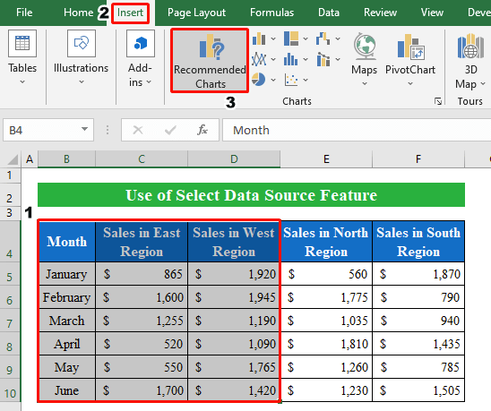
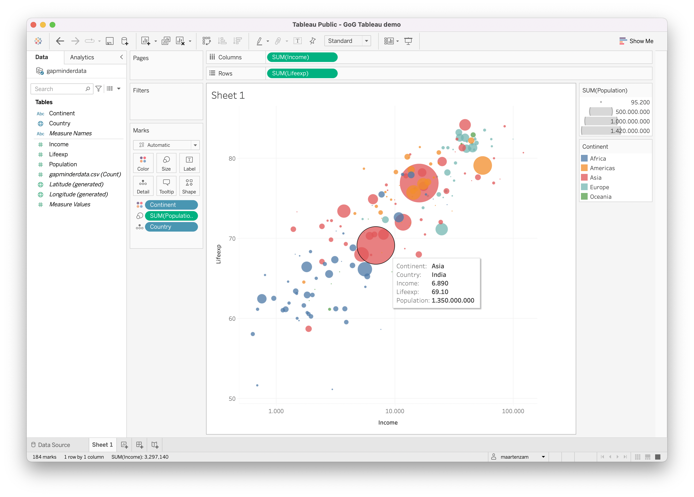
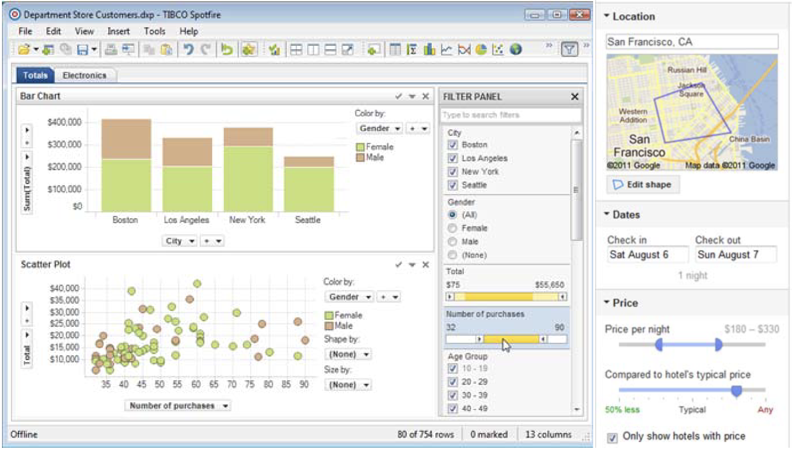
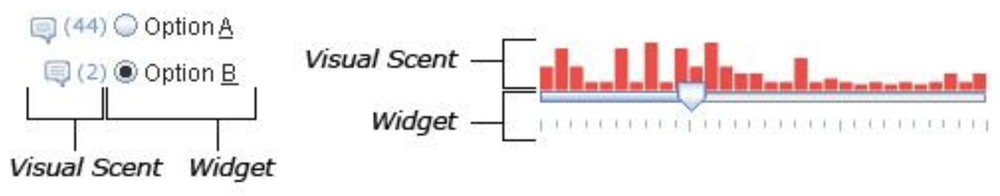
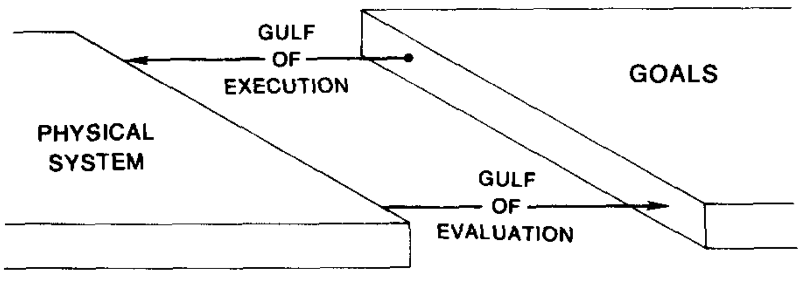

```{r}
#| label: setup
#| echo: false
library(tidyverse)
library(nanoparquet)
theme_set(theme_classic() + theme(panel.border = element_rect(fill = NA, linewidth = .5)))
set.seed(2026)
```

## History

1. Interactive visualizations are visualizations that respond to user input. We
grew up with computers, so we might have gotten used to how extraordinary they
are.  But stepping back, consider that even though visualizations have been a
part of scientific and public discourse for centuries, they were almost always
static. The visualization designer was responsible for a particular data and
view that would be broadcast verbatim to all their readers.  A particularly
ambitious team might prepare a few related visualizations mean to be viewed
together, like an atlas. A few visionaries explored the idea of interactivity
using mechanical devices, like the Bertin Loom,

    

  These were impractical, but they set the stage for what was to come.

2. The situation changed dramatically with the arrival of computers in the 1970s
- 1980s. Compared to print, computer displays can cheaply show many views in
sequence. Through new interfaces, users could also direct the particular
sequence that was shown to them. There might be thousands of options for what
data, visual encodings, and annotation to include in a particular visualization.
An well-designed interactive visualization lets users explore many options
iteratively; they might traverse a path through the space of visualizations that
no other reader has ever considered, one tailored to their particular interests.

   .](figures/prim9.jpeg)

   In this sense, interactive visualizations put their users into conversation
   with the data. They are no longer passive viewers, but can pose questions and
   receive answers from their visualizations (a good interactive visualization
   should feel like an engaging conversation, exploring many avenues and going
   beyond superficialities).

3. There has since been an explosion of software tools for building interactive
visualizations. But there are fundamental concepts that are shared across all
these tools, both about interaction dynamics (so that the plots help users
actually answer questions) and software design (so that the implementation is
modular and logical).

## Interaction Taxonomy: Data and View Specification

4. Heer and Shneiderman argue that, at a high-level, interaction dynamics in
visualization can be categorized into three groups: (1) data and view
specification, (2) view manipulation, and (3) analysis process and provenance.
These notes focus on group (1), which can be further broken into four actions,

    - Visualize: Decide on a set of visual encodings.
    - Filter: Modify which samples are shown.
    - Sort: Reorder where the the samples appear on the display.
    - Derive: Introduce new variables to the display.

   all of which are made accessible to the user.

5. From our study of static visualizations, we know that different visual
encodings prioritize different comparisons. An interactive visualization that
supports the "visualize" action allows the user to modify the encodings directly
within the interface. This can be done through excel-style dropdowns,

    

   but this is less expressive than a full grammar of graphics (e.g., we can't
   overlay regression lines over a scatterplot). Alternatively, some systems
   allow particular encodings to be specified interactively. These are
   essentially interactive, code-free versions of ggplot2; the most famous
   example is tableau.

    

6. Filters allow users to query for particular subsets of the data. They can be
specified through input widgets, like dropdown menus, sliders, radio buttons, or
search bars.

   

   Further, the filter input can itself be augmented by small visualizations,
   called scented widgets (because they give a "scent" about the information
   that can be "foraged" through a particular interaction).

   

7. Often the ordering of the datapoints can make a difference in the patterns
that we perceive. The visualization below shows the relationships between
characters in Les Miserables (we'll study networks in much more depth later).
Notice how many of the purple connections are collected in the same block when
using the Bray Curtis, but not Euclidean, sorting option.

   

8. Finally, it's possible to compute new variables based on interactive user
queries. This is the least common form of interactive data/view specification,
but it has a lot of potential, especially in data science, where statistical
algorithms often return new numerical summaries related to the analysis. For
example, we can fit a linear regression over a subset of interest, or compute
$p$-values contrasting selected vs. unselected points, like in the plot below.

   .](figures/diff_exp_analysis_demo.gif)

### Gulfs, Constancy, and Memory

9. As we've seen above, interactivity opens up many possibilities for
"conversing" with the data. But sometimes interactive visualizations are painful
to use. What can go wrong?

10. One useful abstraction idea is that interactive systems must bridge the two
interaction gulfs.

   - Gulf of execution: The time it takes to specify a query and update the display.
   - Gulf of evaluation: How long it takes to understand the updated display.

   If either of the gulfs takes too long to cross, then the system starts
   becoming difficult to use. Updates that take less than 0.1 seconds feel
   smooth, between 0.1 and 1 second will have a noticeable lag but still support
   continuous train of thought. 10 seconds is generally considered the limit
   before users actively change their interaction behaviors.

   

11. Animation can help reduce the gulf of evaluation. Instead of having to
manually scan plot labels or marks to see how it has changed, we can follow the
same object as it transitions between views. For example, the plot below shows
the population breakdown of different states according to age groups. It's easy
to see which states had stable rankings.

   

   It's important that the transitions track the same object. For example, it
   makes no sense to transition between views showing different datasets.
   Further, if there is very little shared between two adjacent views, then the
   animations can become very hard to follow.

12. This highlights the basic tradeoff between static and interactive
visualization. While interactive visualization allows us to explore many related
views, it relies heavily on our memory. In contrast, a small multiples plot
doesn't place as much burden on memory, though it doesn't scale well to many
views. This basic trade-off is summarized by Tamara Munzner's rule of thumb:
"eyes beat memory." We should only use interactivity when it's really not
possible to gather the same insights from a static view.

## Mosaic

13. The basic challenge in programming interactive systems is that different
parts of the code need to be rerun on demand as the user sends new inputs.  This
is different from traditional computer programs, which execute code from the top
to the bottom of a file, and is often called "reactive programming," because the
program's state reacts to user inputs.

14. There are different ways to handle the resulting coordination problem. We'll
discuss how Mosaic monitors for user interactions and triggers updates to the
visualization. Let's focus on an example. The visualization below responds to
two slider inputs. When we set `batch = n`, it will filter to the first `10n`
rows of the data and recompute the confidence intervals. The confidence interval
widths depend on the confidence level, which itself can be set by a slider
(larger CI levels are more conservative, so lead to wider intervals). As with the
movies example, we compute the `batch` column and drop missing heights in R first,
and write the result to a CSV that the coordinator loads.

```{r}
athletes_tmp <- tempfile()
download.file("https://github.com/uwdata/mosaic/raw/main/data/athletes.parquet", athletes_tmp, quiet = TRUE)

athletes <- read_parquet(athletes_tmp) |>
    filter(!is.na(height)) |>
    group_by(sport) |>
    mutate(batch = 10 * ceiling(row_number() / 10))

write_csv(athletes, "data/athletes.csv")
```

```{ojs}
path = (p) => new URL(`data/${p}`, document.baseURI).href

// setup the data coordinator
vg = {
    const vg = await import("https://cdn.jsdelivr.net/npm/@uwdata/vgplot@0.19.0/+esm");
    const wasm = await vg.wasmConnector();
    vg.coordinator().databaseConnector(wasm);
    await vg.coordinator().exec([
      vg.loadCSV("athletesBatched", path("athletes.csv"))
    ]);
    return vg;
}

// Parameters and selection
$ci = vg.Param.value(0.95)
$query = vg.Selection.single()

vg.vconcat(
    // user inputs
    vg.slider({ select: "interval", as: $query, column: "batch", from: "athletesBatched", label: "Max Samples" }),
    vg.slider({as: $ci, min: 0.5, max: 0.999, step: 0.001, label: "Conf. Level"}),

    // graphical encodings
    vg.plot(
        vg.errorbarX(
        vg.from("athletesBatched", {filterBy: $query}),
          {
            ci: $ci,
            x: "height",
            y: "sport",
            stroke: "sex",
          }
        ),
        vg.xLabel("Height"),
        vg.marginLeft(120), // keep labels visible
        vg.width(500),
        vg.height(400)
    ),
    vg.colorLegend({for: "heights"}),
)
```

### Coordinator

15. The first defines the database coordinator, like we introduced in week 2.
Remember that this reads in the data and stores it in a database that's hidden
from our view. We already did all the preprocessing in R, so this step can
simply load the CSV. Remember that the `path` helper function constructs the
absolute path to the data that we are interested in.

```js
const wasm = await vg.wasmConnector();
vg.coordinator().databaseConnector(wasm);
await vg.coordinator().exec([
    vg.loadCSV("athletesBatched", path("athletes.csv"))
]);
```

The coordinator object is actually a wrapper of the databases we defined when
discussing data management. We can see what tables are available using this query.

```{ojs}
table_names = vg.coordinator().query("SHOW TABLES")
Inputs.table(table_names)
```

Here are the first few rows from `athletesBatches`.

```{ojs}
athletes_head = vg.coordinator().query("SELECT * FROM athletesBatched LIMIT 5")
Inputs.table(athletes_head)
```

When we interact with the visualization, queries like this will be automatically
constructed and sent to the coordinator to fetch relevant data.

### Reactives

16. The reactive variables are stored as either `Param`s or `Selection`s. We have
a `Param` for the confidence interval level and a `Selection` for the number of
data batches to use in the visualization. What they have in common is that any
changes to their values (via user inputs, discussed below) will trigger changes
on all visualization components that refer to them. In mosaic, both these types
of variables are prefixed with a `$`. The key difference is:

   * `Selection` define SQL queries that are used to filter the rows that end up in the visualization.
   * `Params` are variables that influence visual appearance or any computational steps after the data has been queried.

   You can think of this as data and view specification.

17. An important aspect of `Selection`s is that a visualization might define
multiple selections which later need to be reconciled. E.g., we might have two
sliders defining filters using two columns, like Height > c_1, Weight > c_2.
There are a few reconciliation approaches defined in mosaic.

   * `vg.Selection.intersection()`: Consider only samples that pass both conditions.
   * `vg.Selection.union()`: Consider samples that pass either condition.
   * `vg.Selection.single()`: Consider samples that pass the condition that was most recently changed by the user.

18. In our example, we define a parameter for confidence level initialized at
0.95. This changes the width of the intervals in the visualization, but we can
change its value without needing to query the data.

```{ojs}
//| eval: false
$ci = vg.Param.value(0.95)
```

For the number of batches to use, we instead need a selection. The code below
doesn't specify what data query will be run every time it is changed. We're
using `.single()` reconciliation strategy, but this could have been choice,
because we only have one selection in this visualization.

```{ojs}
//| eval: false
$query = vg.Selection.single()
```

### Inputs

19. Mosaic allows the user to modify these reactive variables using `Inputs`.
The package implements,

    * [`menu`](https://idl.uw.edu/mosaic/api/inputs/menu.html): Select rows by the category levels in a column.
    * [`slider`](https://idl.uw.edu/mosaic/api/inputs/slider.html): There are either point or interval sliders. Point sliders let you filter rows where a column is above (or below) a given threshold. Interval sliders filter rows where a column has values between the interval boundaries.
    * [`search`](https://idl.uw.edu/mosaic/api/inputs/search.html): Select rows where the search text appears in a column.
    * [`table`](https://idl.uw.edu/mosaic/api/inputs/table.html): Select rows where the user has hovered their mouse.

20. In our example, there are two sliders. The syntax is different because the
first modifies a `Selection` while the second modifies a `Param`. The first
slider is requerying the `athletesBatched` dataset to retrieve rows where the
value in the `batch` column is less than `query`.

```{ojs}
//| eval: false
vg.slider({ select: "interval", as: $query, column: "batch", from: "athletesBatched", label: "Max Samples" })
```

The arguments mean:

   - `as`: The `Selection` object. This ties the user inputs to subsequent visual changes.
   - `from`: Which dataset do we draw the query from?
   - `column`: Which column of the dataset do we use when defining the query?
   - `select`: Should we keep only the rows where `batch` equals the slider value, or should we consider any value less than the selected slider value? Interval means we should use the latter.

Given this information, the slider will internally construct the SQL query,

```sql
SELECT * FROM athletesBatched WHERE batch < {slider value}
```

   The definition of the `Param`-based slider slider is more straightforward, because it never needs to refer to the data.

```{ojs}
//| eval: false
vg.slider({as: $ci, min: 0.5, max: 0.999, step: 0.001, label: "Conf. Level"})
```

   - `as`: The `Param` object. Like in the slider above, this makes sure inputs
   trigger changes in the downstream visualization.
   - `min, max, step`: Controls the endpoints and resolution of the slider. When we used a `Selection`, this information was automatically inferred^[We could have also set it manually.].

21. Different inputs have different arguments controlling their appearance and
what they make possible to the user, and when working on a new visualization,
it's helpful to have the documentation open. But they all have the same
`Selection` vs. `Param` distinction, with different specifications depending on
whether they are used to define new data queries (`Selection`) or simply set
variables that will be used downstream (`Param`).

### Visual Layers

22. Finally, we relate these reactive variables to the visualization. Any part of
a Mosaic plot that refers to a reactive variable will be recomputed whenever the
user inputs are changed. Whenever `query` selection is changed, we requery the
`athletesBatched` dataset (the first argument in any mosaic layer describes the
dataset of interest). The `ci` parameter controls the `ci` visual encoding in
the error bar layer.

```{ojs}
//| eval: false
vg.plot(
    vg.errorbarX(
    vg.from("athletesBatched", {filterBy: $query}),
    {
        ci: $ci,
        x: "height",
        y: "sport",
        stroke: "sex"
    }
    ),
)
```

_Exercise: What are the reactive variables in this program? When they are changed, do they affect the displayed data or the visual encoding?_

23. We can organize the interface using `vconcat` (vertical concatenation) and
`hconcat` (horizontal concatenation). They are analogous to `/` and `+` for
combining panels in patchwork. They have no influence on the computation or
interaction dynamics, just where the components appear on the display.

24. For example, if we had wanted to place the sliders on the side of the main
visualization, we can use

```{ojs}
vg.hconcat(
    vg.vconcat(
        vg.slider({ select: "interval", as: $query, column: "batch", from: "athletesBatched", label: "Max Samples" }),
        vg.slider({as: $ci, min: 0.5, max: 0.999, step: 0.001, label: "Conf. Level"})
    ),
    vg.plot(
        vg.errorbarX(
        vg.from("athletesBatched", {filterBy: $query}),
        {
            ci: $ci,
            x: "height",
            y: "sport",
            stroke: "sex"
        }
        ),
        vg.xLabel("Height"),
        vg.marginLeft(120), // keep labels visible
        vg.width(500),
        vg.height(400)
    ),
    vg.colorLegend({for: "heights"}),
)
```

### Application: Filtering Movie Ratings

25. Let's work through another example inspired by the classic
[FilmFinder](https://youtu.be/g9JadyYUyK8?si=_uP3aRTsRk2Vwedh&t=141)
visualization. We first prepare a CSV file that we can load into our mosaic
coordinator. First, we need to handle the missing values present in the raw
data. If the genre or MPAA rating were unknown, we replace them with a new
category level called "Missing". Since the focus of the plot is the IMDB and
Rotten Tomatoes ratings, we drop the movie if either of those is missing.

```{r}
library(lubridate)

movies <- read_csv("https://raw.githubusercontent.com/krisrs1128/stat479_s22/main/_posts/2022-02-10-week04-03/apps/data/movies.csv") |>
    mutate(
        year = year(as_date(Release_Date, format = "%b %d %Y")),
        Major_Genre = fct_explicit_na(Major_Genre),
        MPAA_Rating = fct_explicit_na(MPAA_Rating)
    ) |>
    filter(!is.na(IMDB_Rating)) |>
    filter(!is.na(Rotten_Tomatoes_Rating))

write_csv(movies, "data/movies.csv")
```

26. The entire app is given in the block below. We've written two helper
functions, `movie_controls` and `movie_plot,` to support the interactivity and
graphical encodings, respectively. The use case of the app is relatively simple,
but it already reveals some interesting patterns. For example, dramas tend to
have higher ratings than horror. Also, what do you think is going on with the
fact that movies released before 1995 seem to have higher ratings in general?

```{ojs}
movie_app = {
    await vg.coordinator().exec([
        vg.loadCSV("movies", path("movies.csv"))
    ]);

    const movieQuery = vg.Selection.intersect();

    return vg.vconcat(
        movie_controls(movieQuery),
        movie_plot(movieQuery)
    );
}
```

27. Let's study those two functions. `movie_controls` defines the three user
interface inputs. The `from` argument tells us to always look at the `movies`
database within the coordinator. `column` says which column should be used to
define the selector. Notice the interaction types have to match the data types.
For example, it's not be possible to use a slider for genre.

The argument `query` is a `vg.Selection.intersect()` object.  This ensures that
only the movies that satisfy all these selections will be returned from the
database.

_Exercise: What would happen if we had used `vg.Selection.single()` instead?  What about `vg.Selection.union()`?_

```{ojs}
function movie_controls(query) {
    return vg.hconcat(
        vg.menu({
            as: query,
            from: "movies",
            column: "Major_Genre",
            value: "Drama",
            label: "Genre"
        }),
        vg.menu({
            as: query,
            from: "movies",
            column: "MPAA_Rating",
            label: "MPAA Rating"
        }),
        vg.slider({
            as: query,
            from: "movies",
            column: "year",
            min: 1928,
            max: 2046,
            select: "interval",
            value: 2020,
            step: 1,
            label: "Released Through"
        })
    );
}
```

27. The function below draws the actual plot. Notice that we have two dot
layers.  The first shows everything in a faint background, and the second shows
those that pass the query. The `tip: true` call ensures that we can see the
movie title when we hover our mouse near the highlighted point.

```{ojs}
function movie_plot(query) {
     return vg.plot(
       vg.dot(vg.from("movies"), {
         x: "Rotten_Tomatoes_Rating",
         y: "IMDB_Rating",
         r: 1.5,
         fill: "#777",
         fillOpacity: 0.1
       }),
       vg.dot(vg.from("movies", {filterBy: query}), {
         x: "Rotten_Tomatoes_Rating",
         y: "IMDB_Rating",
         r: 3,
         fill: "#c84f4f",
         title: "Title",
         tip: true
       }),
       vg.xyDomain(vg.Fixed),
       vg.xLabel("Rotten Tomatoes Rating"),
       vg.yLabel("IMDB Rating"),
       vg.width(680),
       vg.height(400)
     );
}
```
