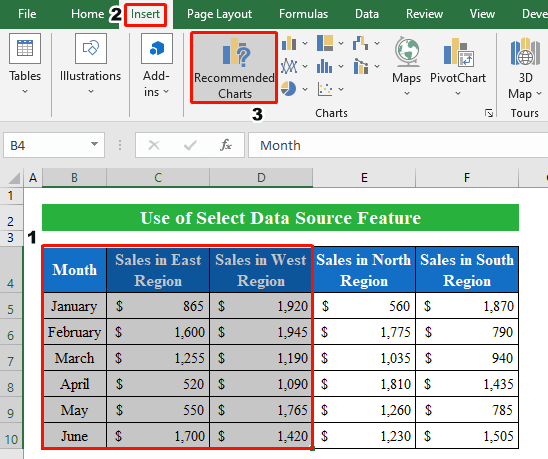
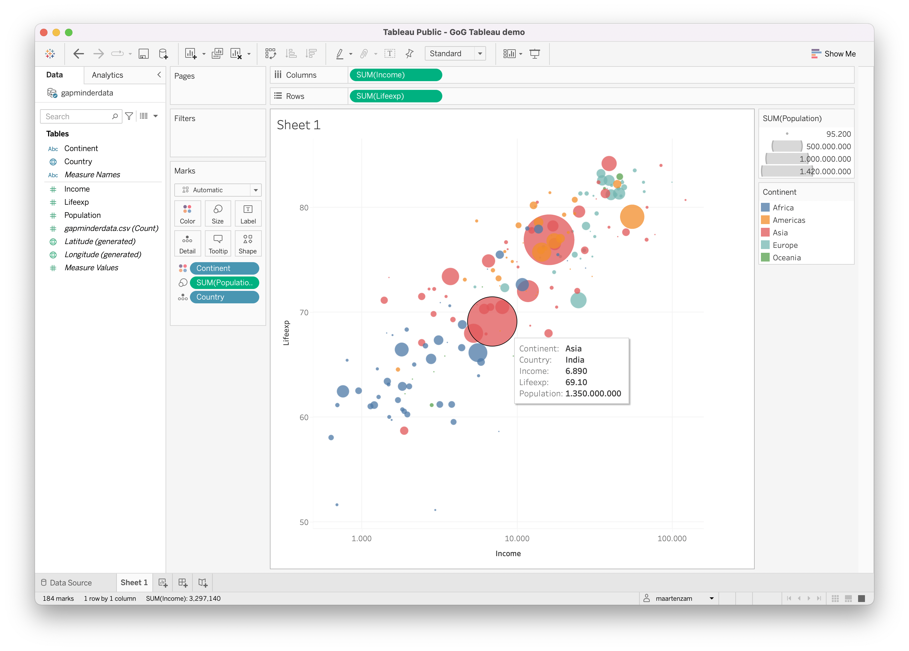
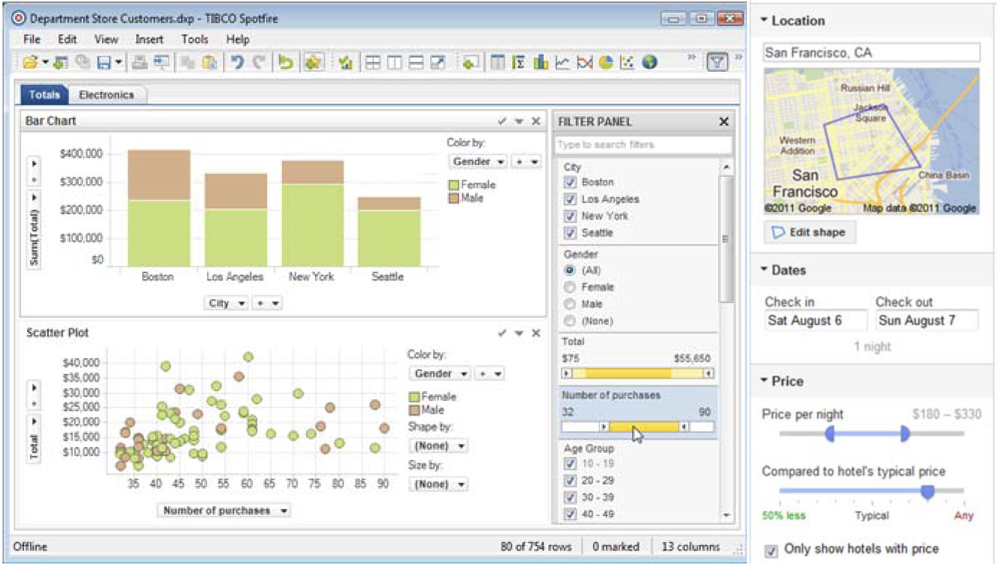
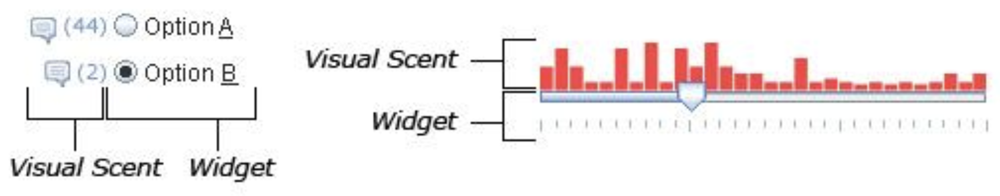
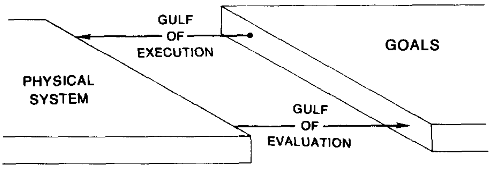

```{r}
#| label: setup
#| echo: false
library(tidyverse)
library(nanoparquet)
theme_set(theme_classic() + theme(panel.border = element_rect(fill = NA, linewidth = .5)))
set.seed(2026)
```

Readings [1](https://homes.cs.washington.edu/~jheer/files/idfva-draft.pdf) (Sections 1 - 2), [2](https://idl.uw.edu/mosaic/what-is-mosaic/)

## History

1. Interactive visualizations are visualizations that respond to user input. We
grew up with computers, so we might have gotten used to how extraordinary they
are.  But stepping back, consider that even though visualizations have been a
part of scientific and public discourse for centuries, they were almost always
static. The visualization designer was responsible for a particular data and
view that would be broadcast verbatim to all their readers.  A particularly
ambitious team might prepare a few related visualizations mean to be viewed
together, like an atlas. A few visionaries explored the idea of interactivity
using mechanical devices, like the Bertin Loom.

   

   These were impractical, but they set the stage for what was to come.

2. The situation changed dramatically with the arrival of computers in the
1970s - 1980s. Compared to print, computer displays can cheaply show many views
in sequence. Through new interfaces, users could also direct the particular
sequence that was shown to them. There might be thousands of options for what
data, visual encodings, and annotation to include in a particular visualization.
An well-designed interactive visualization lets users explore many options
iteratively; they might traverse a path through the space of visualizations that
no other reader has ever considered, one tailored to their particular interests.

   .](figures/prim9.jpeg)

   In this sense, interactive visualizations put their users into conversation
   with the data. They are no longer passive viewers, but can pose questions and
   receive answers from their visualizations (a good interactive visualization
   should feel like an engaging conversation, exploring many avenues and going
   beyond superficialities).

3. There has since been an explosion of software tools for building interactive
visualizations. But there are fundamental concepts that are shared across all
these tools, both about interaction dynamics (so that the plots help users
actually answer questions) and software design (so that the implementation is
modular and logical).

## Interaction Taxonomy: Data and View Specification

4. Heer and Shneiderman argue that, at a high-level, interaction dynamics in
visualization can be categorized into three groups: (1) data and view
specification, (2) view manipulation, and (3) analysis process and provenance.
These notes focus on group (1), which can be further broken into four actions,

   - Visualize: Decide on a set of visual encodings.
   - Filter: Modify which samples are shown.
   - Sort: Reorder where the the samples appear on the display.
   - Derive: Introduce new variables to the display.

    Basically, we can use interactivity to decide what data to show (data
    specification) and how we show it (view specification).

5. _Visualize._ From our study of static visualizations, we know that different visual
encodings prioritize different comparisons. An interactive visualization that
supports the "visualize" action allows the user to modify the encodings directly
within the interface. This can be done through excel-style dropdowns,

   

   but this is less expressive than a full grammar of graphics (e.g., we can't
   overlay regression lines over a scatterplot). Alternatively, some systems
   allow particular encodings to be specified interactively. These are
   essentially interactive, code-free versions of ggplot2; the most famous
   example is tableau.

   

6. _Filter._ Filters allow users to query for particular subsets of the data.
They can be specified through input widgets, like dropdown menus, sliders, radio
buttons, or search bars.

   

   Further, the filter input can itself be augmented by small visualizations,
   called scented widgets (because they give a "scent" about the information
   that can be "foraged" through a particular interaction).

   

7. _Sort._ Often the ordering of the datapoints can make a difference in the
patterns that we perceive. The visualization below shows the relationships
between characters in Les Miserables (we'll study networks in much more depth
later).  Notice how many of the purple connections are collected in the same
block when using the Bray Curtis, but not Euclidean, sorting option.

   

8. _Derive._ Finally, it's possible to compute new variables based on
interactive user queries. This is the least common form of interactive data/view
specification, but it has a lot of potential, especially in data science, where
statistical algorithms often return new numerical summaries related to the
analysis. For example, we can fit a linear regression over a subset of interest,
or compute $p$-values contrasting selected vs. unselected points, like in the
plot below.

   .](figures/diff_exp_analysis_demo.gif)

### Gulfs, Constancy, and Memory

9. As we've seen above, interactivity opens up many possibilities for
"conversing" with the data. But sometimes interactive visualizations are painful
to use. What can go wrong?

10. One useful abstraction idea is that interactive systems must bridge the two
interaction gulfs.

    - Gulf of execution: The time it takes to specify a query and update the display.
    - Gulf of evaluation: How long it takes to understand the updated display.

    If either of the gulfs takes too long to cross, then the system starts
    becoming difficult to use. Updates that take less than 0.1 seconds feel
    smooth, between 0.1 and 1 second will have a noticeable lag but still support
    continuous train of thought. 10 seconds is generally considered the limit
    before users actively change their interaction behaviors.

    

11. Animation can help reduce the gulf of evaluation. Instead of having to
manually scan plot labels or marks to see how it has changed, we can follow the
same object as it transitions between views. For example, the plot below shows
the population breakdown of different states according to age groups. It's easy
to see which states had stable rankings.

    

    It's important that the transitions track the same object. For example, it
    makes no sense to transition between views showing different datasets.
    Further, if there is very little shared between two adjacent views, then the
    animations can become hard to follow.

12. This highlights the basic tradeoff between static and interactive
visualization. While interactive visualization allows us to explore many related
views, it relies heavily on memory. In contrast, a small multiples plot doesn't
place as much burden on memory, but don't scale well to many views. This basic
trade-off is summarized by Tamara Munzner's rule of thumb: "eyes beat memory."
We should only use interactivity when it's not possible to gather the same
insights from a static view.

## Mosaic

13. The basic challenge in programming interactive systems is that different
parts of the code need to be rerun on demand as the user sends new inputs.  This
is different from traditional computer programs, which execute code from the top
to the bottom of a file, and is often called "reactive programming," because the
program's state reacts to user inputs.

14. We'll discuss how Mosaic monitors for user interactions and triggers updates
to the visualization. First, let's setup a database with the datasets we'll use
in our illustrations below.

```{ojs}
path = (p) => new URL(`data/${p}`, document.baseURI).href

// setup the data coordinator
vg = {
    const vg = await import("https://cdn.jsdelivr.net/npm/@uwdata/vgplot@0.19.0/+esm");
    const wasm = await vg.wasmConnector();
    vg.coordinator().databaseConnector(wasm);
    await vg.coordinator().exec([
      vg.loadCSV("penguins", path("penguins.csv")),
      vg.loadCSV("athletesBatched", path("athletes.csv")),
      vg.loadCSV("movies", path("movies.csv"))
    ]);
    return vg;
}
```

### `Param` and `Selection`

15. In mosaic, `Params` are used for interactive view specification. They are the
link between user inputs and the visual rendering code that needs to be rerun
based on the user input. For example, the scatterplot below allows us to change
point color using a menu. The user can provide inputs through `vg.menu`. The
`vg.dot` layer uses whatever color is passed to the `fill` argument.  `$color`
appears in both the `vg.menu` and `vg.dot` code is and ensures the visualization
is rerendered every time the input changes.

```{ojs}
//| label: param-minimal-plot
$color = vg.Param.value("red")

menu = vg.menu({as: $color, options: ["red", "blue", "green"], label: "Point color"})
plot = vg.plot(
    vg.dot(
        vg.from("penguins"),
        {x: "bill_length_mm", y: "bill_depth_mm", fill: $color}
    ),
    vg.width(500),
    vg.height(300)
)

vg.vconcat([menu, plot])
```

16. In this example, `Param` simply controls the view and never refers to the
underlying dataset. If instead we want to use interactivity for data
specification, we need to use mosaic's `Selection` object. Like `Param`, this
serves as a link between user inputs and visual rendering. However, the
`Selection` object can query the underlying database. For example, we can filter
to different species using the `filterBy` argument of `from`.

```{ojs}
//| label: selection-minimal-plot
$species = vg.Selection.single()

speciesMenu = vg.menu({as: $species, from: "penguins", column: "species", label: "Species"})
speciesPlot = vg.plot(
    vg.dot(
        vg.from("penguins", {filterBy: $species}),
        {x: "bill_length_mm", y: "bill_depth_mm"}
    ),
    vg.xDomain([30, 60]), // keeps the window ranges fixed
    vg.yDomain([12, 22]),
    vg.width(500),
    vg.height(300)
)

vg.vconcat([speciesMenu, speciesPlot])
```

17. Filtering completely removes points from the plot. We can instead highlight
one group and fade the rest into the background using `vg.highlight`. This again
requires a `Selection` object, because we need to refer to the underlying data.

```{ojs}
//| label: selection-highlight-plot
$species2 = vg.Selection.single()

speciesMenu2 = vg.menu({as: $species2, from: "penguins", column: "species", label: "Species"})
speciesPlot2 = vg.plot(
    vg.dot(
        vg.from("penguins"),
        {x: "bill_length_mm", y: "bill_depth_mm"},
    ),
    vg.highlight({by: $species2, opacity: 0.1}),
    vg.width(500),
    vg.height(300)
)

vg.vconcat([speciesMenu2, speciesPlot2])
```

18. We can also combine several user inputs into the same selection. For
example, below we have one menu for species and another for island, and they
both point to the same `Selection` object. Mosaic defines a few ways to
reconcile the competing user inputs.

    * `vg.Selection.intersect()`: Consider only samples that pass both conditions.
    * `vg.Selection.union()`: Consider samples that pass either condition.
    * `vg.Selection.single()`: Consider samples that pass the condition that was most recently changed by the user.

```{ojs}
//| label: selection-reconcilation-plot
// one Selection shared by both menus; swap intersect() for union() or single()
$filter = vg.Selection.intersect()

speciesMenu3 = vg.menu({as: $filter, from: "penguins", column: "species", label: "Species"})
islandMenu = vg.menu({as: $filter, from: "penguins", column: "island", label: "Island"})
speciesIslandPlot = vg.plot(
    vg.dot(
        vg.from("penguins"),
        {x: "bill_length_mm", y: "bill_depth_mm", fill: "species"}
    ),
    vg.highlight({by: $filter, opacity: 0.1}),
    vg.xDomain([30, 60]),
    vg.yDomain([12, 22]),
    vg.width(500),
    vg.height(300)
)

vg.vconcat([vg.hconcat([speciesMenu3, islandMenu]), speciesIslandPlot])
```

### Inputs

19. Menus are just one way that the user can provide inputs. Mosaic package
implements,

    * [`menu`](https://idl.uw.edu/mosaic/api/inputs/menu.html): Select rows by the category levels in a column.
    * [`slider`](https://idl.uw.edu/mosaic/api/inputs/slider.html): There are two types of sliders. Point sliders refer to a single value while interval sliders refer to lower and upper bounds.
    * [`search`](https://idl.uw.edu/mosaic/api/inputs/search.html): Select rows where the search text appears in a column.
    * [`table`](https://idl.uw.edu/mosaic/api/inputs/table.html): Select rows where the user has hovered their mouse.

20. These work with both `Param` and `Selection` objects. For example, we can
change point sizes using a `Param` object.

```{ojs}
//| label: param-minimal-slider
$size = vg.Param.value(5)

size_slider = vg.slider({as: $size, min: 1, max: 25, label: "point size"})
size_plot = vg.plot(
    vg.dot(
        vg.from("penguins"),
        {x: "bill_length_mm", y: "bill_depth_mm", r: $size}
    ),
    vg.width(500),
    vg.height(300)
)

vg.vconcat([size_slider, size_plot])
```

We can alternatively use a slider to highlight samples with flipper sizes between a given range.

```{ojs}
//| label: param-slider-selection
$flipper_selection = vg.Selection.single()

flipper_slider = vg.slider({as: $flipper_selection, from: "penguins", column: "flipper_length_mm", select: "interval", label: "Flipper length"})
flipper_plot = vg.plot(
    vg.dot(
        vg.from("penguins"),
        {x: "bill_length_mm", y: "bill_depth_mm"}
    ),
    vg.highlight({by: $flipper_selection, opacity: 0.1}),
    vg.width(500),
    vg.height(300)
)

vg.vconcat([flipper_slider, flipper_plot])
```

The arguments to `slider` are more complicated now because we have to refer to
the `flipper_length_mm` column of the dataset.

- `as`: The `Selection` object. This ties the user inputs to rendered visual changes.
- `from`: Which dataset do we draw the query from?
- `column`: Which column of the dataset do we use when defining the query?
- `select`: Should we keep only the rows where `flipper_length_mm` equals the slider value? Or anything up to this value?

21. This is an example table selection. We create a table based on the `penguins`
data. We draw two layers of dots, one grey and another red. If we hover over a
row in the table, then we filter the red layer to show only the hovered penguin.

```{ojs}
//| label: selection-table
$table_selection = vg.Selection.single()

// define the table input
penguin_table = vg.table({
    as: $table_selection,
    from: "penguins",
    columns: ["species", "island", "bill_length_mm", "bill_depth_mm", "flipper_length_mm"]
})

// Define the plot from two dot layers (background and foreground)
table_plot = vg.plot(
    vg.dot(
        vg.from("penguins"),
        {x: "bill_length_mm", y: "bill_depth_mm", fill: "#CDB4BB", r: 2}
    ),
    vg.dot(
        vg.from("penguins", {filterBy: $table_selection}),
        {x: "bill_length_mm", y: "bill_depth_mm", fill: "#7D323D", r: 3}
    ),
    vg.width(500),
    vg.height(300)
)

vg.vconcat([table_plot, penguin_table, vg.vspace(10)])
```

22. $^\dagger$ By default, the menu, slider, and table inputs aren't really that
pretty. But you can customize their appearance using CSS. For example, I created
the alternating light/dark row highlighting and sticky header using the CSS code
below.

    ```{=html}
    <style>
      thead th {
        position: sticky;
        top: 0;
      }
      tbody tr:nth-child(even) {
        background: #f3f3f3;
      }
    </style>
    ```

    Here are some other CSS rules to ensure the menu labels have aren't squeeezd
    too tightly next to the dropdown.

    ```{=html}
    <style>
      .input { margin-right: 1em; }
      .input > * { vertical-align: middle; }
      .input label:first-of-type { margin-right: .5em; }
    </style>
    ```

## Examples

### Athlete Heights

23. The example below comes from the mosaic documentation and shows how
confidence intervals become narrower when we have more samples. It illustrates
this by computing a confidence interval for the height of athletes within each
sport. Let's take a look at the original data. The batch column is defined so
that, within each sport, every 10 rows gets labeled with a new batch number.

```{ojs}
athletes_preview = vg.coordinator().query("SELECT * FROM athletesBatched")
Inputs.table(athletes_preview)
```

24. The visualization has two slider inputs. `$query` controls a `Selection`
that filters rows with less then the specified batch number. When a smaller
dataset is passed into the `errorbarX` layer, the associated error bars get
wider. `ci` controls a `Param` governing the confidence level. Confidence levels
that are larger (e.g., 99%) require wider intervals, but this doesn't reference
the underlying data, so we can get away with a `Param`.

    ```{r}
    #| echo: false
    athletes_tmp <- tempfile()
    download.file("https://github.com/uwdata/mosaic/raw/main/data/athletes.parquet", athletes_tmp, quiet = TRUE)
    athletes <- read_parquet(athletes_tmp) |>
        filter(!is.na(height)) |>
        group_by(sport) |>
        mutate(batch = 10 * ceiling(row_number() / 10))

    write_csv(athletes, "data/athletes.csv")
    ```

```{ojs}
// Parameters and selection
$ci = vg.Param.value(0.95)
$query = vg.Selection.single()

vg.vconcat(
    // user inputs
    vg.slider({ select: "interval", as: $query, column: "batch", from: "athletesBatched", label: "Max Samples" }),
    vg.slider({as: $ci, min: 0.5, max: 0.999, step: 0.001, label: "Conf. Level"}),

    // graphical encodings
    vg.plot(
        vg.errorbarX(
            vg.from("athletesBatched", {filterBy: $query}),
            {ci: $ci, x: "height", y: "sport"}
        ),
        vg.xLabel("Height"),
        vg.marginLeft(120), // keep labels visible
        vg.width(500),
        vg.height(400)
    ),
    vg.colorLegend({for: "heights"}),
)
```


### Movie Ratings

25. Let's work through another example inspired by the classic
[FilmFinder](https://youtu.be/g9JadyYUyK8?si=_uP3aRTsRk2Vwedh&t=141)
visualization. We first prepare a CSV file that we can load into our mosaic
coordinator. First, we need to handle the missing values present in the raw
data. If the genre or MPAA rating were unknown, we replace them with a new
category level called "Missing". Since the focus of the plot is the IMDB and
Rotten Tomatoes ratings, we drop the movie if either of those is missing.

    ```{r}
    #| echo: false
    library(lubridate)

    movies <- read_csv("https://raw.githubusercontent.com/krisrs1128/stat479_s22/main/_posts/2022-02-10-week04-03/apps/data/movies.csv") |>
        mutate(
            year = year(as_date(Release_Date, format = "%b %d %Y")),
            Major_Genre = fct_explicit_na(Major_Genre),
            MPAA_Rating = fct_explicit_na(MPAA_Rating)
        ) |>
        filter(!is.na(IMDB_Rating)) |>
        filter(!is.na(Rotten_Tomatoes_Rating))

    write_csv(movies, "data/movies.csv")
    ```

26. The entire app is given in the block below. We've written two helper
functions, `movie_controls` and `movie_plot,` to support the interactivity and
graphical encodings, respectively. The use case of the app is relatively simple,
but it already reveals some interesting patterns. For example, dramas tend to
have higher ratings than horror. Also, what do you think is going on with the
fact that movies released before 1995 seem to have higher ratings in general?

```{ojs}
movieQuery = vg.Selection.intersect();

vg.vconcat(
    movie_controls(movieQuery),
    movie_plot(movieQuery)
);
```

27. Let's study those two functions. `movie_controls` defines the three user
interface inputs. The `from` argument tells us to always look at the `movies`
dataset in our database. `column` says which column should be used to define the
selector. The argument `query` is a `vg.Selection.intersect()` object.  This
ensures that only the movies that satisfy all these selections will be returned
from the database.

    _Exercise: What would happen if we had used `vg.Selection.single()` instead?  What about `vg.Selection.union()`?_

```{ojs}
function movie_controls(query) {
    return vg.hconcat(
        vg.menu({
            as: query,
            from: "movies",
            column: "Major_Genre",
            value: "Drama",
            label: "Genre"
        }),
        vg.menu({
            as: query,
            from: "movies",
            column: "MPAA_Rating",
            label: "MPAA Rating"
        }),
        vg.slider({
            as: query,
            from: "movies",
            column: "year",
            min: 1928,
            max: 2046,
            select: "interval",
            value: 2020,
            step: 1,
            label: "Released Through"
        })
    );
}
```

28. The function below draws the actual plot. Notice that we have two dot
layers.  The first shows everything in a faint background, and the second shows
those that pass the query. The `tip: true` call ensures that we can see the
movie title when we hover our mouse near the highlighted point.

```{ojs}
function movie_plot(query) {
     return vg.plot(
       vg.dot(vg.from("movies"), {
         x: "Rotten_Tomatoes_Rating",
         y: "IMDB_Rating",
         r: 1.5,
         fill: "#CDB4BB"
       }),
       vg.dot(vg.from("movies", {filterBy: query}), {
         x: "Rotten_Tomatoes_Rating",
         y: "IMDB_Rating",
         r: 3,
         fill: "#7D323D",
         title: "Title",
         tip: true
       }),
       vg.xyDomain(vg.Fixed),
       vg.xLabel("Rotten Tomatoes Rating"),
       vg.yLabel("IMDB Rating"),
       vg.width(680),
       vg.height(400)
     );
}
```
