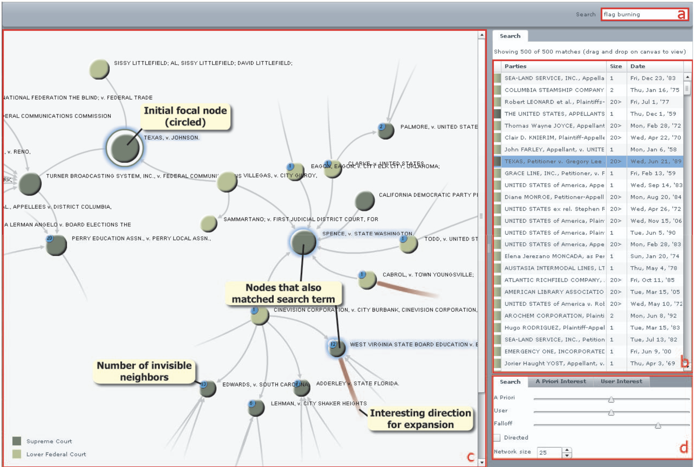

```{r}
#| label: setup
#| echo: false
library(tidyverse)
theme_set(theme_classic() + theme(panel.border= element_rect(fill = NA, linewidth = .5)))
set.seed(2026)
```

Readings [1](https://homes.cs.washington.edu/~jheer/files/idfva-draft.pdf) (Sections 3), [2](https://idl.uw.edu/mosaic/core/)

## Taxonomy: View Manipulation

1. Besides data and view specification, interactivity can support view
manipulation. Important actions associated with view specification are,

   - **Select** items to focus or operate on.
   - **Navigate** the view to an region of interest.
   - **Coordinate** interactions across related panels.
   - **Organize** views into an easier to understand layout.

2. **Selection** operations are used to direct our attention to subsets of
particular interest. While we could use a search bar or dropdown widget for this
purpose, these require a priori knowledge of groups of interest. To highlight
items based on plot itself, we can instead use click or hover events. These
types of inputs (based on the plot rather than external widgets) are called
graphical queries.

   

   Hover and click are useful for individual samples. For groups, we can instead
   use brushes (interactive rectangular selections).  This examples uses brushes on
   a parallel coordinates and shows that low weight cars transitioned to having
   lower MPG in the late 1970s.

   

   Instead of brushes, for some data it makes more sense to define lassos
   (arbitrarily shaped selections).

   

   [source](https://old.observablehq.com/blog/linked-brushing)

3. Rather than querying the samples directly, we can query properties of the
samples. For example, this version of
[TimeSearcher](https://www.youtube.com/watch?v=VWx1TMcrb74) lets us we can
search for all lines with slopes within a certain range [doi:10.1145/506443.506460].

   

4. In complex data, we often **navigate** to a particular view of interest. Some
visualizations act like small viewports into a larger display, in which case
navigation might mean panning and zooming the viewport to the region of
interest.

   

5. Beyond literal navigation across visualization space, it is often helpful to
navigate across resolutions.  Focus-plus-context visualizations include a
graphical overview that, when queried, reveals extra details (the focus) without
losing the context. Some examples,

   - To navigate a very large tree, we would start most of the subtrees collapsed into intermediate notes, and when those nodes are clicked, the associated subtrees can be expanded. The graphical query is clicking on or near a node.
   - To navigate a very detailed map, we can show an overview of the main landmarks. By brushing on this overview map, we update another panel giving all the details within that brushed region. The graphical query is brushing on the overview map.

   This principle is summarized by Shneiderman's Mantra: Overview first, zoom
   and filter, then details-on-demand [doi:10.5555/832277.834354].

6. Focus-plus-context only makes sense when an overview is useful. A laywer
interested in a particular case doesn't need an overview of all cases ever
litigated, instead they need to navigate to cases similar to the one they are
working on. In this case, an alternative to Shneiderman's mantra is "Search,
Show Context, Expand on Demand" [doi:10.1109/TVCG.2009.108].

   {width=700}

7. Interactivity can also be used to **coordinate** views. This is especially
helpful when working with small multiples and multipanel layouts. Dynamic
linking is a visualization technique where interacting with one view updates
others. For example, selecting a sample (or group of samples) in one view
highlights or filters the corresponding samples in the other views.

   Here is an example where each panel has the same visual encoding. By brushing
   the delays histogram, we can see that the most delayed flights often depart
   later in the day.

   

   Here is a multipanel example. We can see which departure/dropoff combinations
   are most common and they change over the course of the day.

   

8. Finally, interactivity can be used to **organize** displays. We're so used to
working with multiple windows open at a time that it's easy to forget that this
is indeed a form of interactivity. We have to deliberately tell our
visualization to adjust $x$ and $y$ axis scales so that when the window is
resized, the plot remains visible.

9. Altogether this taxonomy shows that interactivity entails many design choices
into visualization, more than we already had with deciding on graphical
encodings in static visualizations. Which features or samples should be
queryable, and how (widget vs. graphical, click vs. brush, ...)?  Earlier we saw
that the hierarchy of encodings means the choice of design will prioritize
certain comparisons over others. Similarly, choices of interactivity will
prioritize some queries over others. As designers, it's our responsibility to
know which queries our users will be most likely to care about and create
visualizations that help them resolve them accurately and easily.

10. How should we search across the (vast) space of possible visualization
designs? After reviewing many successful and failed visualization projects,
Tamara Munzner developed the design space metaphor. Each visualization is a
point in the design space. It's important to explore the space broadly before
committing to and refining one. This means creating many rough prototypes to
understand the tradeoffs in their choice of graphical encodings and interaction
dynamics. Only after the differences are well-understood do we have enough
information to decide on one [https://www.cs.ubc.ca/labs/imager/tr/2012/dsm/dsm-talk.pdf and doi:https://dl.acm.org/doi/10.1109/TVCG.2012.213].

       
    ![]

## Mosaic Interactors

11. Mosaic can also be used for view manipulation through
[Interactors](https://idl.uw.edu/mosaic/api/vgplot/interactors.html).  They
behave like Inputs (`vg.slider`, `vg.menu`, ...) in the sense that they use
arguments like `{ as: selection }` to pass new user inputs to `Selection`
objects. However, unlike traditional Inputs, these Interactors are themselves a
part of the plot, and so appear inside `vg.plot`; i.e., interactors define
graphical queries.

    We'll illustrate the main types of interactors using the penguins data. They all
    have basically the same steps,

    - Define a `Selection`.
    - Allow the interactor to change the selection using `{as: selection}`
    - Allow the plot (or table) to respond to the selection. This can either be
    through highlighting with `vg.highlight({by: selection})` or filtering
    `vg.from("penguins", {filterBy: selection})`.

12. Let's first look at `vg.intervalX`. This defines an $x$-oriented brush. Here
we're filtering all of the penguins with a certain bill length. We fix the $x$
and $y$ domains to maintain our orientation (otherwise it would redraw with new
$x$ and $y$ axes on each interaction).

```{ojs}
//| label: interval-x-same-filter
brush_filter = vg.Selection.intersect()

vg.plot(
    vg.dot(
        vg.from("penguins", {filterBy: brush_filter}),
        {x: "bill_length_mm", y: "bill_depth_mm"}
    ),
    vg.intervalX({as: brush_filter}),
    vg.xDomain([30, 60]),
    vg.yDomain([12, 22]),
    vg.width(500),
    vg.height(300)
)
```

13. Instead of filtering, we can highlight the penguins that lie in our brush
selection.

```{ojs}
//| label: interval-x-same-highlight
brush_same = vg.Selection.intersect()

vg.plot(
    vg.dot(
        vg.from("penguins"),
        {x: "bill_length_mm", y: "bill_depth_mm"}
    ),
    vg.intervalX({as: brush_same}),
    vg.highlight({by: brush_same, opacity: 0.1}),
    vg.width(500),
    vg.height(300)
)
```

14. We can link multiple plots using brushes . The plot below defines an
interval on the histogram of flipper length, but the highlight is placed inside
the scatterplot of bill length and depth. This is a "scented" version of the
slider filter that we introduced in our prevous note. In this way, we can start
understanding the relationships across multiple dimensions, even though our
plots are only 2D^[Some people call this "escaping flatland" in reference to Abbott's classic novella.].

```{ojs}
//| label: interval-x-other-highlight
brush_hist = vg.Selection.intersect()

vg.hconcat(
    // draw the histogram
    vg.plot(
        vg.rectY(
            vg.from("penguins"),
            {x: vg.bin("flipper_length_mm"), y: vg.count(), inset: 0.5}
        ),
        vg.intervalX({as: brush_hist}),
        vg.width(300),
        vg.height(250)
    ),

    // draw the scatterplot
    vg.plot(
        vg.dot(
            vg.from("penguins"),
            {x: "bill_length_mm", y: "bill_depth_mm"}
        ),
        vg.highlight({by: brush_hist, opacity: 0.1}),
        vg.width(300),
        vg.height(250)
    )
)
```

15. We can use the same selection on several outputs. For example, here we
highlight the scatter plot and filter the table, both using the same histogram
brush.

```{ojs}
//| label: interval-x-plot-and-table
brush_table = vg.Selection.intersect()

vg.vconcat(
    // draw the histogram and brush
    vg.hconcat(
        vg.plot(
            vg.rectY(
                vg.from("penguins"),
                {x: vg.bin("flipper_length_mm"), y: vg.count(), inset: 0.5}
            ),
            vg.intervalX({as: brush_table}),
            vg.width(300),
            vg.height(250)
        ),
        vg.plot(
            vg.dot(
                vg.from("penguins"),
                {x: "bill_length_mm", y: "bill_depth_mm"}
            ),
            vg.highlight({by: brush_table, opacity: 0.1}),
            vg.width(300),
            vg.height(250)
        )
    ),
    // draw the table
    vg.table({
        from: "penguins",
        filterBy: brush_table,
        columns: ["species", "island", "bill_length_mm", "bill_depth_mm", "flipper_length_mm", "body_mass_g"],
        height: 200
    })
)
```

16. `intervalX` restricts the brush to the $x$-direction. There's an analog in
the y-direction called `vg.intervalY`. There's also a 2D version called
`vg.intervalXY`. Here, we can brush one plot to see the corresponding penguins
in the other.

```{ojs}
//| label: interval-xy-other-highlight
brush_xy = vg.Selection.intersect()

vg.hconcat(
    // plot with the XY brush
    vg.plot(
        vg.dot(
            vg.from("penguins"),
            {x: "flipper_length_mm", y: "body_mass_g"}
        ),
        vg.intervalXY({as: brush_xy}),
        vg.width(300),
        vg.height(250)
    ),
    // plot that responds
    vg.plot(
        vg.dot(
            vg.from("penguins"),
            {x: "bill_length_mm", y: "bill_depth_mm"}
        ),
        vg.highlight({by: brush_xy, opacity: 0.1}),
        vg.width(300),
        vg.height(250)
    )
)
```

17. We can define brushes on both plots and then reconcile them, just like we
defined several menus in our movies example. When we use
`vg.Selection.single()`, we instruct mosaic to pay attention to only the most
recent brush, and the previous brush disappears. .

```{ojs}
//| label: interval-xy-bidirectional
brush_both = vg.Selection.single()

vg.hconcat(
    // first brushed scatterplot
    vg.plot(
        vg.dot(
            vg.from("penguins"),
            {x: "bill_length_mm", y: "bill_depth_mm"}
        ),
        vg.intervalXY({as: brush_both}),
        vg.highlight({by: brush_both, opacity: 0.1}),
        vg.width(300),
        vg.height(250)
    ),
    // second brushed scatterplot
    vg.plot(
        vg.dot(
            vg.from("penguins"),
            {x: "flipper_length_mm", y: "body_mass_g"}
        ),
        vg.intervalXY({as: brush_both}),
        vg.highlight({by: brush_both, opacity: 0.1}),
        vg.width(300),
        vg.height(250)
    )
)
```

_Exercise: What would happen if we replaced `single()` with `intersect()`?_

18. If our data are categorical rather than continuous, we can instead use
`toggle`. Just like `interval`, there are `X`, `Y`, and `XY` versions of
`toggle`. When we click on a mark, it selects all the rows in that category. If
you shift-click, it allows you to select multiple categories. Here, we make a
bar plot of the counts of the different species of penguins and then update our
scatterplot to highlight those that are clicked. Since the species are oriented
along the $x$-axis of the barplot we use `toggleX`. We also use a `vg.highlight`
in of our bar plot so that the bars that aren't selected fade away.

```{ojs}
//| label: toggle-x-other-highlight
clicked_species = vg.Selection.single()

vg.hconcat(
    vg.plot(
        vg.barY(
            vg.from("penguins"),
            {x: "species", y: vg.count(), fill: "species"}
        ),
        vg.toggleX({as: clicked_species}),
        vg.highlight({by: clicked_species}),
        vg.width(250),
        vg.height(250)
    ),
    vg.plot(
        vg.dot(
            vg.from("penguins"),
            {x: "bill_length_mm", y: "bill_depth_mm", fill: "species"}
        ),
        vg.highlight({by: clicked_species, opacity: 0.1}),
        vg.width(350),
        vg.height(250)
    )
)
```

19. Another interactor is `nearest`, which again has `X`, `Y`, and `XY`
versions. It identifies the row that is closest according to the $x$, $y$, or
both $\left(x, y\right)$ coordinates. For example, we can use it to show the IDs
of penguins that are closest to the mouse position. We also draw a vertical line
using `ruleX` and filter to the selection controlled by the `nearestX` Interactor.

```{ojs}
//| label: nearest-x-label
nearest_penguin = vg.Selection.intersect()

vg.plot(
    vg.dot(
        vg.from("penguins_id"),
        {x: "bill_length_mm", y: "bill_depth_mm", fill: "#CDB4BB"}
    ),
    // track the nearest penguin according to bill-length
    vg.nearestX({as: nearest_penguin, field: "bill_length_mm"}),

    // update the line and label
    vg.ruleX(
        vg.from("penguins_id", {filterBy: nearest_penguin}),
        {x: "bill_length_mm", stroke: "#7D323D"}
    ),
    vg.text(
        vg.from("penguins_id", {filterBy: nearest_penguin}),
        {x: "bill_length_mm", y: "bill_depth_mm", text: "id", dy: -10, fill: "#7D323D"}
    ),
    vg.xDomain([30, 60]),
    vg.yDomain([12, 22]),
    vg.width(500),
    vg.height(300)
)
```

20. So far, the interactor flag samples of interest (data specification). We can
instead support view manipulation using panning and zooming with the `panZoom`
interactor. Adding `clip: true` ensures that points that don't fall into the
updated window range are removed from the plot (instead of bleeding outside the
window). The plot border is created by `vg.frame()`.

```{ojs}
//| label: pan-one-plot
vg.plot(
    vg.frame(),
    vg.dot(
        vg.from("penguins"),
        {x: "bill_length_mm", y: "bill_depth_mm", clip: true}
    ),
    vg.panZoom(),
    vg.width(500),
    vg.height(300)
)
```

21. Plots that share some of the same axes can be linked through panning and
zooming. We just need to specify which interactors apply to which plots. For
example, in the plot below we have a pan for the shared $x$-axis (bill length)
and separate pans for the two $y$-axes. Since the two plots share the same
$x$-axis panning object, the views are coordinated along that dimension.

```{ojs}
//| label: pan-two-plots
x_pan = vg.Selection.intersect()
y_pan_depth = vg.Selection.intersect()
y_pan_flipper = vg.Selection.intersect()

vg.hconcat(
    vg.plot(
        vg.frame(),
        vg.dot(
            vg.from("penguins"),
            {x: "bill_length_mm", y: "bill_depth_mm", clip: true}
        ),
        vg.pan({x: x_pan, y: y_pan_depth}),
        vg.width(300),
        vg.height(250)
    ),
    vg.plot(
        vg.frame(),
        vg.dot(
            vg.from("penguins"),
            {x: "bill_length_mm", y: "flipper_length_mm", clip: true}
        ),
        vg.panZoom({x: x_pan, y: y_pan_flipper}),
        vg.width(300),
        vg.height(250)
    )
)
```

## Weather Example

22. We'll combine several interactors to implement the
[Seattle weather plot](https://idl.uw.edu/mosaic/examples/weather.html) from the Mosaic gallery,
shown below. It implements several types of data and view manipulation,

    - Brushing a data range changes the heights of bars on the bottom panel, reflecting the distribution of weather categories within the selected range.
    - Clicking bars in the bottom panel filters the points that appear in the main panel and greys out unselected legend items. Clicking again reselects all weather categories.
    - Click the legend changes both the scatterplot and barplot, just like clicking the bars.

```{ojs}
//| echo: false
click = vg.Selection.single()
range = vg.Selection.intersect()

vg.vconcat(
  vg.hconcat(
    vg.plot(
      vg.dot(
        vg.from("weather", {filterBy: click}),
        {
          x: vg.dateMonthDay("date"),
          y: "temp_max",
          fill: "weather",
          r: "precipitation",
          fillOpacity: 0.7
        }
      ),
      vg.intervalX({as: range, brush: {stroke: "#888"}}),
      vg.highlight({by: range, fill: "#ccc", fillOpacity: 0.2}),
      vg.colorLegend({as: click, columns: 1}),
      vg.xyDomain(vg.Fixed),
      vg.xTickFormat("%b"),
      vg.colorDomain(domain),
      vg.colorRange(colors),
      vg.rDomain(vg.Fixed),
      vg.rRange([2, 10]),
      vg.width(680),
      vg.height(300)
    )
  ),
  vg.plot(
    vg.barX(
      vg.from("weather"),
      {x: vg.count(), y: "weather", fill: "#ccc", fillOpacity: 0.2}
    ),
    vg.barX(
      vg.from("weather", {filterBy: range}),
      {x: vg.count(), y: "weather", fill: "weather"}
    ),
    vg.toggleY({as: click}),
    vg.highlight({by: click}),
    vg.xDomain(vg.Fixed),
    vg.yDomain(domain),
    vg.yLabel(null),
    vg.colorDomain(domain),
    vg.colorRange(colors),
    vg.width(680)
  )
);
```

23. Before we construct this plot, let's create the coordinator. We refer to a
version of the dataset saved in the `parquet` file linked below (you can also
browse it
[here](https://raw.githubusercontent.com/uwdata/mosaic/main/data/seattle-weather.parquet)).

```{ojs}
path = (p) => new URL(`data/${p}`, document.baseURI).href

// setup the data coordinator
vg = {
  const vg = await import("https://cdn.jsdelivr.net/npm/@uwdata/vgplot@0.19.0/+esm");
  const wasm = await vg.wasmConnector();
  vg.coordinator().databaseConnector(wasm);
  await vg.coordinator().exec([
    vg.loadCSV("penguins", path("penguins.csv")),
    // a copy of penguins with a row id, used for labeling
    "CREATE OR REPLACE TABLE penguins_id AS SELECT row_number() OVER () AS id, * FROM penguins",
    vg.loadParquet("weather", "https://raw.githubusercontent.com/uwdata/mosaic/main/data/seattle-weather.parquet")
  ]);
  return vg;
}
```

We define the color schemes as a `Param` object so that if we ever change the
palette, all the plots will automatically rerender.

```{ojs}
domain = vg.Param.array(["sun", "fog", "drizzle", "rain", "snow"])
colors = vg.Param.array(["#e7ba52", "#a7a7a7", "#aec7e8", "#1f77b4", "#9467bd"])
```

24. Before adding interactivity, let's create a static version. This forces us to
define the basic graphical marks (like dots) and the associated encodings (e.g.,
date $\to$ $x$ position, temperature $\to$ $y$ position). We combine the panels
into a stacked layout using `vconcat`.

```{ojs}
vg.vconcat(
  vg.plot(
    vg.dot(
      vg.from("weather"),
      {
        x: vg.dateMonthDay("date"),
        y: "temp_max",
        fill: "weather",
        r: "precipitation"
      }
    ),
    vg.colorLegend(),
    vg.colorDomain(domain),
    vg.colorRange(colors)
  ),
  vg.plot(
    vg.barX(
      vg.from("weather"),
      {x: vg.count(), y: "weather", fill: "weather"}
    ),
    vg.yDomain(domain),
    vg.colorDomain(domain),
    vg.colorRange(colors)
  )
);
```

25. We now add a brushing **selection** to the scatterplot, without attempting to
coordinate the views. This is the `intervalX` brushing approach described above.
Whenever the brush is moved, it triggers a change to `vg.highlight`, which greys
out all the points that don't fall into the `months_v1`
selection^[We're using the suffices `_v1`, `_v2`, ... to distinguish between
selections across our implementation versions.]

    ```js
    const months_v1 = vg.Selection.intersect();

    vg.plot(
      ...
      vg.intervalX({as: months_v1}),
      vg.highlight({by: months_v1, fill: "#ccc", fillOpacity: 0.2}),
      ...
    )
    ```

    We also set `vg.xyDomain(vg.Fixed)` so that the axes are fixed throughout all
    our interactions. If we removed this, the axes limits would change with each
    interaction, which makes comparisons more difficult.

```{ojs}
months_v1 = vg.Selection.intersect()

vg.vconcat(
  vg.plot(
    vg.dot(
      vg.from("weather"),
      {
        x: vg.dateMonthDay("date"),
        y: "temp_max",
        fill: "weather",
        r: "precipitation"
      }
    ),
    vg.intervalX({as: months_v1}),
    vg.highlight({by: months_v1, fill: "#ccc", fillOpacity: 0.2}),
    vg.colorLegend(),
    vg.xyDomain(vg.Fixed),
    vg.colorDomain(domain),
    vg.colorRange(colors)
  ),
  vg.plot(
    vg.barX(
      vg.from("weather"),
      {x: vg.count(), y: "weather", fill: "weather"}
    ),
    vg.yDomain(domain),
    vg.colorDomain(domain),
    vg.colorRange(colors)
  )
);
```

26. Next let's **coordinate** the two plots, so that the barplot reflects the
brushed date range. We can think of this like the conditional distribution of
weather types given the selected date range. We use the same `vg.from()` pattern
from the previous section, where we set `filterBy` to the range `Selection`
object (which changes each time we brush).

    ```js
    vg.plot(
      vg.barX(
        vg.from("weather", {filterBy: months_v2}),
        {x: vg.count(), y: "weather", fill: "weather"}
      ),
      ...
    )
    ```

    This adjusts the height of the bars, but loses context about the original
    distribution over weather types. To keep that context, we can keep an unfiltered
    version of the barplot as the background in grey (hex code `#ccc`). This is a
    basic form of the focus-plus-context principle.

    ```js
    vg.plot(
      // unfiltered background distribution over the full dataset
      vg.barX(
        vg.from("weather"),
        {x: vg.count(), y: "weather", fill: "#ccc", fillOpacity: 0.2}
      ),
      // filtered counts restricted to the brushed range
      vg.barX(
        vg.from("weather", {filterBy: $months_v2}),
        {x: vg.count(), y: "weather", fill: "weather"}
      ),
      ...
    )
    ```

    This is the updated plot.

```{ojs}
months_v2 = vg.Selection.intersect()

vg.vconcat(
  vg.plot(
    vg.dot(
      vg.from("weather"),
      {
        x: vg.dateMonthDay("date"),
        y: "temp_max",
        fill: "weather",
        r: "precipitation"
      }
    ),
    vg.intervalX({as: months_v2}),
    vg.highlight({by: months_v2, fill: "#ccc", fillOpacity: 0.2}),
    vg.colorLegend(),
    vg.xyDomain(vg.Fixed),
    vg.colorDomain(domain),
    vg.colorRange(colors)
  ),
  vg.plot(
    vg.barX(
      vg.from("weather"),
      {x: vg.count(), y: "weather", fill: "#ccc", fillOpacity: 0.2}
    ),
    vg.barX(
      vg.from("weather", {filterBy: months_v2}),
      {x: vg.count(), y: "weather", fill: "weather"}
    ),
    vg.xDomain(vg.Fixed),
    vg.yDomain(domain),
    vg.colorDomain(domain),
    vg.colorRange(colors)
  )
);
```

27. Finally, let's support **selection** through clicks on the barplot and the
legend. We define a new `weather_type_v3` selection object. Notice here we're using
`vg.Selection.single()` rather than `vg.Selection.intersect()`, because we only
want to filter by one bar at a time (the new bar replaces the previous bar's
filter).

```{ojs}
weather_type_v3 = vg.Selection.single()
months_v3 = vg.Selection.intersect()

vg.vconcat(
  vg.plot(
    vg.dot(
      vg.from("weather", {filterBy: weather_type_v3}),
      {
        x: vg.dateMonthDay("date"),
        y: "temp_max",
        fill: "weather",
        r: "precipitation"
      }
    ),
    vg.intervalX({as: months_v3}),
    vg.highlight({by: months_v3, fill: "#ccc", fillOpacity: 0.2}),
    vg.colorLegend({as: weather_type_v3}),
    vg.xyDomain(vg.Fixed),
    vg.colorDomain(domain),
    vg.colorRange(colors),
    vg.rDomain(vg.Fixed)
  ),
  vg.plot(
    vg.barX(
      vg.from("weather"),
      {x: vg.count(), y: "weather", fill: "#ccc", fillOpacity: 0.2}
    ),
    vg.barX(
      vg.from("weather", {filterBy: months_v3}),
      {x: vg.count(), y: "weather", fill: "weather"}
    ),
    vg.toggleY({as: weather_type_v3}),
    vg.highlight({by: weather_type_v3}),
    vg.xDomain(vg.Fixed),
    vg.yDomain(domain),
    vg.colorDomain(domain),
    vg.colorRange(colors)
  )
);
```