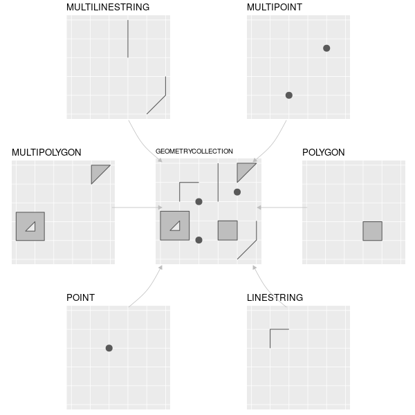

```{r}
#| label: libraries
library(ceramic)
library(knitr)
library(raster)
library(sf)
library(spData)
library(terra)
library(tidyverse)
library(tmap)
theme_set(theme_minimal())
```

### Preview

1. Spatial data come in two main formats: vector and raster. We’ll examine them
in detail soon, but first let's review the high-level distinction and gives a
few examples. We'll also see how to read and write data to and from these
formats.

2. Vector data formats are used to store geometric information, like the
locations of hospitals (points), trajectories of bus routes (lines), or
boundaries of counties (polygons). It’s useful to think of the associated data
as being spatially enriched data frames, with each row corresponding to one of
these geometric features.

3. Vector data are usually stored in `.geojson`, `.wkt`, `.shp`, or `.topojson`
formats. Standard data.frames cannot be used because then important spatial
metadata would be lost, like the Coordinate Reference System (to be explained in
the fourth lecture this week).

4. In R, these formats can be read using `read_sf` in the `sf` package. They can
be written using the `write_sf` function. Here, we'll read in a vector dataset
containing the boundaries of lakes in Madison.

```{r}
#| label: read-lakes
lakes <- read_sf("https://uwmadison.box.com/shared/static/duqpj0dl3miltku1676es64d5zmygy92.geojson")

lakes |>
    dplyr::select(id, name, geometry)
#write_sf(lakes, "output.geojson", driver = "GeoJSON")
```

We'll discuss plotting soon, but for a preview, this is how you can
visualize the lakes using ggplot2.

```{r}
#| label: plot-lakes
#| echo: TRUE
lakes <- lakes |>
    group_by(id) |>
    mutate(
    longitude = st_coordinates(geometry)[1, 1],
    latitude = st_coordinates(geometry)[1, 2]
    )

tm_shape(lakes) +
    tm_polygons(col = "#00ced1")
```

5. There is a surprising amount of public vector data available online. Using this [query^[It can be constructed easily using the wizard]](https://overpass-turbo.eu/s/14ma), I’ve downloaded locations of all hospital clinics in Madison.

```{r}
#| label: read-clinics
clinics <- read_sf("https://uwmadison.box.com/shared/static/896jdml9mfnmza3vf8bh221h9hlvh70v.geojson")

# how would you overlay the names of the clinics, using geom_text?
tm_shape(clinics) +
    tm_dots(col = "red", size = 1)
```

Using this [query](https://overpass-turbo.eu/s/14m9), I’ve downloaded all the
bus routes.

```{r}
#| label: read-bus
bus <- read_sf("https://uwmadison.box.com/shared/static/5neu1mpuh8esmb1q3j9celu73jy1rj2i.geojson")

tm_shape(bus) +
    tm_lines(col = "#bc7ab3", size = 1)
```

For the boundaries of the lakes above, I used this [query](https://overpass-turbo.eu/s/14mb).

Many organizations prepare geojson data themselves and make it publicly
available; e.g., the boundaries of
[rivers](https://data-wi-dnr.opendata.arcgis.com/datasets/c7de80dd473d440e98ab3acb611e7d64_2)
or
[glaciers](https://rds.icimod.org/Home/DataDetail?metadataId=9361&searchlist=True).

### Raster Data

6. Raster data give a measurement along a spatial grid. You can think of them as
spatially enriched matrices, where the metadata says where on the earth each
entry of the matrix is associated with.

7. Raster data are often stored in `tiff` format. They can be read in using the
`rast` function in the `terra` library, and can be written using
`writeRaster`.

```{r}
#| label: read-shanghai
shanghai <- rast("https://uwmadison.box.com/shared/static/u4na56w3r4eqg232k2ma3eqbvehfiaoq.tif")
#writeRaster(shanghai, "output.tiff", driver = "GeoTIFF")
```

8. Some of the most common types of public raster data are satellite images or
derived measurements, like elevation maps. For example, the code below shows an
image of a neighborhood outside Shanghai.

```{r}
#| label: plot-shanghai
tm_shape(shanghai / 1636 * 255) + # rescale the max value to 255
  tm_rgb()
```

There’s actually quite a bit of information in this image. We can zoom in…

```{r}
#| label: zoom-shanghai
bbox <- ext(121.66, 121.665, 30.963, 30.968)
shanghai_ <- crop(shanghai, bbox)

tm_shape(shanghai_ / 1636 * 255) +
  tm_rgb()
```

Here are is data on elevation in Zion national park.

```{r}
#| label: zion-elevation
f <- system.file("raster/srtm.tif", package = "spDataLarge")
zion <- rast(f)
tm_shape(zion) +
  tm_raster(palette = "PuBuGn") +
  tm_layout(legend.position = c("left", "bottom"))
```

### Installation

9. A note about R packages: for historical reasons, spatial data libraries in R
reference a few command line programs, like `gdal` and `proj`. Since these
command line programs are not themselves a part of R, they need to be installed
before the corresponding R packages. The process will differ from operating
system to operating system, and the experience can be frustrating, especially
when the R packages don’t recognize the underlying system installation. I
recommend following the instructions on [this page](https://github.com/r-spatial/sf)
and reaching out early if you have any issues.

### Vector Data Formats

10. Vector data are used to store geometric spatial data. Specifically, there are
7 types of geometric information that are commonly used, as given in the figure
below.



11. We can construct these geometric objects from scratch. For example, starting
from the defining coordinates, we can use `st_point`, `st_linestring`, and `st_polygon` to draw points, lines, and polygons.

```{r}
#| label: construct-geoms
# make a point
p <- st_point(c(5, 2))
plot(p)

# make a line
linestring_matrix <- rbind(c(1, 5), c(4, 4), c(4, 1), c(2, 2), c(3, 2))
p <- st_linestring(linestring_matrix)
plot(p)

# make a polygon
polygon_list <- list(rbind(c(1, 5), c(2, 2), c(4, 1), c(4, 4), c(1, 5)))
p <- st_polygon(polygon_list)
plot(p)
```

12. Different geometries can be combined into a geometry collection, using `sfc`.

```{r}
#| label: sfc-collection
point1 <- st_point(c(5, 2))
point2 <- st_point(c(1, 3))
points_sfc <- st_sfc(point1, point2)
plot(points_sfc)
```

13. Real-world vector datasets are more than just these geometries — they also
associate each geometry with some additional information about each feature. We
can add this information to the geometries above by associating each element
with a row of a data.frame. In R, this this merging is accomplished by `st_sf`,
using `geometry` to associate a raw `st_geom` a row of a data.frame.

```{r}
#| label: st-sf-london
lnd_point <- st_point(c(0.1, 51.5))
lnd_geom <- st_sfc(lnd_point, crs = 4326)
lnd_attrib = data.frame(
  name = "London",
  temperature = 25,
  date = as.Date("2017-06-21")
)

lnd_sf = st_sf(lnd_attrib, geometry = lnd_geom)
```

14. To visualize vector data, we can use the tmap package. Like ggplot2, this
package allows us to layer multiple visual encodings, but this time specialized
to different types of geospatial data.

Vector data can be directly plotted using base R. For example, suppose we
want to plot the boundaries of India, within it's local context. Each row of the
`world` object below contains both the boundary of a country (in the `geom`
column) and information about its location and population characteristics.

```{r}
#| label: head-world
data(world)
head(world)
```

This makes the plot, using `dplyr` to filter down to just the row containing the
India geometry.

```{r}
#| label: india-base
india_geom <- world |>
  filter(name_long == "India") |>
  st_geometry()

plot(india_geom)
```

Alternatively, we can use the `tmap` package,

```{r}
#| label: india-tmap
bbox <- c(60, 5, 110, 40)
tm_shape(india_geom) +
  tm_polygons()
```

Like `ggplot2`, `tmap` builds packages from sets of basic layers for all vector formats,

- Data: `tm_shape` sets up the raster or vector data to be used in subsequent layers.
- Points: `tm_dots()` draws dots at spatial points, `tm_markers()` draws Google Map-style markers, `tm_squares()` draws small squares.
- Lines: `tm_lines()` draws spatial line vectors.
- Polygons: `tm_polygons()` draws polygon vectors, `tm_fill()` draws polygons with the border removed, `tm_borders()` draws polygons with only the border.

There are other layers for more specialized contexts, like adding text labels or iso-contour lines.

15. Often, we want to layer on several vector objects. `tmap` makes this possible
in a ggplot2-like syntax. To change the coordinates of the viewing box, we can
set the `bbox` (bounding box) argument.

```{r}
#| label: world-asia
world_asia <- world |>
  filter(continent == "Asia")

bbox <- c(60, 5, 110, 40)
tm_shape(world_asia, bbox = bbox) +
  tm_polygons(col = "white") +
  tm_shape(india_geom) +
  tm_polygons()
```

16. We can also encode data that's contained in the vector dataset.

```{r}
#| label: lifeExp-map
tm_shape(world_asia, bbox = bbox) +
  tm_polygons(col = "lifeExp") +
  tm_polygons()
```

All the encoding channels we are used to modifying through ggplot2 (like color,
linetype, and size) can also be modified through these tmap commands, though
note, there is no intermediate aesthetic encoding function.

### Raster Formats

17. The raster data format is used to store spatial data that lie along regular
grids. The values along the grid are stored as entries in the matrix. The raster
object contains metadata that associates each entry in the matrix with a
geographic coordinate.

18. Since the data they must lie along a regular grid, rasters are most often
used for continuously measured data, like elevation, temperature, population
density, or landcover class.

19. We can create a raster using the `rast` command. The code block below loads
an elevation map measured by the space shuttle.

    ```{r}
    #| label: zion-rast
    f <- system.file("raster/srtm.tif", package = "spDataLarge")
    zion <- rast(f)
    ```

20. Typing the name of the object shows the metadata associated with it (but not
the actual grid values). We can see that the grid has 457 rows and 465 columns.
We also see its spatial extent: The minimum and maximum longitude are both close
to -113 and the latitudes are between 37.1 and 37.5. A quick google map [search](https://goo.gl/maps/X4EY2BsGgMZzN5BM9) shows that this is located in Zion
national park.

    ```{r}
    #| label: zion-metadata
    zion
    ```
    ```{r}
    #| label: plot-zion
    plot(zion)
    ```


21. In contrast, the `raster` command lets us create raster objects from scratch.
For example, the code below makes a raster with increasing values in a 6 x 6
grid. Notice that we had to give a fake spatial extent.

    ```{r}
    #| label: test-raster
    test <- raster(
      nrows = 6, ncols = 6, res = 0.5,
      xmn = -1.5, xmx = 1.5, ymn = -1.5, ymx = 1.5,
      vals = 1:36
    )

    plot(test)
    ```

22. Real-world rasters typically have more than one layer of data. For example, you might measure both elevation and slope along the same spatial grid, which would lead to a 2 layer raster. Or, for satellite images, you might measure light at multiple wavelengths (usual RGB, plus infrared or thermal for example).

23. Multi-layer raster data can be read in using `rast`. You can refer to particular layers in a multi-layer raster by indexing.

    ```{r}
    #| label: landsat-channels
    f <- system.file("raster/landsat.tif", package = "spDataLarge")
    satellite <- rast(f)

    satellite # all 4 channels
    satellite[[1:2]] # only first two channels
    ```

24. Base R’s `plot` function supports plotting one layer of a raster at a time. To plot more than one layer in a multichannel image (like ordinary RGB images) you can use the `plotRGB` function.

    ```{r}
    #| label: plotRGB
    plotRGB(satellite, stretch = "lin")
    ```

25. Sometimes, it’s useful to overlay several visual marks on top of a raster
image.

    ```{r}
    #| label: overlay-point
    satellite <- project(satellite, "EPSG:4326")
    point <- data.frame(geom = st_sfc(st_point(c(-113, 37.3)))) |>
      st_as_sf()

    tm_shape(satellite) +
      tm_raster() +
      tm_shape(point) +
      tm_dots(col = "blue", size = 5)
    ```

26. If we want to visualize just a single layer, we can use `tm_rgb` with all
color channels set to the layer of interest. Note that, here, I've rescaled the
maximum value of each pixel to 255, since this is the default maximum value for
a color image.

    ```{r}
    #| label: tm-rgb-layer
    tm_shape(satellite / max(satellite) * 255) +
      tm_rgb(r = 1, g = 1, b = 1)
    ```


### Coordinate Reference Systems

27. An important subtlety of geographic data visualization is that all our maps
are in 2D, but earth is 3D. The process of associated points on the earth with
2D coordinates is called « projection. » All projections introduce some level of
distortion, and there is no universal, ideal projection.

28. Here are a few examples of famous global projections. There are also many
projections designed to give optimal representations locally within a particular
geographic area.

29. This means that there is no universal standard for how to represent
coordinates on the earth, and it’s common to find different projections in
practice. For example, the block below shows how North America gets projected
according to two different CRSs.

    ```{r}
    #| label: crs-projections
    # some test projections, don't worry about this syntax
    miller <- "+proj=mill +lat_0=0 +lon_0=0 +x_0=0 +y_0=0 +ellps=WGS84 +datum=WGS84 +units=m +no_defs"
    lambert <- "+proj=lcc +lat_1=20 +lat_2=60 +lat_0=40 +lon_0=-96 +x_0=0 +y_0=0 +ellps=GRS80 +datum=NAD83 +units=m +no_defs"

    north_america <- world |>
      filter(continent == "North America")

    tm_shape(st_transform(north_america, miller)) +
      tm_polygons()

    tm_shape(st_transform(north_america, lambert)) +
      tm_polygons()
    ```

30. Both vector and raster spatial data will be associated with CRS’s. In either
`sf` or `raster` objects, they can be accessed using the `crs` function.

31. A common source of bugs is to use two different projections for the same
analysis. In this class, we will always use the EPSG:4326 projection, which is
what is used in most online maps. But in your own projects, you should always
check that the projections are consistent across data sources. If you find an
inconsistency, it will be important to « reproject » the data into the same CRS.

### Interactivity and Spatial Data

**Selection**

32. It's natural to use maps to select regions of interest. We may also need
extra pan and zoom functionality to make the most of very high-resolution
spatial data.

33. Mosaic vgplot is especially well-suited to selection interactions. We need
two main changes from our previous mosaic visualizations.

   - We make sure our coordinator loads the spatial data input. This isn't
   enabled by default and requires us to first call
   `vg.loadExtension("spatial")`, which makes the spatial database tools
   available. We can then load typical vector data formats using
   `vg.loadSpatial()`.
   - We use `vg.geo()` to encode vector data. This layer is analogous to
   `vg.dot()` or `vg.line()` for dot or line plots, for example.

It's not as common, but if we ever want to customize the CRS, we have to use
`vg.projectionType()`.

1.The block below loads data that will be used in the examples below. Note that
the county geometry data is separate from the original unemployment rates.  The
code below manually joins these into a new table called combined. We could have
alternatively joined these tables elsewhere and then directly loaded the spatial
data with unemployment information baked in.

```{ojs}
//| label: ojs-setup
//| echo: false
path = (p) => new URL(`data/${p}`, document.baseURI).href

vg = {
  const vg = await import("https://cdn.jsdelivr.net/npm/@uwdata/vgplot@0.19.0/+esm");
  const wasm = await vg.wasmConnector();
  vg.coordinator().databaseConnector(wasm);
  await vg.coordinator().exec([
    // load three datasets we'll find useful later
    vg.loadCSV("zion", path("zion_elevation.csv")),
    vg.loadExtension("spatial"),
    vg.loadSpatial("counties", path("us-counties-10m.json"), {layer: "counties", sibling_files: []}),
    vg.loadParquet("rates", path("us-county-unemployment.parquet")),

    // not too smart, but reads in the tables we need
    `CREATE TABLE IF NOT EXISTS "combined" AS SELECT a.name as name, a.geom AS geom, b.rate AS rate FROM counties AS a, rates AS b WHERE a.id = b.id`
  ]);
  return vg;
}
```

34. Let's build an example that allows us to make a choropleth map where counties
can be interactively selected by their unemployment level. The first step is to
define a static version. Fill ensures that the unemployment rate appears as
color in the map, and title ensures that hovering over the counties reveals
their name. Some of the counties have much higher unemployment than others, and
if we had used a standard linear scale, then those colors would dominate the
color scale (some outlier counties would be dark, everything else would be
fait). To get around this, we use a quantized scale Where color shifts at
discrete cut points.

```{ojs}
//| label: ojs-choropleth
vg.vconcat(
  vg.colorLegend({for: "county-map", label: "Unemployment (%)"}),
  vg.plot(
    vg.geo(
      vg.from("combined"),
      {fill: "rate", title: "name"}
    ),
    vg.name("county-map"),
    vg.colorScale("quantile"),
    vg.colorN(9),
    vg.colorScheme("blues"),
    vg.projectionType("albers-usa")
  )
);
```

35. Next, let's link this map with a histogram of the unemployment rates. This
doesn't actually add too much to the visualization because we can already see
unemployment directly on the plot. However, it can still be useful for noticing
differences within the color bins, especially the outliers.

- We build the unemployment histogram using `vg.rectY` and setting the x-axis to
be the binned rate.
- We draw two maps, one that only will show the counties that have been brushed
in the histogram and another grayed-out one that serves as the "context" in a
focus-plus-context view. These are the two calls to `vg.geo`.
- Finally, we enable brushing by defining a reactive selection object called
`$range`. It reacts to user inputs through `intervalX`, and `filterBy` in the
second `vg.geo` call ensures that only the selected subset of the map is drawn
in the "focus."

One subtlety is that in this interactive version, we need to manually set the
breakpoints in the quantile scale. If we omit this, then the color scale adapts
every time we move the brush. This is analogous to fixing the x and y-axis
scales in our earlier weather example.

```{ojs}
//| label: ojs-brush
$range = vg.Selection.intersect()

vg.hconcat(
  // make the histogram
  vg.plot(
    vg.rectY(
      vg.from("combined"),
      {x: vg.bin("rate"), y: vg.count(), fill: "#c8c8c8"}
    ),
    vg.intervalX({as: $range, brush: {fill: "none"}}),
    vg.xLabel("Unemployment (%)"),
    vg.width(300),
    vg.height(300)
  ),
  vg.vconcat(
    // make the map and its legend
    vg.colorLegend({for: "county-map-brush", label: "Unemployment (%)"}),
    vg.plot(
      vg.geo(
        vg.from("combined"),
        {fill: "none", stroke: "#eee", strokeWidth: 0.5}
      ),
      vg.geo(
        vg.from("combined", {filterBy: $range}),
        {fill: "rate", title: vg.sql`concat(rate, '%')`}
      ),
      vg.name("county-map-brush"),
      vg.colorScale("threshold"),
      vg.colorDomain([3.2, 3.8, 4.4, 4.8, 5.2, 5.7, 6.5, 7.6]),
      vg.colorScheme("blues"),
      vg.projectionType("albers-usa"),
      vg.width(500),
      vg.height(300)
    )
  )
);
```

**Rasters**

36. The machinery for working with raster data in Mosaic is not as mature as that
for working with vector data. It's not possible to work with multiband rasters
like those we would need for a full-color satellite image. However, working with
one layer at a time is easy and can be done using the `vg.raster` command.

   A technical detail is that for the raster data to be read in properly, it
   needs to be formatted in long form. That is, it can't just be a matrix of
   raster values. It has to have $x$-coordinate, $y$-coordinate, and
   value-at-that-coordinate columns.

    ```{r}
    #| label: zion-flatten
    zion_df <- as.data.frame(zion, xy = TRUE)
    names(zion_df) <- c("x", "y", "elevation")
    write.csv(zion_df, "data/zion_elevation.csv", row.names = FALSE)
    ```

37. The visual encoding channels are all relatively straightforward. One subtlety
about raster data is that we may want to change the resolution. Increasing pixel
size will reduce the resolution of the plot, which can be helpful if we want to
speed up loading on slow internet connections. Alternatively, we might want to
increase the resolution through interpolation. That requires the use of the
`interpolate` and `bandwidth` arguments.

```{ojs}
//| label: ojs-zion-raster
vg.plot(
  vg.raster(
    vg.from("zion"),
    {
      x: "x",
      y: "y",
      fill: vg.max("elevation"),
      interpolate: "nearest",
      bandwidth: 0,
      pixelSize: 1
    }
  ),
  vg.colorScheme("puBuGn"),
  vg.margin(0),
  vg.width(500),
  vg.height(500)
);
```

38. One topic that we haven't covered is using web mapping frameworks. We haven't